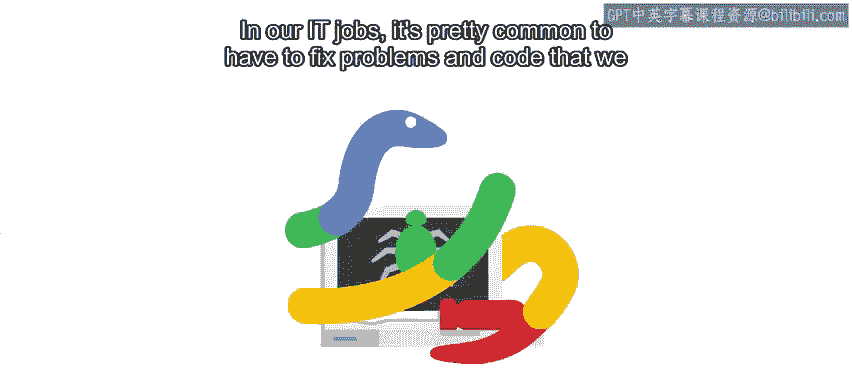
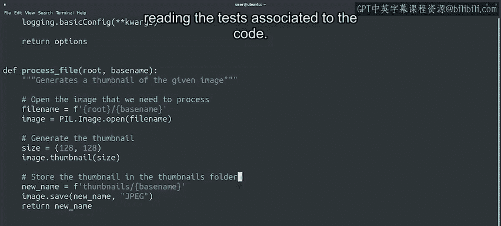

#  094：修复他人的代码 🛠️

在本节课中，我们将学习如何理解和修复他人编写的代码。这是IT工作中常见的任务，无论是处理开源项目还是公司内部其他开发者编写的程序。我们将介绍几种有效的方法来熟悉陌生代码，并逐步掌握修复问题的技巧。

## 理解代码的起点

上一节我们介绍了修复他人代码的常见场景，本节中我们来看看如何开始理解这些代码。如果代码包含注释且函数文档完善，阅读这些内容是理解代码逻辑的最佳起点。

记得在本课程早期介绍Python时，我们强调了编写代码时养成良好习惯的重要性。编写清晰的注释就是这样一个好习惯，它不仅有助于他人理解你的代码，也能帮助未来的你回顾自己的代码。

然而，许多代码缺乏足够的注释，导致我们难以理解其上下文。在这种情况下，你可以在阅读代码并理解其功能时，主动添加注释。

以下是添加注释的几个好处：

*   帮助你巩固对代码的理解。
*   如果你将这些注释反馈给原始开发者，可以帮助其他试图理解代码的人。

## 利用测试理解代码

除了注释，阅读与代码相关的测试也能帮助我们理解他人编写的代码。良好的测试可以告诉我们每个函数的预期行为。

查看现有测试可以揭示哪些用例未被考虑。但如果测试不足怎么办？就像添加额外注释一样，编写你自己的测试可以帮助你更好地理解代码的预期行为，并提高代码的整体质量。

这在修改原始代码时尤其有用，可以确保你的更改不会破坏其他功能。

## 阅读代码的策略

在我的工作中，我经常需要修改他人编写的代码。我肯定会阅读注释，有时也会参考测试。但最终，为了真正理解代码的运行逻辑，我必须亲自阅读代码。

那么，如何开始阅读他人的代码呢？这在一定程度上取决于个人偏好和项目规模。

如果代码只有几百行，通读所有代码是可行的。但当项目有成千上万行代码时，你无法阅读全部内容。你需要专注于与你试图修复的问题相关的函数或模块。

在这种情况下，一种可能的方法是从发生错误的函数开始，然后查看调用它的函数，依此类推，直到你掌握导致问题的上下文。

当然，如果你熟悉代码所用的编程语言，这个过程会容易得多。但你不需要是该语言的专家就能修复程序中的错误。如果你遇到了一个错误，并且通过调试足够理解了问题所在，即使你以前从未见过那种语言，也可能修复它。

## 通过练习提升技能

这项技能会随着练习而提高。因此，在你需要修复代码问题之前开始练习是有意义的。

选择一个你既使用又能访问其代码的程序，弄清楚它是如何执行某个特定操作的。跟踪代码直到你真正理解其运行逻辑。

例如，你可以查看你正在使用的Web服务器软件，了解它如何解析配置文件。或者查看一个你喜欢的Python模块，比如`requests`，弄清楚它如何处理接收到的数据。

通过这样做，你可以习惯阅读他人编写的代码并理解其功能。

另一个选择是选择一个你使用的开源项目，查看其公开问题列表，并尝试修复一个简单的问题。为此，你需要熟悉代码结构，理解其功能以及需要更改的内容。

通过练习，你将提高快速理解代码功能和所需更改的能力，同时帮助提高项目的整体质量。

## 总结

本节课中，我们一起学习了修复他人代码的策略。我们了解到，阅读注释和测试是理解代码的起点，主动添加注释和编写测试可以加深理解并提升代码质量。对于大型项目，需要采取从错误点出发、逐步追踪的策略来聚焦问题。这项技能需要通过实践来提升，例如分析熟悉程序的代码或参与开源项目的issue修复。接下来，我们将通过实践来修复几个导致程序崩溃的问题。