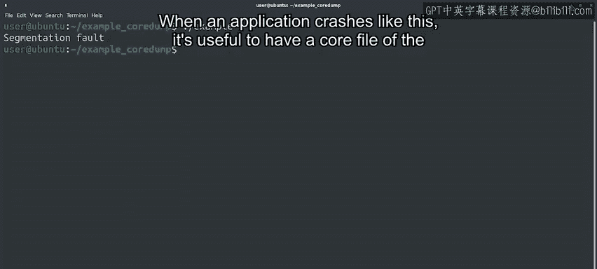
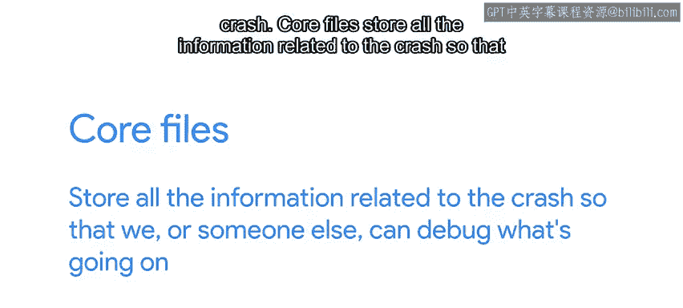
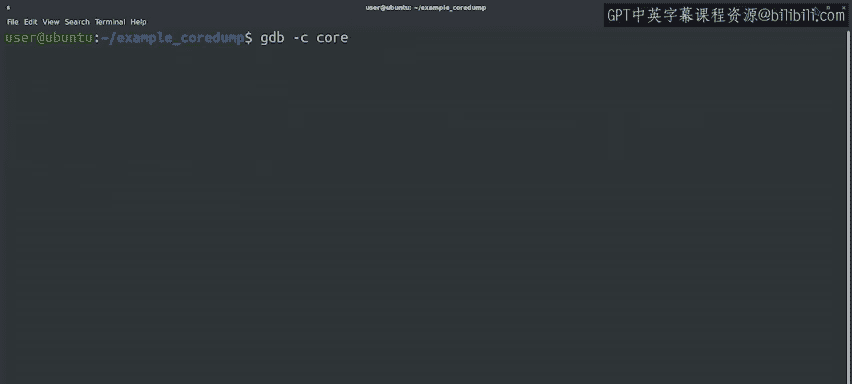

#  095：调试段错误 🐛


在本节课中，我们将学习如何调试一种称为“段错误”的程序崩溃。我们将通过一个实际的例子，了解段错误的表现形式，并学习如何使用核心文件和调试器来诊断和修复这类问题。

---



在之前的课程中，我们讨论了几种不同类型的程序崩溃。本节中，我们来看看“段错误”在实际运行中是什么样子的。



我们有一个简单的示例程序，它会因为段错误而崩溃。

当应用程序像这样崩溃时，拥有一个崩溃时的核心文件会很有用。核心文件存储了与崩溃相关的所有信息，以便我们或其他人能够调试问题所在。

这就像在崩溃发生时拍下一张快照，以便稍后进行分析。我们需要告诉操作系统我们希望生成这些核心文件。

我们通过运行 `ulimit` 命令，然后使用 `-c` 标志来指定核心文件，并设置为 `unlimited` 以表示我们希望生成任意大小的核心文件。

```bash
ulimit -c unlimited
```



完成此设置后，我们可以再次尝试执行我们的示例程序。好的，我们的崩溃程序已经生成了一个核心文件。让我们使用 `ls -l` 命令来查看它。

这个文件包含了程序崩溃时所有正在发生的信息。我们可以通过将其传递给 GDB 调试器来理解程序崩溃的原因。

我们将调用 `gdb -c` 来指定我们的核心文件，然后指定 `example` 来告诉调试器崩溃的可执行文件的位置。

```bash
gdb -c core example
```

当 GDB 启动时，它会显示一系列消息，包括其版本、许可证以及如何获取帮助。然后它会告诉我们程序以段错误结束。它显示崩溃发生在 `strlen` 函数内部，该函数属于系统库的一部分。

我们在这里看到的“No such file or directory”错误意味着我们没有该系统库的调试符号，但这没关系。我们相信 `strlen` 函数能正常工作，问题出在我们自己的代码有缺陷。

让我们使用 `backtrace` 命令来查看崩溃的完整回溯信息。

回溯列表中的第一个元素是发生崩溃的函数。第二个元素是调用该函数的函数，依此类推。在本例中，我们看到失败的 `strlen` 函数是由我们代码中的 `copy_parameters` 函数调用的，而 `copy_parameters` 又是由 `main` 函数调用的。

我们可以使用 `up` 命令在回溯中移动到调用函数，并查看导致崩溃的 `copy_parameters` 中的代码行。

我们看到有问题的行正在调用 `strlen` 函数，但不清楚为什么会失败。我们可以通过调用 `list` 命令来获取失败代码周围的更多上下文，该命令会显示当前行周围的代码。

这里我们看到一段 C 代码。如果你是第一次看 C 代码，可能会觉得有点困惑。这没关系。它和 Python 有一些相似之处，但也有一些相当不同的地方。我们看到有问题的第 10 行位于一个 `for` 循环体内。

`for` 循环用于迭代的变量叫做 `i`。让我们使用 `print` 命令查看 `i` 的值。

GDB 使用美元符号后跟一个数字来为它打印的每个结果提供单独的标识符。在本例中，结果是 1。换句话说，当崩溃发生时，`i` 的值为 1。

由于这个变量被用来访问一个名为 `argv` 的数组，让我们打印第一个元素 `argv[0]` 的内容，然后是第二个元素 `argv[1]`。

那些以 `0x` 开头的奇怪数字是什么？那些是十六进制数字，用于显示内存中存储某些数据的地址。在这里，GDB 告诉我们 `argv` 数组的第一个元素是一个指针，指向 `./example` 字符串。第二个元素是一个指向 0 的指针，也称为空指针。0 从来不是一个有效的指针，在 C 语言中它通常表示数据结构的结束。

所以，我们的代码试图访问数组中的第二个元素，但该数组只有一个有效元素。换句话说，`for` 循环多进行了一次迭代。这被称为“差一错误”，是一种非常常见的错误。

在本例中，修复方法非常简单：我们需要将小于等于号（`<=`）改为严格的小于号（`<`），以便在倒数第二个元素处停止迭代。

---

在本视频中，我们初步了解了如何调试因段错误而崩溃的 C 语言应用程序。接下来，我们将讨论如何调试因异常而崩溃的 Python 应用程序。

本节课中，我们一起学习了段错误的基本概念、如何生成和分析核心文件，以及如何使用 GDB 调试器来定位 C 代码中的“差一错误”。掌握这些技能对于诊断和修复底层程序崩溃至关重要。