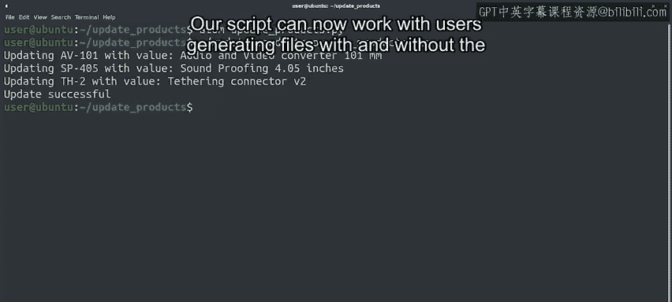

#  096：调试Python程序崩溃 🐛

在本节课中，我们将学习如何调试一个因异常而崩溃的Python程序。我们将通过一个实际的例子，了解如何解读错误信息，并使用Python调试器（PDB）来定位和解决问题。

---

## 从段错误到Python异常

上一节我们介绍了处理C或C++等语言编写的应用程序时常见的段错误问题。本节中我们来看看使用Python等语言时，我们通常需要处理的是导致程序崩溃的意外异常。

让我们看一个例子。我们有一个脚本，用于更新公司数据库中某些产品的描述。这是一个相当简单的脚本，它接收一个CSV文件作为参数，该文件包含需要导入的产品代码和描述数据。我们的脚本只是读取文件然后更新数据库。大多数时候，它运行良好。😊

但是，当由某个特定用户生成包含新描述的文件时，程序会因异常而失败。用户给我们发送了一个导致失败的文件，以便我们尝试找出问题所在。

---

## 检查文件与重现错误

首先，我们检查一下文件的内容。看起来没什么问题。让我们尝试执行程序。

程序因异常而失败。让我们仔细看看这个回溯信息，以便更好地理解它。

在底部，我们看到异常的名称（本例中是 `KeyError`）和消息（本例中是 `‘product_code’`），这是导致失败的键名。在上面，我们看到一个函数调用列表，每个函数有两行信息：第一行告诉我们包含该函数的Python文件、行号和函数名；第二行显示该行的内容。

这个信息类似于我们在上一个视频中看到的回溯，但函数的顺序是相反的：底部的函数 `update_data` 是发生异常的地方。在它上面，我们看到 `update_data` 被 `main` 调用，而在最上面，我们看到 `main` 被模块级别的代码行调用。

那么，这里发生了什么？`update_data` 函数试图访问名为 `row` 的变量中的 `product_code` 字段，但由于某种原因，这失败了并引发了 `KeyError`。

通常，知道异常消息和发生异常的行已经足以理解发生了什么。但在某些情况下，比如这个，这还不够。

---

## 使用Python调试器（PDB）

是时候尝试使用Python调试器了。

我们通过运行 `pdb3` 来启动调试器，然后传递我们想要运行的脚本以及脚本所需的任何参数。

在我们的例子中，我们将调用 `pdb3 update_products.py new_products.csv`。启动调试器后，它会定位到我们脚本的第一行，并等待我们告诉它该做什么。

我们可以使用 `next` 命令逐条执行文件中的指令，但这里有很多代码，所以我们需要经过很多行才能到达失败的地方。或者，我们可以告诉调试器继续执行，直到程序完成或崩溃。我们现在就这么做。

程序以我们之前看到的相同方式失败了，但现在我们可以使用调试器来更好地理解为什么会出现这个烦人的 `KeyError`。

让我们打印变量 `row` 的内容。哈，这真的很奇怪。`‘product_code’` 前面出现的那些字符是什么？

如果我们在网上搜索这个字符序列，我们会发现它代表**字节顺序标记**（BOM），在UTF-16中用于区分以小端序和大端序存储的文件。我们的文件是UTF-8格式，所以不需要BOM，但有些程序仍然包含它，而这正是导致我们脚本出错的原因。

那么，我们能做什么？幸运的是，其他人已经遇到了同样的问题并找到了解决方案。有一个特殊的编码值叫做 `utf-8-sig`，我们可以将其设置为 `open` 函数的 `encoding` 参数。😊

设置此编码意味着，当文件包含BOM时，Python会将其去除；当文件不包含时，则正常处理。让我们修改脚本代码以使用该编码，而不是默认编码。

我们将找到打开文件的地方，然后添加值为 `‘utf-8-sig’` 的 `encoding` 参数。

好的，我们已经做了更改。现在它会工作吗？让我们检查一下。耶，我们解决了问题！我们的脚本现在可以处理用户生成的文件，无论它们是否包含字节顺序标记。

---

## 调试器的更多功能

在最后两个视频中，我们简要介绍了GDB和PDB。我们仅仅触及了使用调试器可以进行的众多操作的表面。

还有大量更高级的调试功能，例如：
*   **设置断点**：让代码运行到某一行代码被执行时停止。
*   **设置监视点**：让代码运行直到某个变量或表达式发生变化。

我们还可以逐条指令地单步执行代码，以检查问题何时发生，以及更多功能。

我们不会在这里深入研究任何这些高级技术，但像往常一样，我们会在接下来的阅读材料中提供更多相关信息，以防你想了解更多。

在那之后，还有另一个练习测验，以确保你理解了所有这些内容。

---

## 总结

本节课中我们一起学习了如何调试一个因 `KeyError` 异常而崩溃的Python脚本。我们通过分析回溯信息定位问题，并使用Python调试器（PDB）检查运行时的变量状态，最终发现问题的根源是CSV文件开头的UTF-8 BOM字符。通过将文件打开编码改为 `‘utf-8-sig’`，我们成功解决了问题，使脚本能够兼容处理带或不带BOM的文件。我们还了解到调试器拥有断点、监视点等强大功能，可用于更复杂的调试场景。