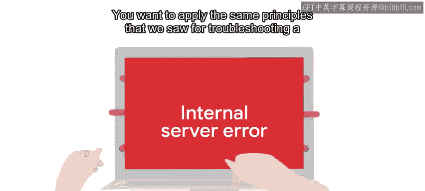
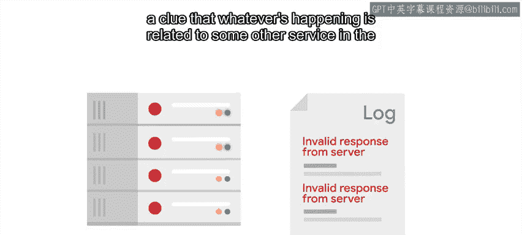
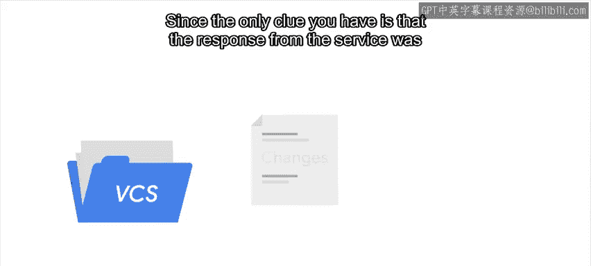
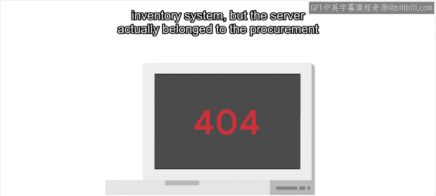
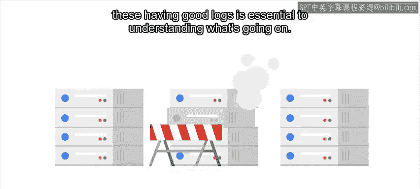
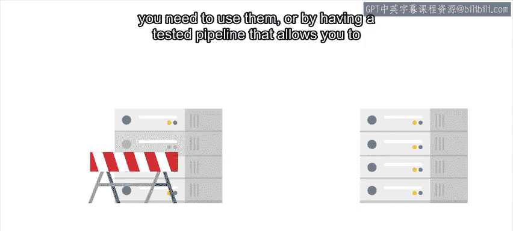
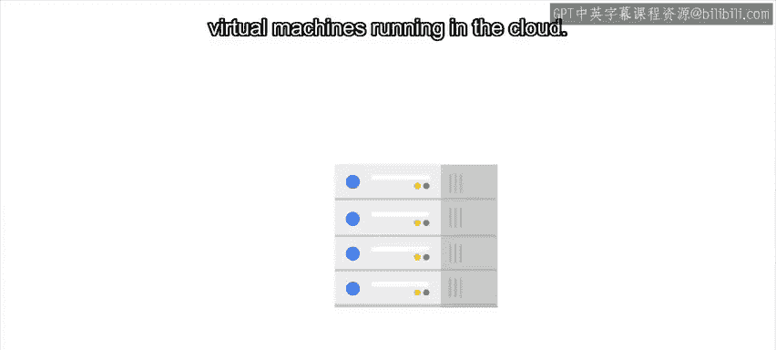

#  097：复杂系统中的故障排查 🕵️

在本节课中，我们将学习如何诊断和修复涉及多个服务和计算机的复杂系统中的故障。我们将探讨如何将单机故障排查的原则应用到更大规模的系统中，并介绍处理此类问题时的关键策略。

---

到目前为止，我们讨论的都是如何诊断和修复局限于单台计算机的错误。这对于单用户使用的计算机来说是常见情况。

然而，一旦我们开始进入涉及许多不同服务的复杂系统，就需要从更宏观的角度审视问题，并理解不同计算机之间如何交互。

假设你负责公司的电子商务网站。用户最近访问的页面中，约有20%的请求会返回“内部服务器错误”。

## 如何定位问题？

你需要应用我们在单机故障排查中学到的相同原则，但这次是在更大的规模上。

因此，你需要检查提供服务的服务器中的日志消息，看看是否能找到任何指向问题根源的额外信息。

你需要查找与故障服务相关的特定日志，同时查看一般的系统日志，以判断是否存在影响整个服务器的普遍问题。

对于这个例子，假设你在日志中发现了一系列条目，显示“来自服务器的响应无效”。这并非一个很有用的错误信息。

你不知道请求是什么，也不知道响应是什么。但这至少是一个线索，表明正在发生的问题与整个系统中的其他服务有关。

## 追溯变化

我们提到这个问题是最近才开始出现的。因此，找出系统正常工作与开始故障之间发生了什么变化是合理的思路。

是否有新版本的系统被部署？是否有与请求相关的任何变更？

假设故障发生在一个周二上午，而该服务的最新版本是在前一周发布的。直到今天为止，一切工作正常。请求看起来也正常，没有异常情况。

所以服务本身可能没问题。但系统中涉及的其他服务呢？

底层系统之一（如数据库、身份验证服务或其他后端服务器，如库存、计费或采购系统）是否有新版本？

查看最近的变更，你发现当天早些时候，前端和后端服务之间使用的负载均衡器进行了一系列更改。

## 实施回滚与改进日志

由于你唯一的线索是“来自服务的响应无效”，你并不确定这些变更就是罪魁祸首，但它们看起来确实可疑。

只要可能，最佳策略是回滚你怀疑导致问题的变更，即使你并不100%确定这就是真正的原因。

如果你的基础设施允许轻松回滚，在进行任何进一步调查之前，请尝试这样做。因为这样，如果它是原因，你将恢复服务的健康状态；如果回滚没有帮助，你也可以排除这个变更作为可能的原因。

无论你是否进行回滚，当遇到无用的错误消息时，改进它们是一个好主意。

与其让错误只说“响应无效”，不如将其更改为包含请求和响应是什么，以及为什么响应无效。这样，下次你尝试调试类似问题时，就已经有了更多可用的信息。

对于这个例子，如果错误包含了这些信息，你就会看到无效的响应是一个404错误。

这起因于将一台服务器作为库存系统的一部分添加到了资源池中，但这台服务器实际上属于采购系统。

## 处理后续故障

现在，假设几周后，你发现同一个服务中又出现了一系列内部服务器错误。

你可能会倾向于再次假设是负载均衡器的故障。但到现在，你应该知道首先要查看日志，看看能发现什么。

没有理由认为这次的错误会和上次相同。查看日志时，你可能会注意到，例如，实际上只有一台前端服务器受到了问题的影响。所有其他机器都在成功提供其内容。

在这种情况下，你首先要做的是将这台机器从可以提供此服务的服务器池中移除。这样，在你调查故障机器发生了什么的同时，可以避免用户遇到更多错误。

## 复杂系统的最佳实践

正如你现在可能已经意识到的，在处理此类复杂系统时，拥有良好的日志对于理解正在发生的事情至关重要。

除此之外，你还需要对服务的运行状态进行良好的监控，并对所有变更使用版本控制，以便快速检查发生了什么变化，并在需要时进行回滚。

能够在必要时非常快速地部署新机器也很重要。这可以通过保留备用服务器以备不时之需来实现。

或者通过拥有一个经过测试的流水线，允许你按需部署新服务器。

如今，许多公司都有自动化流程，可以将服务部署到在云中运行的虚拟机上。这可能需要一些时间来设置，但一旦完成，你就可以非常轻松地增加或减少正在使用的服务器数量。

这在调查和解决问题时会有很大帮助。但需要注意的一点是，当服务器作为虚拟机运行时，尤其是在云中运行时，这些服务可能会受到外部限制。

像可用CPU时间、内存或网络带宽等资源可能会被人为限制。不仅如此，某些外部服务的使用也可能受到限制，例如你可以同时拥有多少个数据库连接，或者可以存储多少数据。如果这些限制导致你的应用程序出现问题，你可能需要重新考虑如何使用资源。

---

本节课中，我们一起学习了在复杂系统中面对问题时可以使用的一系列技术：查看可用日志、找出系统上次正常工作以来的变化、回滚到先前状态、从资源池中移除故障服务器或按需部署新服务器。

接下来，我们将探讨处理更大规模事件的另一个不同方面：沟通与文档。