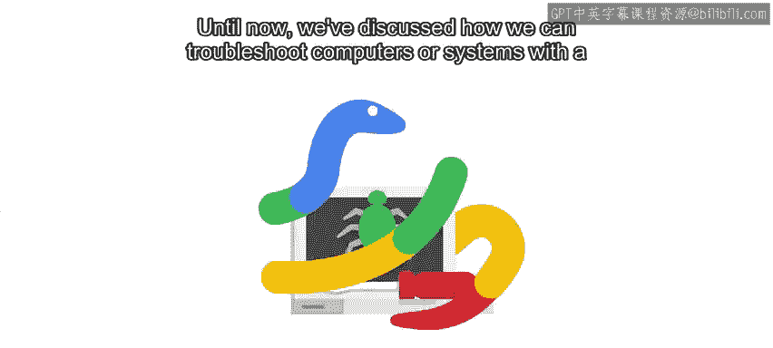
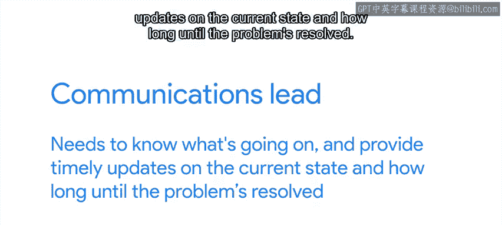
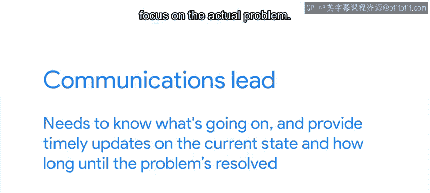
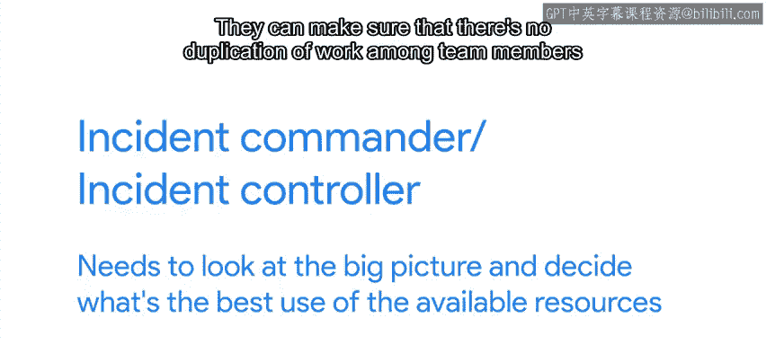
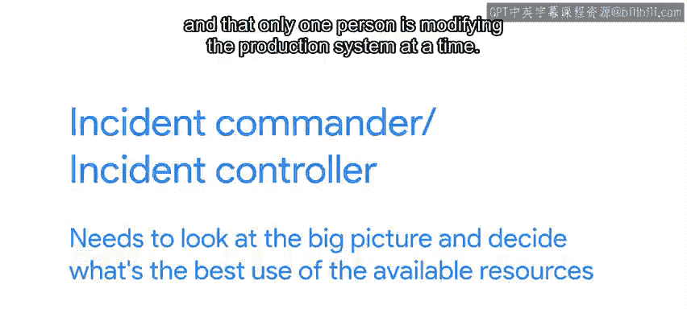
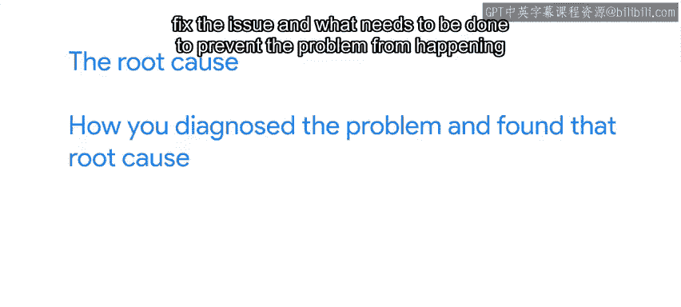
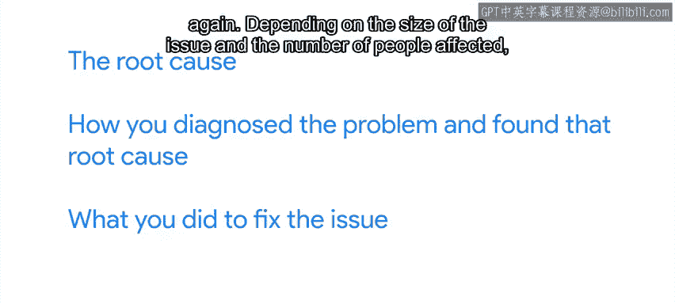

#  098：事件期间的沟通与文档记录 📝

在本节课中，我们将学习在解决IT问题时，如何有效地进行沟通和记录文档。这对于高效协作、避免重复劳动以及为未来提供参考至关重要。

---

## 概述

到目前为止，我们已经讨论了如何对存在特定问题的计算机或系统进行故障排除。我们涵盖了如何获取足够信息以确定根本原因，然后应用必要的修复措施。

然而，所有这些工作还有另一个重要方面，即如何处理与受问题影响人员的沟通，以及作为一个团队在解决大型问题时如何分配任务。凭借目前所学和过往经验，你或许能出色地解决问题，但如果在沟通方面做得不好，最终可能会导致大量沮丧的用户致电询问情况。

---

## 文档记录的重要性

在解决问题时，将你的操作记录在缺陷报告或工单中始终是一个好主意。

如果公司没有这样的系统，可以使用文档、文本文件、Wiki或任何你可以访问的工具。记录你的操作可以让你追踪已尝试的方法及其结果。

这看似不必要，但在经过一整天的故障排除后，我们很容易忘记尝试过什么，或者某个特定操作的结果是什么。此外，以电子形式保存所有这些信息，可以让你轻松地与其他团队成员共享收集到的数据。

例如，如果你回滚了某个后来发现无关的更改，完整的记录过程可以帮助你记得再次将其向前推进。

---

## 与受影响方的沟通

在解决问题期间，与受影响方进行清晰沟通非常重要。他们希望知道你发现了什么问题、有哪些可用的临时解决方案，以及何时能获得下一次更新。

如果你不知道问题是什么，很难给出修复时间的估计，但你仍然可以及时提供关于你正在开展工作的更新。这种定期沟通是有帮助的，无论事件规模大小。

但受影响的人越多，你就越需要提供定期更新，并清晰地说明用户可以做什么以及可以期待什么样的解决方案。这样，他们可以更好地计划和组织自己的时间。

例如，如果网络访问中断，你需要让人们知道修复是需要一两个小时，还是需要一整天。这些信息可能会影响人们是选择当面讨论问题几个小时，还是决定在家工作。

---

## 团队协作与角色分配

如果问题足够严重，需要更多人参与寻找解决方案，你们应该商定谁负责哪些任务。

以下是任务分配的一些示例：
*   可以安排一个人负责寻找临时解决方案，而另一个人负责理解问题的根本原因并寻找长期修复措施。
*   如果问题有很多可能的原因，可以将这些原因分配给团队成员，让他们并行处理。

除了寻找根本原因和解决方案的人员外，还需要指定一个人负责与受影响人员沟通。这可以让团队避免忘记更新跟踪问题，或者更糟的是，提供相互矛盾的信息。这位沟通负责人需要了解进展情况，并及时提供关于当前状态以及问题解决所需时间的更新。

他们可以作为用户提问的“屏障”，让团队其他成员专注于实际问题。

同样，应该有一人负责向团队成员分配不同的任务。这个人有时被称为事件指挥官或事件控制员，需要纵观全局，决定如何最佳利用可用资源。

他们可以确保团队成员之间没有重复工作，并且一次只有一个人修改生产系统。多人同时对系统进行重叠的更改可能会导致混乱的结果，使故障时间更长。

当然，这种角色划分在发生大型事件且有大型团队参与寻找解决方案时最有意义。如果只有两三个人处理问题，商定谁负责什么仍然很重要，但可能不需要使用任何特殊的角色名称。

---

## 事件解决后的总结

问题解决后，总结有用的信息至关重要。

你需要包含的最重要信息包括：
*   **根本原因**
*   **诊断问题并找到该根本原因的过程**
*   **为解决问题所采取的措施**
*   **为防止问题再次发生需要做的事情**

根据问题的规模和受影响的人数，这份总结可以只是你用来跟踪工作的缺陷报告或工单的最后一次更新，也可以是一份完整的事后分析报告。

---

## 总结

本节课中，我们一起学习了在IT事件处理过程中进行有效沟通和文档记录的关键实践。我们明确了记录操作步骤对于追踪进度和团队协作的重要性，探讨了如何向受影响用户提供清晰、及时的更新。我们还介绍了在团队协作中分配特定角色（如沟通负责人、事件指挥官）以提升效率的方法。最后，我们强调了在问题解决后进行总结，记录根本原因、诊断过程、修复措施和预防方案的必要性，为未来积累经验。