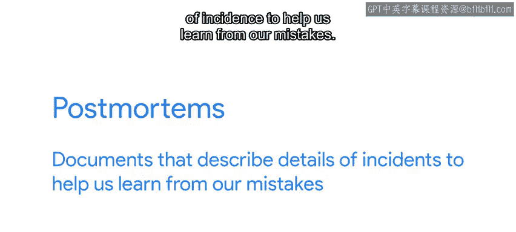
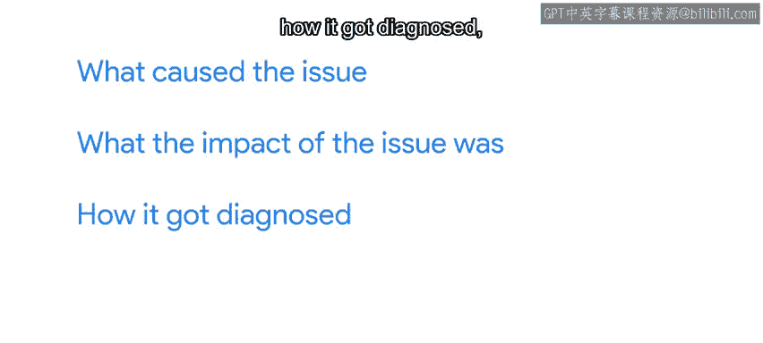
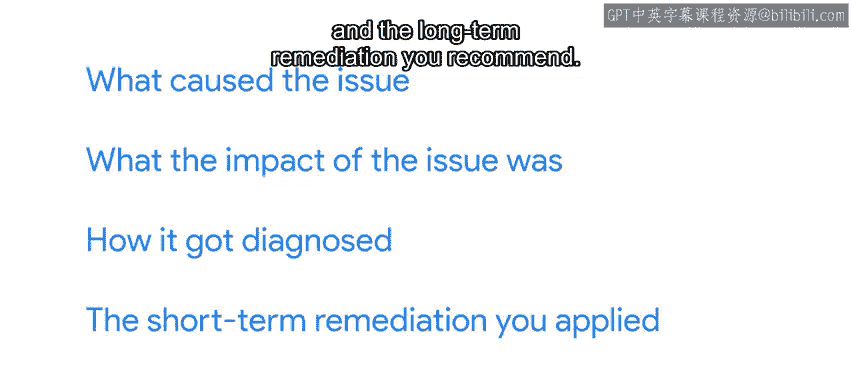
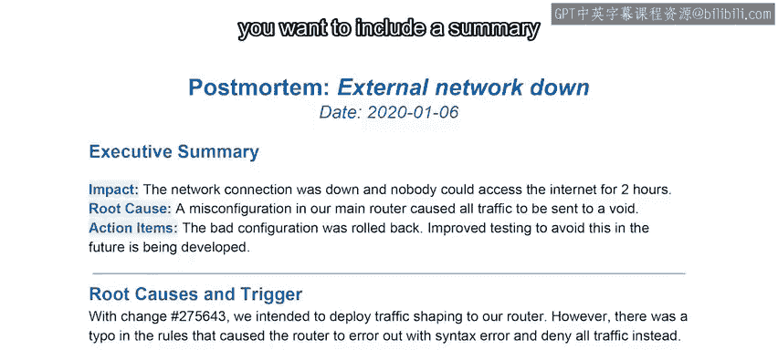

#  099：编写有效的事后分析报告 📝

在本节课中，我们将要学习如何编写一份有效的事后分析报告。事后分析报告是记录和分析已发生事件的重要文档，其核心目标是总结经验教训，防止问题再次发生，而非追究责任。

## 事后分析报告的目的与重要性

上一节我们介绍了在故障排除过程中沟通与文档记录的重要性。本节中，我们来看看当问题足够严重时，我们应如何通过撰写事后分析报告来记录事件。

事后分析报告是描述事件细节的文档，旨在帮助我们从中吸取教训。撰写报告的目的不是指责导致事件的人，而是从已发生的事件中学习，以防止相同问题再次发生。

撰写事后分析报告之所以重要，是因为它能帮助我们避免再次处理相同问题，或至少学会如何更好地应对下一次事件。

## 报告的核心内容

虽然事后分析报告对处理重大事件极为有用，但你无需等到发生大事时才撰写第一份报告。你可以为任何有学习价值的事件练习撰写报告，无论事件多小。这样，当需要在重大事件后撰写报告时，你就知道如何专注于最重要的事情：从问题中学到什么，以及未来如何预防。

那么，事后分析报告应包含哪些内容呢？具体结构可能因个人偏好和处理的事件类型而异。

以下是报告通常应包含的核心部分：

*   **问题原因**：详细说明导致问题的根本原因。
*   **影响范围**：描述问题造成的影响。
*   **诊断过程**：记录如何诊断和定位问题。
*   **短期补救措施**：说明应用了哪些临时解决方案。
*   **长期修复建议**：提出为防止问题再次发生而推荐的长期改进方案。

如果文档较长且需要与多人分享，建议包含一个摘要，重点说明根本原因、影响以及为防止问题再次发生需要采取的措施。

## 记录成功之处与报告的价值

在事后分析报告中记录做得好的方面也很有用。在处理问题时，我们可能会意识到，如果没有某些可用的工具或系统，情况可能会糟糕得多。

例如，我们可以说通过回滚到上一个版本快速解决了问题，或者由于我们拥有良好的监控和告警系统，在用户甚至注意到之前就发现了问题。记录成功之处有助于展示我们系统的有效性，并为维持这些系统的运行提供依据。

撰写事后分析报告有时能帮助你更好地理解你所负责的服务。今年早些时候，我负责的一项服务发生了大规模中断，我需要提供事件相关信息。为此，我需要解析数百GB的归档日志数据，以证明服务从未收到过某些数据。在这个过程中，我意识到需要改进我们工具记录的数据，以提供更好的信息和报告。

## 在IT领域外练习

你甚至可以在IT领域之外练习撰写事后分析报告。例如，如果你烤的饼干没有达到预期效果，可以记录你做了什么、哪里出了问题、哪些做对了，以及未来如何改进结果。你可以用任何爱好来练习，比如摄影、3D打印或自酿啤酒。

你并不总是需要把整个事情都写下来。有时，记在脑子里就足够了。例如，如果你骑车上班时发现背背包会让肩膀酸痛，可以在心里记下给自行车加个篮子，下次把背包放进去；或者，如果你上次旅行时天气比预期冷，而且忘了带外套，可以在心里记下下次出发前应该查看天气。

再次强调，事后分析报告最重要的部分是我们能为未来学到什么。因此，如果你不是撰写整篇文档，而是创建一段事件摘要，请记住将那段摘要的焦点放在“如何能做得更好”上，而不是放在导致事件的任何错误上。

## 总结

本节课中，我们一起学习了如何编写有效的事后分析报告。我们明确了报告的核心目的是学习与改进，而非追责。我们了解了报告应包含问题原因、影响、诊断过程、短期和长期措施等核心内容，并认识到记录成功之处同样重要。最后，我们探讨了可以通过日常小事练习撰写报告，并始终将焦点放在未来的改进上。