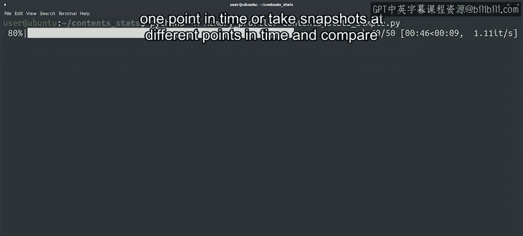

#  102：内存泄漏及如何防止 🧠💾

## 概述
在本节课中，我们将要学习什么是内存泄漏，它如何影响计算机系统，以及如何防止和诊断内存泄漏问题。我们将从基本概念开始，逐步深入到在不同编程语言环境下的具体表现和排查工具。

---

## 什么是内存泄漏？🤔

大多数应用程序需要将数据存储在内存中才能成功运行。

我们之前提到过，在用C或C++等语言编写程序时，进程如何与操作系统交互以请求内存块，然后在不再需要时释放它们。程序员负责决定请求多少内存以及何时归还。

由于我们是人类，有时可能会忘记释放不再使用的内存。

这就是我们所说的内存泄漏。当一块不再需要的内存没有被释放时，就会发生内存泄漏。

如果内存泄漏很小，我们甚至可能不会注意到它，并且它可能不会引起任何问题。

但是，当泄漏的内存随着时间的推移变得越来越大时，它可能导致整个系统开始运行异常。这可不妙。

---

## 内存泄漏的后果 ⚠️

当一个程序使用了大量内存时，其他程序将需要被交换出去，所有程序都会运行缓慢。

如果程序使用了所有可用内存，那么任何进程都将无法请求更多内存，系统会开始以奇怪的方式出错。

当这种情况发生时，操作系统可能会终止进程以释放一些内存，从而导致不相关的程序崩溃。

---

## 高级语言中的内存管理 🔄

你可能会想，如果我不打算用C或C++编程，我为什么要关心这个？确实，像Python、Java或Go这样的语言为我们管理内存，但如果我们不能正确使用内存，仍然可能出错。为了理解这是如何运作的，让我们看看这些语言做了什么。

首先，当我们创建变量时，它们会请求必要的内存。然后，它们运行一个名为“垃圾回收器”的工具，负责释放不再使用的内存。

为了检测何时需要释放内存，垃圾回收器会查看正在使用的变量及其分配的内存，然后检查是否有任何内存部分没有被任何变量引用。

---

## 垃圾回收器如何工作？🔍

例如，假设你在一个函数内部创建了一个字典。用它来处理文本文件，计算文件中单词的频率，然后返回使用最频繁的单词。

当函数返回时，该字典不再被引用，因此垃圾回收器可以检测到这一点并归还未使用的内存。

但是，如果函数返回了整个字典，那么它仍然在使用中，内存将不会被归还，直到情况不再如此。

当我们的代码持续让变量指向内存中的数据时，比如代码本身的变量，或者列表、字典中的元素，垃圾回收器就不会释放那块内存。

换句话说，即使语言为我们处理了内存的请求和释放，我们仍然可能看到与内存泄漏相同的效果。如果内存持续增长，代码可能导致计算机内存耗尽，就像内存泄漏一样。

---

## 内存泄漏的影响范围 📈

操作系统通常会在进程结束后释放分配给该进程的任何内存，因此内存泄漏对于短期运行的程序来说问题不大，但对于在后台持续运行的进程来说，可能变得尤其成问题。

比这些更糟糕的是由设备驱动程序或操作系统本身引起的内存泄漏。在这些情况下，只有完全重启系统才能释放内存。

假设你注意到你的电脑似乎经常内存不足。你观察一段时间内运行的程序，发现有一个进程随着时间的推移使用了越来越多的内存。如果你重启该进程，它开始时占用内存很少，但很快又需要越来越多。如果是这种情况，那么这个程序很可能存在内存泄漏。

---

## 如何诊断内存泄漏？🛠️

如果我们怀疑一个程序有内存泄漏，我们能做什么？

我们可以使用内存分析器来弄清楚内存是如何被使用的。与调试器一样，我们需要为应用程序的语言使用正确的分析器。

以下是用于不同语言的分析工具：

*   **对于分析C和C++程序**，我们将使用Valgrind，我们在之前的视频中提到过它。
*   **对于分析Python程序**，我们有许多不同的工具可供使用，具体取决于我们想要分析什么。我们可以详细到分析单个函数的内存使用情况，也可以宏观到监控一段时间内的总内存消耗。

使用分析器，我们可以看到在某个时间点哪些数据结构使用了最多的内存，或者在不同时间点拍摄快照并进行比较。

这些工具的目标是帮助我们识别哪些我们保存在内存中的信息实际上并不需要。

---

## 优化与总结 📝

在尝试更改任何内容之前，首先测量内存的使用情况非常重要。否则，我们可能优化了错误的代码段。

有时我们需要将数据保存在内存中，这没问题。但要确保只保留实际需要的数据，并释放任何你不会再使用的东西。这样，垃圾回收器就可以将内存归还给操作系统。

当然，如果你检查后发现内存使用正确，但仍然发现可用内存耗尽，那么可能是时候升级硬件了。

你把这些都记在“内存”里了吗？别忘了，关于内存分析，还有很多内容我们来不及涵盖，但我们在接下来的阅读材料中提供了关于其中一些分析工具的更多信息的链接。

接下来，我们将讨论另一种可能需要特别关注的资源：磁盘空间。

---

## 总结
本节课中，我们一起学习了内存泄漏的概念、成因及其对系统的影响。我们了解到，即使在有自动垃圾回收的高级语言中，不当的编程实践也可能导致类似内存泄漏的效果。最后，我们介绍了如何使用内存分析工具来诊断问题，并强调了在优化前进行测量以及适时释放无用数据的重要性。