#  104：网络饱和与性能分析 🚦

在本节课中，我们将学习网络性能的两个核心概念：**延迟**和**带宽**。我们将探讨它们如何影响网络连接的速度，以及在不同场景下如何优化网络性能。

---

## 网络性能的核心因素

在IT工作中，您会与遍布互联网的服务进行交互。有时您可能连接到本地网络上的服务，下一刻则使用位于不同大陆数据中心的服务。

如果网络连接良好，您可能无法分辨所浏览网站的托管位置。但如果处理速度不理想的网络服务，您可能需要获取有关所用连接的更多详细信息。

决定通过网络获取数据所需时间的两个最重要因素是连接的**延迟**和**带宽**。

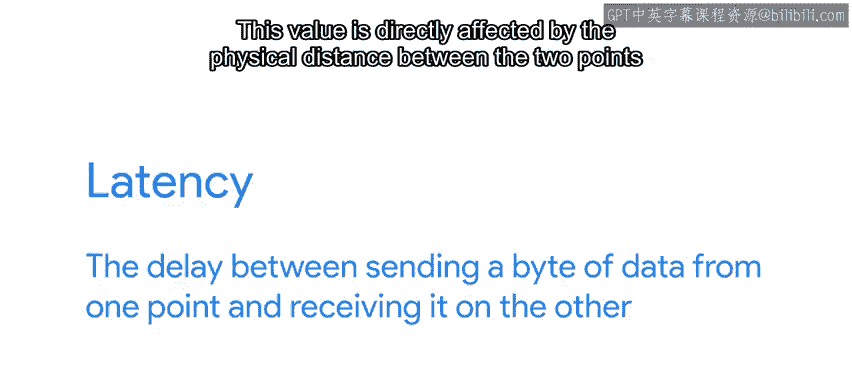

### 延迟

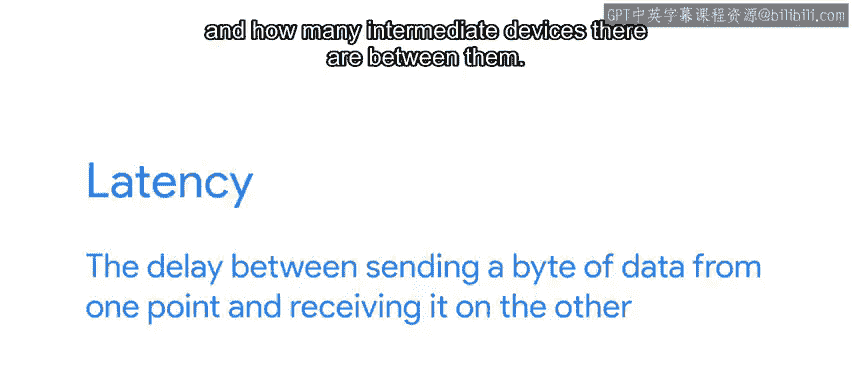

**延迟**是指从一点发送一个数据位到另一点接收它之间的延迟时间。

这个值直接受两点之间的物理距离以及它们之间中间设备数量的影响。

### 带宽

**带宽**是指每秒可以发送或接收的数据量。

这实际上是连接的数据容量。

互联网连接通常根据客户将看到的带宽量来销售。但需要注意的是，与网络服务之间传输数据的可用带宽将由每个端点以及它们之间每个跃点的可用带宽决定。

---

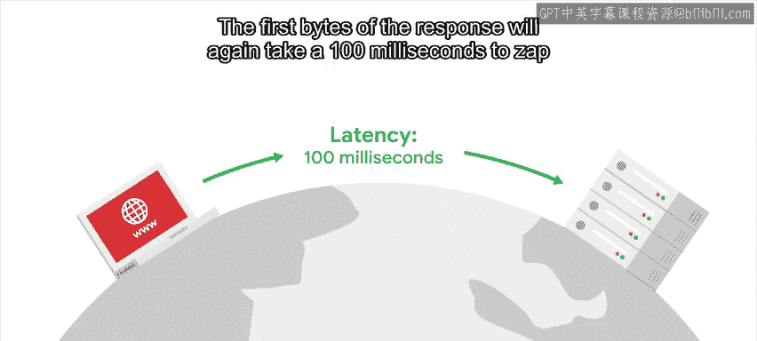

## 延迟与带宽的交互作用

为了理解延迟和带宽如何交互，请思考通过互联网访问网站时发生的情况。

如果Web服务器托管在海洋彼岸，延迟可能约为100毫秒。这是您的请求到达服务器所需的时间。

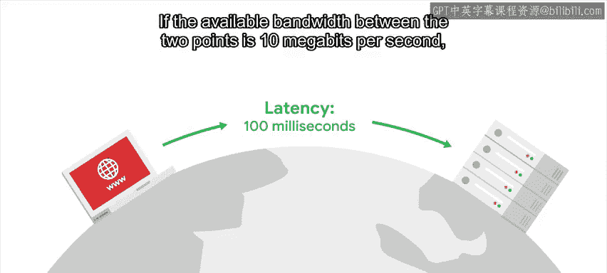

服务器随后会生成响应并将其发送回给您。

响应的第一个数据位将再次花费100毫秒跨越大洋到达您的计算机。

一旦响应开始传输，其余数据到达所需的时间就由带宽决定。

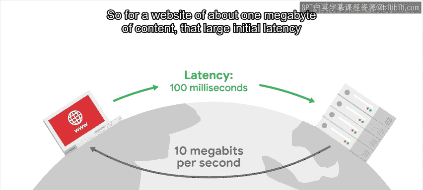

如果两点之间的可用带宽为每秒10兆比特，您将能够每秒接收1.25兆字节。因此，对于一个内容约为1兆字节的网站，由于初始延迟占总下载时间的额外20%，这个较大的初始延迟将很明显。

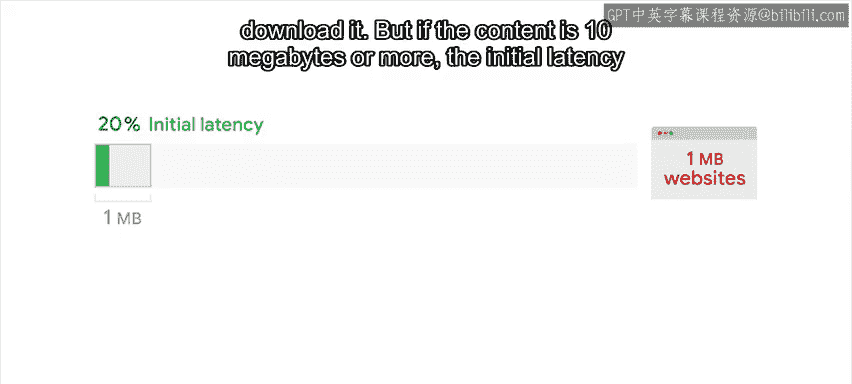

但如果内容是10兆字节或更多，初始延迟将小于总下载时间的5%，因此影响较小。

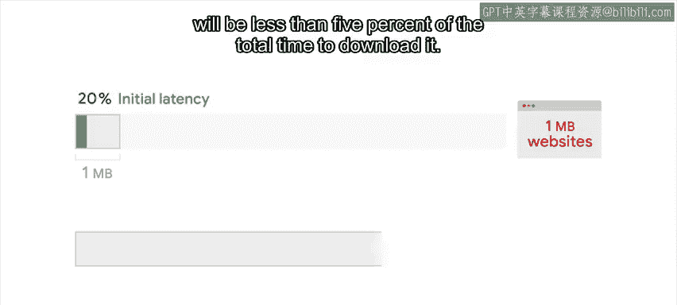

---

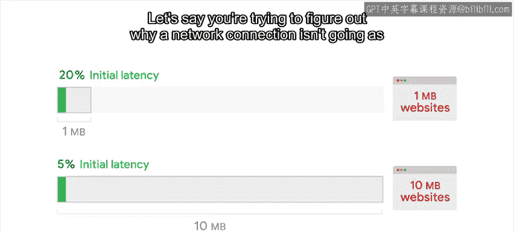

## 优化网络性能的策略

假设您正在尝试找出网络连接速度不如预期的原因。

请记住，如果您传输大量小数据片段，您更关心**延迟**而非带宽。

在这种情况下，您需要确保服务器尽可能靠近服务用户，目标延迟尽可能低于50毫秒，最坏情况下不超过100毫秒。

另一方面，如果您传输大块数据，您更关心**带宽**而非延迟。

在这种情况下，您希望拥有尽可能多的可用带宽，无论服务器托管在何处。

---

## 可用带宽与连接共享

“可用带宽”是什么意思？计算机可以同时与互联网的许多不同点传输数据。

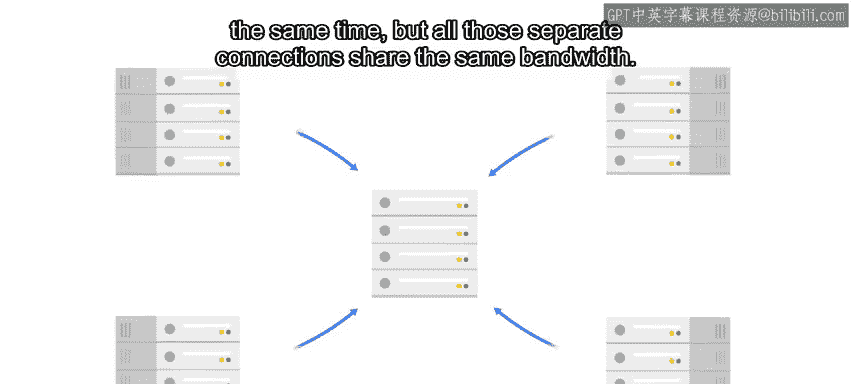

但所有这些独立的连接共享相同的带宽。

每个连接将获得一部分带宽。

但分配不一定均匀。

如果一个连接正在传输大量数据，可能就没有带宽留给其他连接。

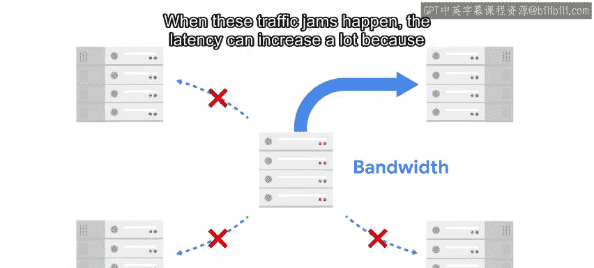

当发生这些流量拥塞时，延迟可能会大幅增加，因为数据包可能会被保留，直到有足够的带宽发送它们。

您可能已经在自己的计算机上经历过这种情况。如果您曾经同时运行多个使用同一网络的应用程序，整体连接速度可能会变慢。

您可以通过运行像`iftop`这样的程序来检查哪些进程正在使用网络连接。这显示了每个活动连接通过网络发送的数据量。

您可能还注意到，共享同一网络的用户越多，数据传入速度越慢。这对于家庭连接和办公室连接都是如此。

无论您拥有多少带宽，它都是一种有限资源。因此，您需要谨慎地在用户之间分配它。

---

## 流量整形与连接管理

如果某些应用程序使用了如此多的带宽，以至于其他应用程序无法传输更多数据，可以通过使用**流量整形**来限制每个连接占用的带宽。

这是一种通过为通过网络发送的数据包标记不同优先级来避免大块数据占用所有带宽的方法。

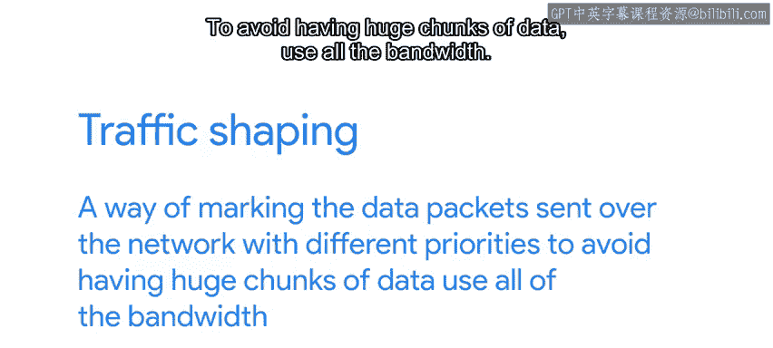

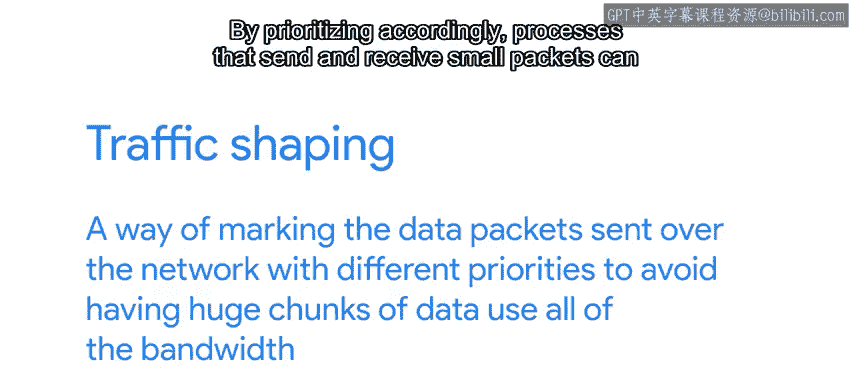

通过相应地设置优先级，发送和接收较小数据包的进程可以正常工作，而需要最多带宽的进程可以使用剩余带宽。

---

## 连接限制与资源管理

单台计算机上可以建立的网络连接数量也有限制。

这通常不是问题，但软件中可能存在错误，导致其打开过多连接或保持旧连接打开，即使它们不再使用。如果这种情况发生在服务器上，在保持这些连接打开的程序关闭它们之前，新用户将无法连接到它。

---

## 总结

在本节课中，我们一起学习了网络性能的两个关键指标：**延迟**和**带宽**。我们探讨了它们如何影响不同场景下的网络体验，例如传输小数据时延迟更重要，传输大数据时带宽更关键。我们还了解了可用带宽的共享性质、流量整形的作用以及连接管理的重要性。理解这些概念有助于诊断和优化网络性能问题。