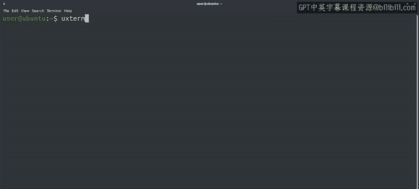
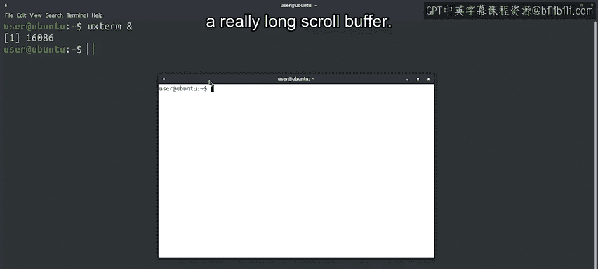
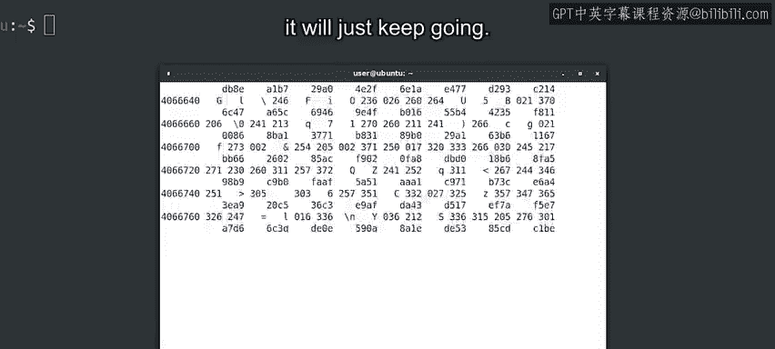
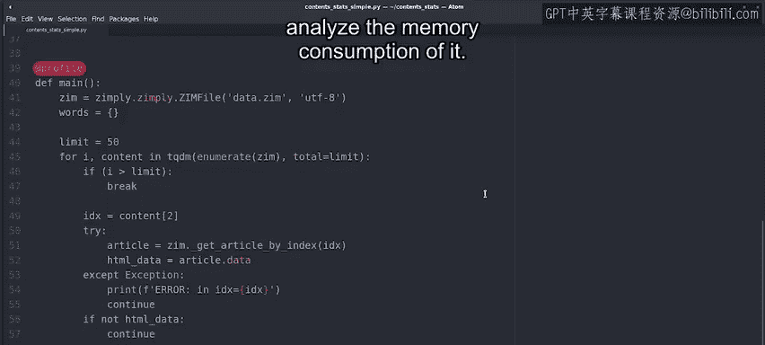
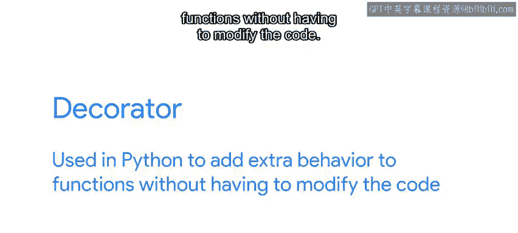
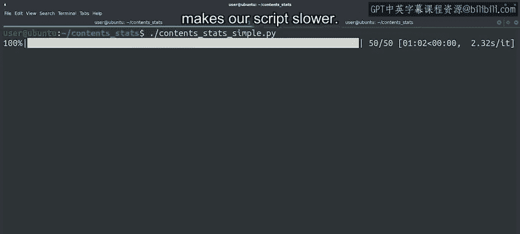

#  105：处理内存泄漏 🐛💾


在本节课中，我们将学习什么是内存泄漏，如何识别它们，以及如何使用工具来诊断和定位Python程序中的内存问题。

---



## 概述




应用程序可能因多种原因请求大量内存。有时这是程序完成任务所必需的，有时则是由软件行为异常引起的。本节我们将通过实例触发异常行为，观察其表现，并学习使用工具来诊断内存问题。

## 触发异常内存行为

首先，让我们自己触发一个异常行为来观察其表现。我们将使用一个名为`UXterm`的终端。

我们配置了这个终端，使其拥有一个非常长的滚动缓冲区。滚动缓冲区是一个方便的功能，允许我们向上滚动查看已执行的命令及其输出。



缓冲区的所有内容都保存在内存中。因此，如果我们将其设置得非常长并设法填满它，就会导致我们的计算机在正常使用下耗尽内存。在正常情况下，这可能需要很长时间才会发生。

但如果我们运行一个持续生成大量输出的命令，我们就能相当快地填满那个缓冲区。例如，我们运行一个像 `od -cx /dev/urandom` 这样的命令。

这个命令将读取由`/dev/urandom`设备生成的随机数，并以字符和十六进制数的形式显示它们。由于`/dev/urandom`设备会持续提供越来越多的随机数，这个命令将一直运行下去。

我们的命令正在填满滚动缓冲区，导致你的计算机需要越来越多的内存。在另一个终端中，让我们打开`top`命令来查看发生了什么。

按下 `Shift + M`，我们告诉`top`我们希望按程序使用的内存量对它们进行排序。我们看到`Xterm`使用的内存百分比正在飞速上升。

让我们通过按下 `Control + C` 来停止填满缓冲区的进程。这样，我们停止了填满缓冲区的命令，但终端仍然分配了那块内存，用于存储滚动缓冲区中的所有行。

## 分析 top 命令输出

让我们更详细地看一下`top`的输出。有一系列不同的列，显示每个进程的数据。

*   **RES列**：标记为特定进程保留的动态内存。
*   **SHR列**：用于跨进程共享的内存。
*   **VIRT列**：列出为每个进程分配的所有虚拟内存。这包括进程特定的内存、共享内存以及存储在磁盘上但映射到进程内存中的其他共享资源。进程在VIRT列中拥有较高的值通常是正常的。

通常指示问题的是**RES列**。

现在，让我们关闭另一个终端，以便它释放所有保留的内存。在这个例子中，我们看到了一个程序不断请求越来越多内存的样子。这是一个非常极端的例子。大多数内存泄漏不会以这种速度发生。

## 识别缓慢的内存泄漏

通常需要很长时间我们才会注意到一个程序占用了比它应该占用的更多的内存，并且可能很难区分实际需要的内存和被浪费的内存。

但是，查看`top`的输出并将其与之前的情况进行比较，通常是任何内存泄漏调查的开始方式。

让我们看另一个例子。我们有一个脚本，用于分析网页中单词的频率。当只有几个网页时，这个脚本运行良好，但如果我们尝试给它所有维基百科的内容，它就会开始耗尽所有内存。

让我们先运行它，看看会发生什么。好的，它正在运行，并且需要很长时间才能完成。毕竟，它正在处理大量的文章。

当这个程序运行时，让我们在另一个终端中查看`top`的输出，看看我们能发现什么。

我们看到有一堆不同的`content_stats`进程在运行。这是因为我们的脚本使用了我们在早期视频中看到的多进程技术，以并行化信息处理并尽可能快地获得结果。

看起来这些脚本占用了大量内存，所以让我们排序以查看详细信息。哇，我们看到其中一个进程使用的内存尤其持续增长。

应用程序正在处理大量数据并生成一个字典，因此预计它会使用一些内存，但不会这么多。这看起来像是程序在内存中存储了比它应该存储的更多的东西。

这个程序相当复杂，所以我们可以在这里使用内存分析器的帮助来找出问题所在。让我们现在停止它，并使用分析器来找出我们计算机的内存去了哪里。

## 使用内存分析器

为此，我们需要使用一个简化版本的代码，因为分析多进程应用程序的内存使用情况特别困难。并且，我们只处理几篇文章，而不是所有文章，以便我们可以快速检查内存消耗。

让我们打开我们简化的脚本看一看。



我们将使用一个名为 `memory_profiler` 的模块。这是Python可用的众多不同内存分析器之一。



我们在主函数定义之前添加了 `@profile` 这个标签，告诉分析器我们想要分析它的内存消耗。

```python
@profile
def main():
    # ... 函数代码 ...
```

这种类型的标签在Python中称为**装饰器**，它用于在不修改代码的情况下为函数添加额外的行为。在本例中，额外的行为是测量内存使用情况。



代码的其余部分基本上与原始代码相同，它只使用单个进程，并且限制为50篇文章，而不是另一个脚本要处理的数千篇文章。

我们启用了内存分析器来运行脚本。这只是读取50篇文章，但由于所有的内存分析，我们的脚本变慢了很多。

程序完成后，内存分析器会提供关于哪些行在增加或减少程序使用的内存中的数据。

第一列显示每行代码执行时所需的内存总量。
第二列显示每行特定代码导致的内存增量。

我们可以看到，在处理了50篇文章之后，程序已经占用了130兆字节的内存。难怪当我们试图处理所有文章时会耗尽内存。

我们可以看到，需要最多内存的变量是`article`和`text`，分别约为4兆字节和3兆字节。这些是我们正在处理的文章，当我们在计算文章中的单词时，它们占用空间是正常的，但一旦我们处理完一篇文章，我们就不应该再保留那块内存。

你能发现问题吗？在代码的最后，它存储了文章以保留对它的引用。但它存储的是整篇文章。如果我们想保留包含某个单词的所有文章的引用，我们可以存储标题或索引条目，绝对不是全部内容。

## 总结

本节课中，我们一起学习了内存泄漏的基本概念。我们通过极端和实际的例子，观察了程序异常占用内存的表现。我们学会了使用 `top` 命令来监控系统的内存使用情况，并识别出问题的进程。最后，我们引入了 `memory_profiler` 这个强大的Python工具，通过装饰器来精确分析代码中每一行的内存消耗，从而定位到导致内存泄漏的具体代码行（例如，不必要地存储了大量数据）。关于内存管理和内存分析，还有更多内容，我们将在后续阅读材料中提供更多资源链接。