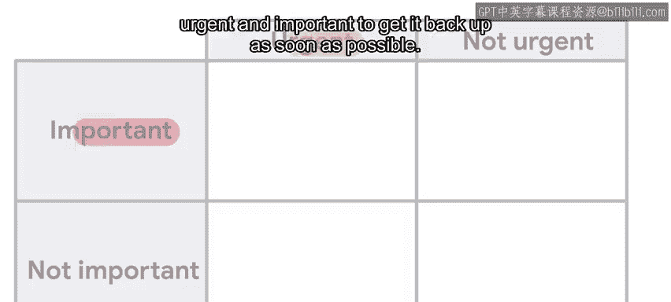
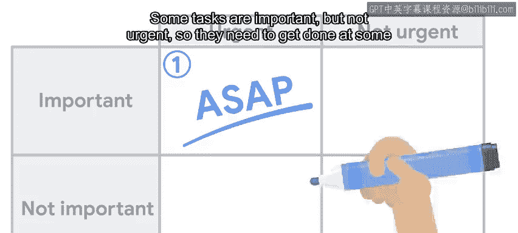
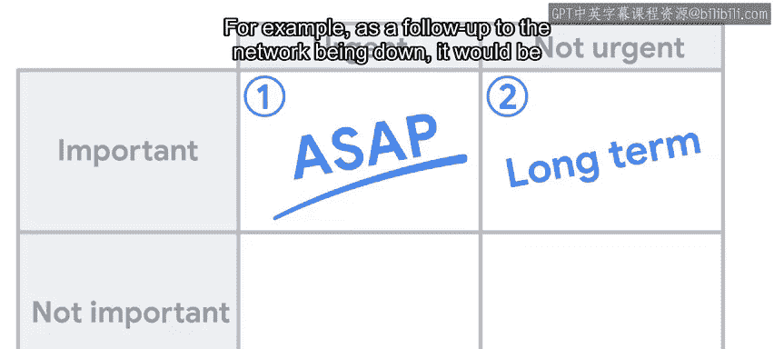
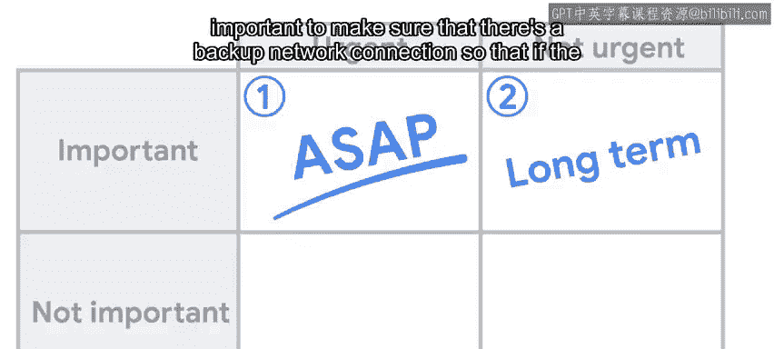
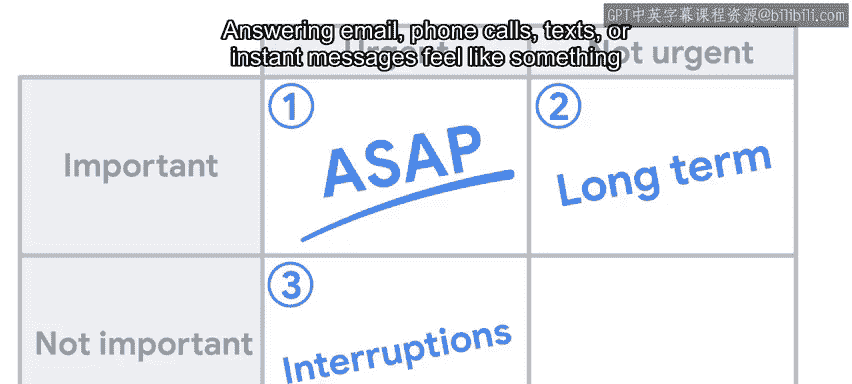
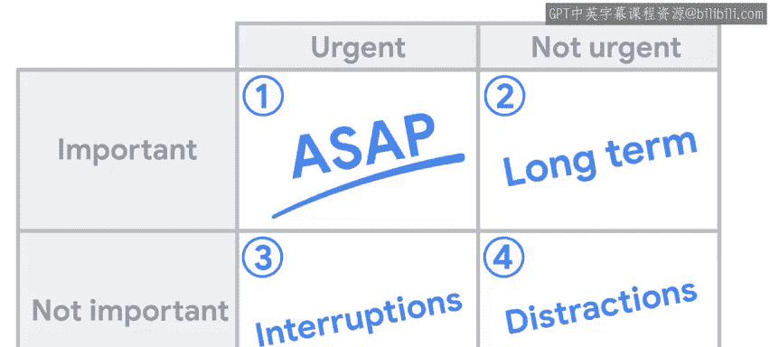
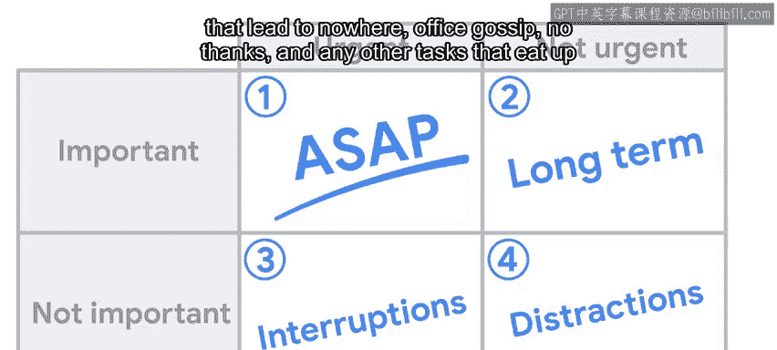
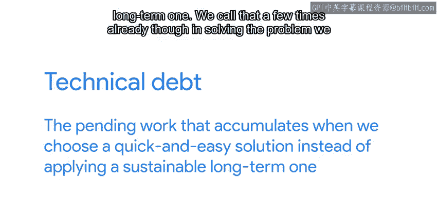

#  106：48_专注于重要任务 🎯

在本节课中，我们将学习如何有效管理工作中最宝贵的资源——时间。我们将介绍一种名为“艾森豪威尔决策矩阵”的工具，帮助你区分任务的紧急与重要程度，从而将精力集中在能创造最大价值的工作上。

---

在之前的课程中，我们讨论了如何更好地利用计算机和系统中的资源，如CPU、内存、磁盘和网络。然而，在我们的日常工作中，还有一种资源更为宝贵，那就是我们作为人类的时间。我们需要确保将时间花在有意义的活动中，例如享受工作本身以及从出色完成的工作中获得满足感。在工作中，我们需要优化时间投入，为公司带来最大价值。找到正确的平衡点很困难，但这正是我们在此要探讨的。

从更新日历到戒除社交媒体，优化时间的方法多种多样。😊 在IT领域工作时，一个极其有效的方法是**艾森豪威尔决策矩阵**。

使用此方法时，我们将任务分为两个不同的类别：**紧急**和**重要**。

以下是任务分类的详细说明：

**重要且紧急的任务**
这类任务需要立即处理。例如，如果公司的网络连接中断，尽快恢复它既是紧急的也是重要的。

**重要但不紧急的任务**
这类任务需要在某个时间点完成，即使需要花费较长时间。例如，作为网络中断的后续跟进，确保有备用网络连接非常重要，这样如果现有网络再次中断，公司可以使用备用连接保持在线。

**紧急但不重要的任务**
许多我们需要处理的干扰都属于此类。回复电子邮件、接听电话、短信或即时消息感觉像是需要立即做的事情，但大多数时候并非最佳利用时间的方式。

**既不重要也不紧急的任务**
这些是干扰和时间浪费，根本不应该做。这包括讨论无用的会议、没有结果的电子邮件线程、办公室八卦等。任何消耗我们时间却无法带来任何有价值回报的任务都属于此类。

总的来说，为了充分利用时间，我们需要确保将大部分时间花在重要的任务上。当然，我们也希望尽快处理紧急任务，但需要为长期规划和执行预留时间。在长期任务上花费时间可能不会立即见效，但在处理重大事件时可能至关重要。

例如，设置基础设施以便轻松回滚更改或在需要时部署新服务器，需要花费大量时间。但对未来的投资可以在响应问题时，为你节省更多时间并减少用户的困扰。研究新技术是此类中的另一项任务。IT领域不断发展，留出时间保持更新非常重要。例如，判断是否该将Web服务器迁移到不同的软件、将邮件服务器更新到新的操作系统版本，或在整个公司部署IP语音。

另一项可能不紧急但很重要的任务是解决**技术债务**。在IT领域工作时，你会经常听到这个术语。它是什么意思？技术债务是指当我们选择快速简单的解决方案，而不是采用可持续的长期解决方案时，所积累的待处理工作。

我们已经多次提到，在解决问题时，我们可能会应用短期补救措施来立即修复，然后计划长期解决方案以防止未来再次发生。在我们找到持久的修复方案之前，我们创建的变通方法就是技术债务，因为我们需要花费时间来维持它，即使它不是最佳解决方案。每当我们选择短期解决方案并将长期解决方案留待以后处理时，我们就在制造技术债务。这在当时可能是正确的决定，以使我们摆脱危机并让用户恢复工作。但我们需要随后安排时间应用长期解决方案，这将使我们未来的工作更轻松。

技术债务也可能由外部因素产生。例如，当我们使用的软件发布新版本时，我们需要安排时间进行升级。在我们完成升级之前，这个待定的升级就是技术债务。

好的，我们已经明确需要将工作重点放在重要的任务上。但对于那些紧急但不重要的干扰，我们能做些什么呢？

如果你从事IT支持工作，被打断是不可避免的，这是角色的一部分。因此，你需要计划如何有效地处理这些干扰。如果你在团队中工作，可以轮换处理这些干扰的人员。例如，可能上午由某人负责，下午换另一个人，或者每天轮流。如果你独立工作，可以尝试建立一套用户可以在正常请求时联系你的固定时间，其余时间只处理紧急情况。这里的关键是预留一段不会被中断的时间窗口。那是你可以完成最重要任务的时间，那时你可以完全专注于处理复杂问题和寻找棘手问题的解决方案。

根据你的角色和公司的工作方式，你可能需要在不同的地点完成这项工作，以避免人们走到你的办公桌前，或者主动静音所有通知，以避免被不重要的对话打断和分心。

好的，假设你已经设法留出一些时间来处理这些重要但不紧急的任务。你如何确保自己以正确的优先级处理正确的事情呢？这将在我们的下一个视频中揭晓。

---

**总结**
本节课我们一起学习了如何通过艾森豪威尔决策矩阵来区分任务的紧急与重要程度。我们明确了应将主要精力投入**重要**的任务，并学会为处理重要但不紧急的长期任务（如解决技术债务、研究新技术）预留时间。同时，我们也探讨了如何通过轮岗或设定专注时间段等策略，来有效管理那些紧急但不重要的干扰，从而最大化我们的时间价值。