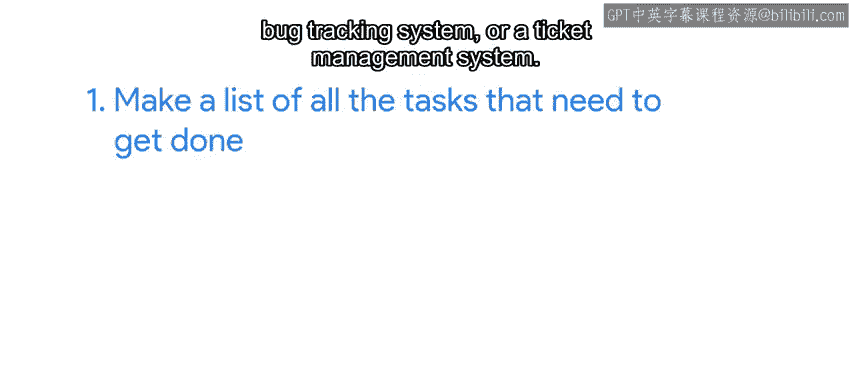
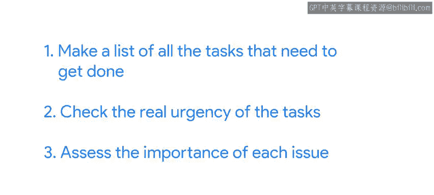
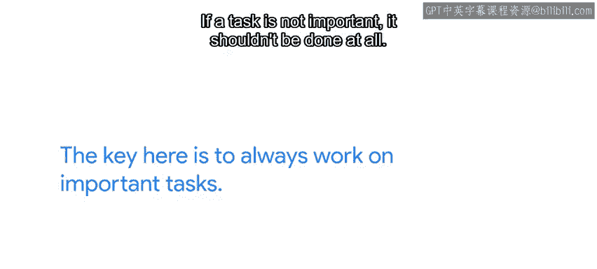

#  107：任务优先级管理 🎯

## 概述

在本节课中，我们将学习如何有效管理IT工作中的多项任务。当所有任务看起来都既重要又紧急时，我们需要一个系统来帮助我们确定处理顺序，从而高效利用有限的时间。

---

## 任务管理的核心挑战

上一节我们介绍了为重要但不紧急的任务安排时间。本节中我们来看看当所有任务都显得既重要又紧急时，我们该如何应对。

例如，你可能需要：
*   为明天入职的新同事部署一台新电脑。
*   升级VPN服务到最新版本，因为旧版本存在安全漏洞。
*   修复一个权限问题，该问题导致一组用户无法访问库存数据。
*   检查邮件系统的问题，该问题导致部分邮件被随机拒收。

面对如此多的事项，很容易失去头绪。每个人的工作方式不同，你需要找到最适合自己的系统，但我们可以先了解一个能帮助我们组织和确定任务优先级的基本框架。

---

## 第一步：列出所有任务 📝

以下是创建任务清单的步骤：

首先，将所有需要完成的任务列成一个清单。你可以使用：
*   一张纸
*   电脑上的一个文本文件
*   缺陷跟踪系统
*   工单管理系统

关键是**将所有任务集中列在一个地方**，避免依赖你那并不总是完美的记忆力。

---

## 第二步：评估紧急性与重要性 ⚖️

列出清单后，你可以开始检查任务的真实紧急性。

问自己：**如果今天不做某项任务，是否会发生不好的事情？** 如果答案是肯定的，那么这些任务应该优先处理。

完成最紧急的任务后，你可以查看清单的其余部分，评估每个问题的重要性。

即使所有事情看起来都很重要，你也应该能分辨出某些事情比其他事情更重要。例如：
*   一项能让更多人受益的任务比一项让较少人受益的任务更重要。
*   如果有一堆不同的任务都依赖于你完成其中一项，那么这项“阻塞性”任务就比其他任务更重要。

如果仍然觉得所有事情都“火烧眉毛”，可以尝试将任务分组为：**最重要、重要、不太重要**，然后在每个组内对任务进行排序。但不要花太多时间在排序上。最终，**精确的顺序并不重要，重要的是你将大部分时间花在最重要的任务上**。

如果你与团队合作，最好在团队成员之间共享任务清单和优先级标准。这有助于避免重复工作并产生不同的优先级判断。

---

## 第三步：估算任务规模 📏

确定需要处理的最重要任务后，你需要对它们所需的工作量有一个大致的了解。

这不是关于精确计时，而是分配大致规模。一种常见的技术是使用**小、中、大**来标记。当规模范围足够大时，如果需要，可以加入**特小**或**特大**。

---

## 第四步：执行任务与应对干扰 🚀

一旦识别出最重要的任务及其规模，就可以开始处理它们。

如果可能，尝试从**规模最大且最重要**的任务开始，以便首先解决它们。但正如我们指出的，当我们的工作涉及IT支持时，我们知道必须处理各种干扰。在被打断的情况下处理复杂任务会非常令人沮丧。

对此，一个有用的策略是：**将最复杂的任务留给你最不可能被打扰的时间段**。如果你知道自己上午最忙，而下午往往有更安静的时间，那么合理的做法是：在一天早些时候处理简单快速的任务，将最复杂的任务留到后面，那时你将有更多时间集中精力。

但当你的专注时间开始时，你应该确保自己是在处理那些大型复杂任务，而不是简单任务。否则，复杂任务将永远无法完成。**这里的关键是始终处理重要任务**。如果一个任务不重要，那根本就不应该做。我们在谷歌就遵循这条规则。

然后，根据紧急性和你能投入的时间来选择要处理的任务，从你能在可用时间内完成的最大任务开始。

但请记住，这不应阻止你休息或从事实验性项目。休息很重要，因为它能让我们的创造性思维保持活力；而从事一个有趣的副项目可以帮助我们研究新兴技术并产生新想法。你知道吗？这个证书项目本身最初就是谷歌的一个副项目。

---

## 第五步：当任务过多时怎么办？ 😅

但是，如果不可思议的事情发生了怎么办？如果在所有这些优先级排序、规模估算和排序之后，仍然有太多工作要做而时间太少，我们该怎么办？

首先要明白：**这很正常**。大多数IT工作者都有太多事情要做，无法完成所有他们想做的事情。不幸的是，我们人类还不能按需复制自己，而长期加班是不可持续的。

这意味着基本上有两种选择：
1.  从其他团队成员那里获得额外帮助。
2.  决定某些任务实际上并没有那么重要，因此不会去做。

对于这两种选择，你都需要让其他人（比如你的经理）参与进来，并确保清晰地沟通期望。

---

## 区分任务类型：小任务与大项目

有些任务，例如修复目录权限、更换故障键盘或在单台计算机上安装新应用程序，可以是**独立**的，并且能在短时间内完成。

其他任务，例如将数据库软件升级到新版本、自动化创建用户账户，或编写适配器来协调不兼容的程序，则是**更大的项目**，可能需要数天甚至数周才能完成。

当遇到后一种情况时，**对任务完成所需时间进行粗略估计，并向受影响的人清晰地传达期望**，就显得非常重要。我们将在接下来的几个视频中详细讨论这两个方面。

---

## 总结

本节课中我们一起学习了任务优先级管理的基本框架。我们了解到，面对众多任务时，应首先列出清单，然后评估其紧急性与重要性，接着估算任务规模，并策略性地安排执行时间以应对干扰。最后，我们认识到当工作量超出负荷时，寻求帮助或重新评估任务重要性是必要的步骤，并且清晰沟通期望至关重要。