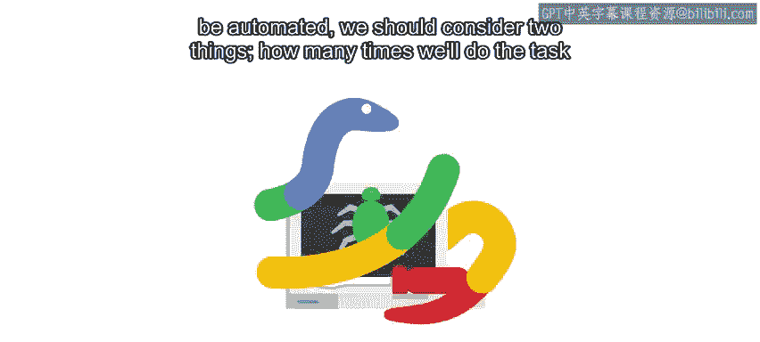
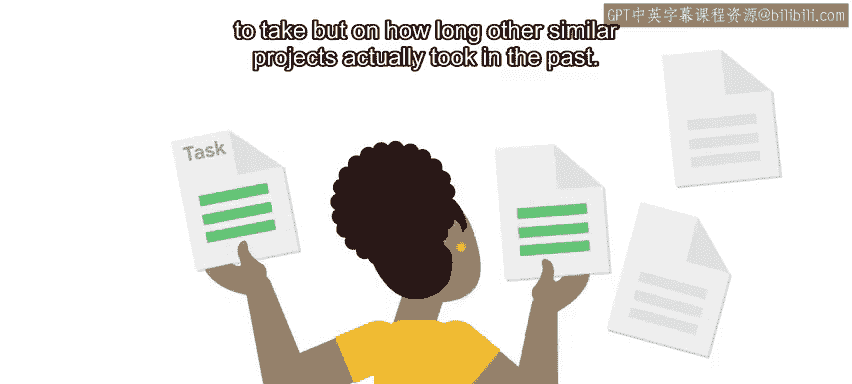
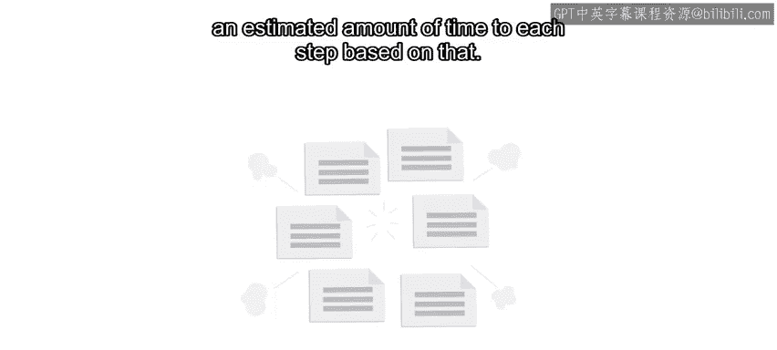
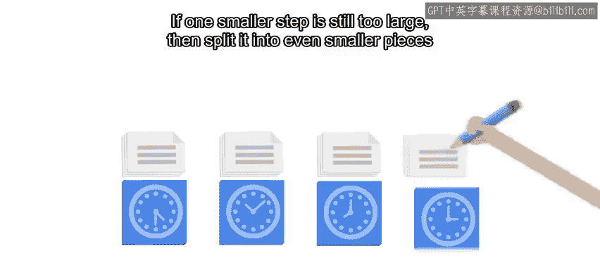

#  108：如何估算任务所需时间 ⏱️

在本节课中，我们将学习如何为一个任务（尤其是自动化任务）估算所需时间。我们将探讨为何估算容易出错，并学习一种基于过往经验、将大任务拆解为小步骤的系统性估算方法。

---

## 概述：为何估算时间如此困难？

在决定是否将一个手动任务自动化时，我们通常会考虑两个因素：**任务在一定时间内执行的频率**和**手动执行一次所需的时间**。通过这两个因素，我们可以判断手动执行的总时间是否超过了编写自动化脚本所需的时间。

然而，问题在于：**在我们实际完成自动化之前，我们无法确切知道编写它需要多久**。我们只能进行估算，而人类通常非常不擅长估算任务耗时。

---

## 克服过度乐观的倾向

我们往往对编写一段代码或搭建某个基础设施所需的时间过于乐观。通常，我们的第一反应是基于“理想状态”来思考：即我们能全神贯注且完全理解问题时的效率。我们忘记了可能会遇到的许多障碍，例如：

*   遇到不知如何修复的 Bug。
*   被更紧急的问题打断。
*   发现新工具与现有工具不兼容。

因此，在估算项目（无论大小）的完成时间时，**你需要保持现实**，避免过度乐观。

---

## 基于过往经验进行估算

避免过度乐观的最佳方法是：**将你当前的任务与你过去完成的类似任务进行比较**。

这样，你的估算就不是基于“你希望项目花多久”，而是基于“过去类似项目实际花了多久”。

如果手头的任务很大，可能很难找到足够相似的参照物。这时，你需要将其拆解。

---

## 拆分任务：化整为零的估算方法

为了更好地估算一个超乎寻常的大项目，你需要将其切分。

**以下是拆分任务的步骤：**

1.  **将任务拆分为更小的步骤。**
2.  将每个小步骤与你过去完成的类似任务进行比较。
3.  基于比较，为每个步骤分配一个预估时间。

如果某个小步骤仍然太大，就继续将其拆分成更小的部分，直到每一部分都能与你过往的经验进行比较。

---

## 整合与缓冲：应对未知的挑战

当你获得了所有小步骤的预估时间后，将它们相加，就能得到整个任务的粗略估算。

但即使这个总和也仍然是乐观的，因为**将所有部分整合在一起需要额外的时间**。

因此，在得到所有步骤的总时间估算后，你需要**为“整合”环节预留一些额外时间**。这个预留时间也应基于过往经验：回想一下以前整合项目各部分花了多久，就能大致知道该增加多少。

---

## 应用“经验乘数”因子

要知道，即使我们基于过往经验进行估算，得出的数字也往往接近“最佳情况”。我们无法预知所有未知的障碍。

因此，请**将这个估算值乘以一个系数**。同样，这个系数最好基于你过去的经验。

例如，如果你上次做类似估算时，实际花费的时间是计划的三倍，那么这次就将你的估算乘以 3。

这看起来像是在夸大数字，但请记住：我们的目标是获得一个**扎实的、接地气的**任务完成时间估算。这意味着要将那些你肯定会遇到但尚未知晓的障碍考虑进去。

---

## 记录、沟通与迭代

无论我们的估算多么详细，最终结果都很难与实际耗时完全吻合。但它能给我们一个大致的概念：任务是需要几小时、几天、几周还是几个月来完成。

一旦完成估算，**请将其记录下来**，以便日后检查你的估算与实际结果的差距。你可以根据这个差距来调整未来的估算。

同时，**务必与相关方沟通**，让他们知道任务预计何时完成。我们将在下一个视频中更详细地讨论沟通技巧。

---

## 总结

本节课我们一起学习了如何系统性地估算任务时间。核心方法是：**基于过往经验，将大任务拆解为可比较的小步骤，分别估算后求和，并为整合过程与未知风险预留缓冲时间（通常通过乘以一个经验系数来实现）**。记住要记录估算并与实际结果对比，以持续改进你的估算能力。