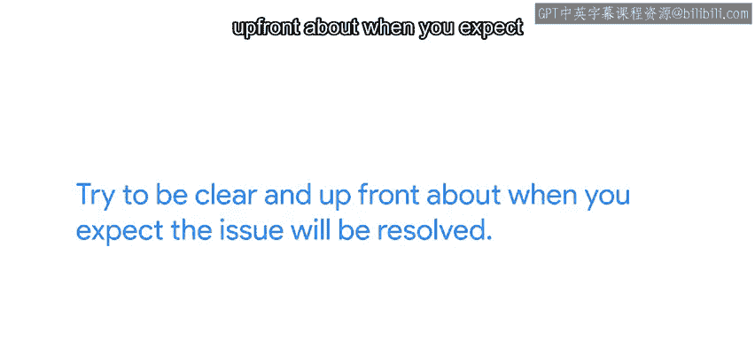

#  109：沟通预期 - 第51课 📢

在本节课中，我们将学习如何在与用户沟通时有效管理他们的预期。这包括理解用户的隐含期望、主动沟通时间安排、处理优先级冲突，以及通过一些实用技巧提升工作效率。

---

## 理解用户期望 🤔

上一节我们介绍了课程概述，本节中我们来看看如何理解用户的期望。

当你处理一个影响一个或多个用户的问题时，你可能会感到压力，需要满足你所帮助的人设定的期望。每个人对于你解决问题所需的时间以及他们何时能期待解决方案都有自己的想法。如果问题是用户把咖啡洒在键盘上需要更换，用户的期望是更换键盘将是一个非常小的任务，几乎不花时间。如果问题是即将有一位新员工入职，需要为他们设置一台新电脑，用户的期望是这将比更换键盘花费更长的时间。

即使我们有一个自动化的流程来设置新电脑，这意味着几乎不需要手动工作，理解这些隐含的期望并告知用户解决问题是否比他们预期的要长，对于成功的互动至关重要。如果问题在用户的期望内得到解决，他们会感到满意；但如果花费的时间比他们想象的要长得多，他们会变得沮丧。

---

## 主动沟通与时间管理 ⏰

上一节我们探讨了理解期望的重要性，本节中我们来看看如何主动沟通并管理时间。

只要我们尽早与他们沟通情况，他们就能够理解并根据情况安排自己的时间。假设你需要更换一个键盘，但没有备用件。这意味着你需要购买一个新的，甚至可能需要购买一整批以备下次使用。在这种情况下，提前与用户沟通更换需要更多时间非常重要。然后，评估更换的紧急程度。

以下是评估紧急程度时可以考虑的两种情景：

*   **情景一：** 用户是一名会计，正在处理需要在一小时内发送给银行的工资存款单，否则没人能按时收到工资。你可能选择把你的键盘先给他用，同时去最近的硬件店购买另一个。
*   **情景二：** 用户可以先用笔记本电脑工作，直到第二天新一批键盘按计划到货。这样你就不需要特意去提前获取更换件。

---

## 处理优先级冲突 🚦

上一节我们讨论了时间管理，本节中我们来看看当多个任务冲突时如何处理。

同样重要的是，让用户知道是否存在任何可能延迟响应他们需求的优先级冲突。假设一个用户打电话请求访问一个共享资源，但你正在处理一个导致公司数据库离线的问题。即使用户的请求解决起来快速简单，修复数据库是至关重要的，并且影响整个公司，因此在这种情况下应该优先处理。确保告诉用户你正在处理一个紧急事件，并将在危机解决后帮助他们处理请求。让他们知道他们的问题预计何时能得到解决，以便他们计划下一步行动。

因此，作为一个通用规则，**沟通是关键**。尽量清晰、提前地说明你预计问题何时能解决。如果出于任何原因，问题到时没有解决，解释原因以及新的预期时间应该是怎样的。

---

## 应对复杂问题与使用工单系统 🐛

不幸的是，当你试图解决的问题涉及故障排除和调试时，通常很难准确估计修复问题需要多长时间。请注意一个主题：**估计执行更复杂工作所需的时间是困难的**。你的很多时间将花在调查、研究正在发生的事情以及弄清楚应该发生什么上。

在这种情况下，确保让用户知道他们何时可以期待关于他们问题的更新，并在可能时及时提供更新。让用户通过工单跟踪系统提交他们的请求是一个非常好的主意。

使用这样的系统有很多优势。以下是使用工单系统的主要好处：

*   **任务组织：** 将所有你需要做的工作集中在一处，让你可以按优先级组织任务。
*   **时间管理：** 通过系统而不是电话或聊天接收问题报告，让你能更好地利用时间。你可以决定何时查看问题列表，而不是在任务中途被打断。
*   **更新便捷：** 当你对你一直在处理的问题有更新时，你可以轻松地更新工单，而不必追踪用户来告知他们请求的进展。

---

## 实用技巧与自动化 🛠️

最后，在与用户打交道时，尝试一些实用的快捷方式。花时间思考你所做的工作，并找出避免中断和节省时间的方法是有意义的。

以下是几个可以节省时间的实用技巧：

*   **更换外设：** 例如，如果用户告诉你他们的鼠标不工作，你的第一反应可能是亲自去检查，然后在必要时带一个新的过去。但这需要很多来回。相反，你可以要求用户将有问题的鼠标带给你，以便你在自己的电脑上测试。如果坏了，就换一个新的。甚至更好的是，如果你信任你的用户，你甚至可以留出一套鼠标、键盘和其他配件，供用户在正在使用的设备损坏时取用。我们在谷歌就是这样做的，这为我们节省了大量时间和挫败感。
*   **备用电脑：** 同样地，如果公司的预算允许，你可以准备几台备用电脑随时可用。这样，当一台电脑出现故障时，你可以让用户尽快恢复工作。然后你可以按照自己的节奏调试有故障的电脑。

但并非所有问题都能通过备用设备解决。有时，花时间改进你的基础设施可以帮助你用更少的时间完成更多工作。自动化流程，如安装新电脑、设置新用户账户、部署虚拟机或将更改回滚到先前版本，可以在你响应事件时帮助你节省大量时间。

---

## 总结 📝

本节课中我们一起学习了有效沟通预期的重要性。我们探讨了如何理解用户的隐含期望、主动沟通时间安排、处理任务优先级冲突，以及利用工单系统和实用技巧（如准备备用设备、自动化流程）来提升IT支持工作的效率。记住，清晰、主动的沟通是管理用户期望和建立信任的关键。