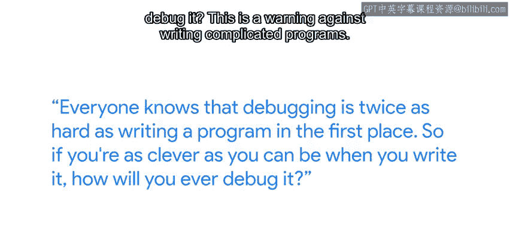

#  110：课程 52: 处理困难问题 🧩

在本节课中，我们将探讨为何调试工作有时会异常困难，并学习一些实用的策略来更有效地应对和解决复杂的技术问题。

---

你可能会疑惑，为什么调试如此困难，以至于我们需要用一整门课程来学习它？布莱恩·柯尼汉，Unix 操作系统的早期贡献者之一，也是著名的《C 程序设计语言》一书的合著者，曾说过一句名言：“众所周知，调试的难度是首次编写程序的两倍。”

所以，如果你在编写程序时已经竭尽所能地展现聪明才智，那么你将来又该如何调试它呢？

这实际上是对编写复杂程序的一种警告。如果代码清晰、简单，那么调试起来会比那些“聪明”但晦涩的代码容易得多。这个道理同样适用于 IT 系统。如果一个系统设计得过于“巧妙”，当它出现故障时，理解其内部状况将变得极其困难。因此，专注于构建简单易懂的系统和应用程序至关重要，这样当问题发生时，我们才能快速找到修复方法。

那么，我们该如何做到这一点呢？

以下是一些实用的建议：

**首先，以小块、易于理解的方式开发代码。** 我经常停下来测试已经写好的部分。最困难的事情莫过于在完成整个程序后才第一次运行它并进行调试，因为出错的可能性实在太多了。

**其次，保持目标清晰。** 如果你在编写代码，可以尝试在实际编码之前先为程序编写测试，这有助于你专注于目标。如果你在构建系统或部署应用程序，那么记录下最终目标以及实现步骤的文档会非常有帮助，它既能让你保持正轨，也能帮助发现沿途可能出现的问题。

我们在课程开始时提到，解决技术问题有点像一门艺术，当一切豁然开朗时，它会带来乐趣。然而，故障排除和调试最糟糕的部分，莫过于我们陷入困境的时候 😊。

当我们想不出程序失败的其他原因，或者不知道还能做什么来修复它时，就会感到束手无策。在本课程中，我们为你提供了一系列可以遵循的工具和流程，希望能帮助你避免在许多情况下陷入困境，但我们无法涵盖所有情况。你仍然可能会遇到一个完全不知道该如何处理的问题，这很正常。

如果你身处困境，首要任务是保持冷静。我们需要创造力来解决问题，而创造力的最大敌人就是焦虑。所以，如果你觉得自己已经黔驴技穷，最好暂时把问题放一放。也许去喝杯咖啡，或者到外面散散步。有时，环境的改变正是我们获得新灵感、发现遗漏之处的关键。这在编码和生活中都是如此。

如果你试图解决的问题很复杂，并且影响到很多人，在众人等待的情况下进行彻底调试会带来巨大压力。因此，更好的做法是首先专注于短期解决方案，让受影响的人能够恢复工作，然后再寻找长期的根治方案。

同时，不要害怕寻求帮助。有时，仅仅向他人解释问题本身，就能帮助我们意识到自己遗漏了什么。有一种技巧叫做“橡皮鸭调试法”，就是简单地向一只橡皮鸭解释问题。这听起来有些异想天开，你可能会显得有点古怪，但它确实有效。因为当我们强迫自己解释问题时，我们其实已经开始从不同角度思考这个问题了。

记住，没有人无所不知。有时，学习新技能和技巧的最佳方式就是向他人求助。我们都在共同面对这些挑战。有时候，我知道如果我在一个问题花上足够多的时间，我可能会找到解决方案。但这是对我时间的最佳利用方式吗？通常，更好的答案是向有经验的人请教，以节省时间和减少挫败感，然后把当前问题当作一个持续学习的机会，这样下次我就能独立完成了。

当你向同事寻求帮助以解决一个 bug 时，注意不要直接告诉他们你认为问题的根本原因可能是什么。相反，告诉他们问题的症状，看看他们会提出什么问题，探索哪些可能性。他们可能会提出完全不同的排查路径。

当然，如果我们能完全避免问题，IT 专家的生活将会轻松得多。在接下来的课程中，我们将探讨一些主动的方法，以便在问题影响到任何用户之前就发现它们。

---

**本节课总结：**
我们一起学习了调试工作为何具有挑战性，以及应对复杂问题的关键策略：保持代码和系统的简洁性、分块开发与测试、明确目标、在困境中保持冷静并适时休息、优先实施短期解决方案、勇于并善于向他人寻求帮助。掌握这些方法将帮助你在面对技术难题时更加从容和高效。