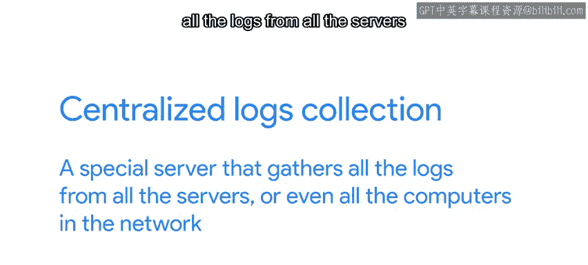

#  111：积极主动的实践 🛡️

## 概述

在本节课中，我们将学习如何在IT自动化工作中采取积极主动的策略，以预防和高效处理软件中的“Bug”。我们将探讨一系列实践方法，包括测试、部署、日志记录和文档编写，旨在帮助我们在问题影响用户之前发现并解决它们，或在问题发生时能更快速地进行故障排除。

---

## IT专家与Bug处理 🐛

IT专家和“Bug处理者”有一个共同点，那就是都需要处理“Bug”。无论是我们自己的软件还是他人的软件，我们都会遇到许多触发程序各种故障的Bug。

我们可以采用一系列策略，通过在问题影响用户之前捕获它们，或通过拥有更好的信息来简化故障排除，从而使我们的工作更轻松。我们之前已经零散地提到过其中一些策略。但现在，是时候深入探讨了。

为了避免在服务中断时手忙脚乱地修复问题，拥有能让我们提前测试变更的基础设施非常有帮助。这样，我们可以在变更到达用户之前，检查一切是否按预期运行。

---

## 编写与运行测试 ✅

上一节我们提到了提前测试的重要性。本节中，我们来看看具体如何通过测试来保障代码质量。

如果我们是代码的编写者，可以做的一件事是确保我们的代码具有良好的单元测试和集成测试。如果测试对代码的覆盖度很高，我们就可以依赖它们来捕获各种Bug，尤其是在有变更可能破坏现有功能时。

为了让这些测试真正有意义，我们需要经常运行它们，并确保在它们失败时能第一时间知晓。设置持续集成（CI）可以帮助实现这一点。

以下是实施测试的关键点：
*   **编写全面的测试**：包括单元测试（测试单个函数或模块）和集成测试（测试模块间的交互）。
*   **实现高覆盖率**：确保测试覆盖了代码的大部分逻辑分支。
*   **集成到CI流程**：自动运行测试，并在失败时立即通知团队。

---

## 建立测试环境与分阶段部署 🚦

仅仅在本地运行测试还不够。接下来，我们探讨如何在更接近真实场景的环境中验证软件。

朝着这个方向迈出的另一步是拥有一个测试环境，我们可以在将新代码发布给所有用户之前，先部署到这个环境中。这有两个目的。

首先，我们可以对软件进行全面的检查，就像用户看到的那样。根据软件的性质和更新频率，我们可以在这个环境中进行自动化和手动测试。

其次，我们可以使用这个测试环境在问题发生时进行故障排除。我们可以尝试可能的解决方案和新功能，而不会影响生产环境。

更进一步，在管理大量计算机时，另一个推荐的做法是分阶段或“金丝雀”式部署软件。这意味着，与其同时升级所有计算机（并可能同时破坏所有计算机），不如先升级一部分计算机，并检查它们的行为。如果一切顺利，你可以再升级更多计算机，依此类推，直到你有足够信心升级剩余的计算机。

正如谚语所说，“像煤矿里的金丝雀一样”。为了最好地利用这种实践，我们需要能够轻松地回滚到之前的版本。根据软件的不同，这可能或多或少需要一些基础设施，但请相信，花时间设置这些额外的基础设施是值得的。如果你部署了一个有问题的软件版本，突然之间你的一批计算机无法正常工作，你会希望尽快将它们回滚到之前的状态。

---

## 记录日志与集中监控 📊

即使采取了所有这些预防措施，Bug仍然会渗透进来，问题仍会发生。本节我们学习如何通过记录和监控来简化故障排除过程。

我们可以通过在代码中加入良好的调试日志记录，使故障排除变得更容易。这样，每当我们必须弄清楚一个问题时，我们可以查看日志，并对正在发生的事情有一个很好的了解。

另一个可以帮助我们的方法是建立集中式日志收集。这意味着有一个特殊的服务器，用于收集网络中所有服务器甚至所有计算机的日志。这样，当我们需要查看这些日志时，我们不需要单独连接到每台机器。我们可以在集中式服务器上一同梳理所有日志。

同样，拥有一个良好的监控系统也非常有帮助。我们可以用它来及早发现问题，以免影响太多用户；并且在调试期间，我们可以查看收集到的数据，试图确定是否有任何异常情况发生。

---

## 利用工单系统与编写文档 📝

我们已经多次提到工单系统，因为我们不能过分强调它们的重要性。本节我们看看如何有效利用它们以及文档的力量。

充分利用工单系统可以帮助我们在试图找出问题根源时节省大量时间。如果我们要求用户提前提供所需的信息，我们就不必浪费时间来回沟通。

即使在这里，我们也可以寻找自动化的机会。假设你几乎总是需要用户计算机上的一些特定信息。你可以通过创建一个脚本来自动获取你需要的所有数据，并让用户将其附加到工单中。

最后，请记住花时间编写文档，同样重要的是，将文档存储在众所周知的位置。即使编写文档不是特别有趣，但拥有关于如何解决特定问题的良好说明、知道如何诊断服务器问题或跟踪系统中的已知问题，确实可以节省大量时间。

在谷歌，我们有一系列称为“操作手册”的文档，其中详细说明了值班人员可以采取哪些措施来诊断和缓解大量不同问题。通过保持这些信息的更新，我们确保无论值班人员是谁，每个人都能访问整个团队积累的知识库。

---

## 前瞻性规划 🔮

我们的实践并未止步于此。如果我们处理的系统在不断变化和增长，我们可以主动规划未来所需的额外容量。

说到提前规划，你可以在我们的下一个视频中计划听到更多关于这方面的内容。

---

## 总结

本节课中，我们一起学习了在IT自动化中采取积极主动实践的多项策略。我们从编写和运行测试开始，以确保代码质量；接着探讨了建立测试环境和实施分阶段部署（金丝雀部署）的重要性，以安全地发布变更。然后，我们了解了如何通过记录调试日志、建立集中式日志收集和监控系统来简化故障排除。最后，我们强调了有效利用工单系统、自动化信息收集以及编写和维护文档对于积累团队知识和快速解决问题至关重要。这些实践共同构成了一个强大的防御和响应体系，能帮助我们在问题影响扩大之前有效地预防、发现和解决它们。