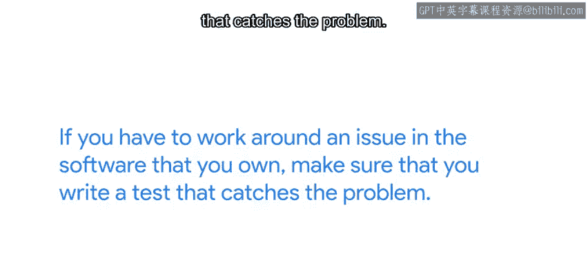

#  113：防止未来问题 🛡️


在本节课中，我们将学习如何在解决IT问题后，采取进一步措施防止问题再次发生。我们将探讨监控系统的重要性、如何有效报告错误，以及如何通过编写测试和文档来确保长期稳定性。

---

## 概述

在之前的课程中，我们多次提到，面对问题时，通常最好先找到快速解决方案，以便受影响用户尽快恢复工作。例如，数据库服务器因空间不足而崩溃，我们可以通过添加额外硬盘并重启服务来快速解决。

但我们的工作并未就此结束。一旦用户恢复正常工作，我们需要寻找长期解决方案，以防止问题在未来再次发生。在数据库服务的场景中，这意味着在磁盘空间耗尽之前就检测到这一情况。

那么，我们如何在没有“水晶球”的情况下做到这一点呢？一个关键策略是充分利用监控。

---

## 利用监控进行预防 📊

上一节我们介绍了快速解决方案的必要性，本节中我们来看看如何通过监控来预防问题。

关于监控有很多内容可讲，甚至足以开设一门完整的课程。简而言之，我们希望所关心的计算机将其数据发送到一个集中位置，该位置会汇总所有信息。

然后，我们希望能够自己查看这些信息，并在数值超出可接受范围时触发警报。

初次设置监控系统时，可能不确定应优先关注哪些信息。因此，应从基础开始。

以下是应优先监控的基本指标列表：
*   **CPU使用率**
*   **磁盘使用率**
*   **内存使用率**
*   **网络使用率**

随着时间的推移，在处理更多事件后，可能会发现其他需要纳入监控系统的指标。例如，如果曾不得不调试与计算机过热相关的问题，就会希望将温度传感器的数据纳入监控系统。

还需要纳入与计算机上运行的特定服务相关的信息。

如果是一台Web服务器，需要知道成功Web响应与错误之间的比率。如果是一台数据库服务器，需要知道随时间处理的查询数量。

每当处理一个未被监控系统捕获的事件时，请记住设置新的监控和警报规则，以便在问题再次发生时通知你。

监控的一个重要功能是包含一段时间内进行的测量。这样，我们可以跟踪资源使用情况，并及早发现趋势变化，以帮助我们进行规划。良好的监控能让我们及早发现故障。

---

## 确保修复持久有效 🔧

上一节我们探讨了如何通过监控预警问题，本节中我们来看看如何确保修复措施持久有效。

我们已经提到过这一点，但值得重复：如果你必须解决由他人开发的应用程序中的问题，向相关开发人员报告错误至关重要。这样，负责代码的人员可以将你的情况考虑在内，并在未来使其正常工作。

如果不这样做，你为当前版本找到的解决方案可能不足以应对下一个版本，届时你将不得不寻找全新的解决方案。

向他人报告错误时，请记住我们之前讨论的所有最佳实践。

以下是报告错误时应包含的关键信息：
*   **告知他们你试图实现的目标。**
*   **告知他们你做了什么。**
*   **告知他们预期结果是什么。**
*   **告知他们实际结果是什么。**

包含你的问题复现步骤和临时解决方案。如果你能访问项目的源代码，提供一个修复问题的补丁会增加代码被修复的机会。

另一方面，如果你必须解决自己拥有的软件中的问题，请确保编写一个能捕获该问题的测试。

```python
# 示例：一个简单的单元测试，用于检查函数是否在磁盘空间不足时抛出正确异常
import unittest
from your_module import your_function

class TestDiskSpace(unittest.TestCase):
    def test_low_disk_space_throws_error(self):
        # 模拟磁盘空间不足的情况
        with self.assertRaises(DiskSpaceError):
            your_function(simulate_low_disk=True)
```

这样，你可以确信不会对代码进行任何会再次触发相同问题的更改。即使你不负责软件的开发，也可以在出现新版本时运行自动测试，以检查其是否仍按预期工作。因此，请确保在应用程序发布新版本时执行这些测试。



---

## 记录与总结 📝

最后，无论错误是来自你编写的软件还是他人编写的软件，请确保记录你所做工作的关键部分：如何诊断问题以及如何解决它。

这样，如果问题再次发生，你或其他需要处理它的人将能够快速应用解决方案，而不是花费宝贵的时间进行调查。

以下是应记录的核心信息：
*   **问题描述与影响**
*   **诊断步骤与根本原因**
*   **应用的解决方案（临时和永久）**
*   **相关的监控指标或测试用例**

---

## 总结

本节课中，我们一起学习了在快速解决IT问题后，如何通过建立监控系统来预防问题复发，如何通过有效报告错误和编写测试来确保修复的持久性，以及如何通过详细记录来为未来积累知识。这些实践将帮助你从被动的“救火”转向主动的“防火”，构建更稳定、可维护的IT环境。