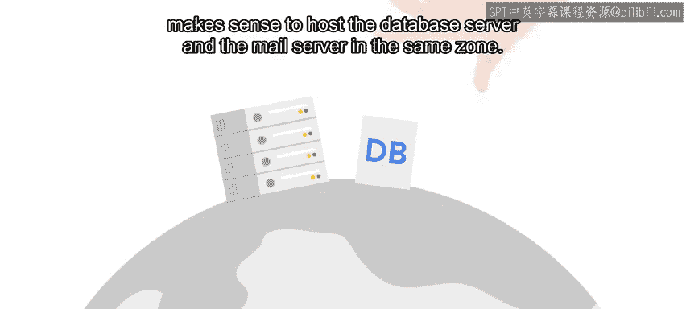

#  119：云服务概览 ☁️

在本节课中，我们将要学习“云服务”的基本概念。我们会探讨云服务的本质、不同类型以及选择云服务时需要考虑的关键因素，例如区域和延迟。

---

当我们说一项服务运行在“云”中时，我们实际指的是什么？

这与天空中那些白色、蓬松的东西毫无关系。

它仅仅意味着该服务运行在别处，要么在数据中心，要么在我们可以通过互联网访问的其他远程服务器上。

这些数据中心容纳了大量各式各样的机器。

不同类型的机器用于不同的服务。例如，一些机器可能配备本地固态硬盘（SSD）以提升性能，而另一些则可能依赖通过网络挂载的虚拟驱动器以降低成本。

云提供商通常提供一系列不同类型的服务。

用户最常使用的是**软件即服务**类别。

**软件即服务**（SaaS）是指云提供商向客户交付一整套应用程序或程序。

如果你选择像Gmail这样的云电子邮件解决方案、像Dropbox这样的云存储解决方案，或者像Microsoft Office 365这样的云生产力套件，你只有少量选项可供选择或定制。

云提供商为你管理与服务相关的一切，包括决定其托管位置、确保服务有足够容量满足你的需求、频繁可靠地执行备份等等。

许多不同的云提供商或其他互联网公司都提供大量软件即服务。

但是，当然，并非我们所有的需求都能通过预打包的软件解决。有时我们需要开发自己的软件。

对于我们软件的某些组件，我们可能会选择使用**平台即服务**。

**平台即服务**（PaaS）是指云提供商向客户提供一个预配置的平台。

这里说的“平台”可能有点令人困惑，因为在PaaS模型下存在许多不同的平台。

让我们看一个例子来更好地理解这一点。假设你需要一个SQL数据库来存储应用程序的部分数据。

你可以选择在自己的硬件上托管这个数据库。为此，你需要在那台计算机上安装操作系统，然后在选定的操作系统上安装SQL软件。

这需要对这些不同的部分有基本的了解，仅仅是为了让数据库运行起来。

有很多环节可能出错。即使你最终能解决所有问题，也可能需要一段时间。

相反，你可以决定使用提供SQL数据库即服务的云提供商。这样，你就可以专注于编写SQL查询和使用平台，而让云提供商处理其余的事情。

云提供商提供许多不同的平台即服务。

但是，当然，它们不太可能覆盖你所有的需求。

如果你需要对正在运行的软件及其与系统中其他部分的交互方式有高度的控制权，你可能想选择**基础设施即服务**。

**基础设施即服务**（IaaS）是指云提供商仅提供最基础的计算体验。

通常，这意味着一个虚拟机环境以及连接虚拟机所需的任何网络组件。

云提供商不会关心你用虚拟机来做什么。你可以用它们来托管网络服务器、邮件服务器、具有你自己配置的自有SQL数据库，或者更多其他可能性。

在云提供商的IaaS产品上运行你的IT基础设施是一个非常流行的选择。

市面上有许多大大小小的不同提供商，提供可以在他们的云中运行虚拟机的服务。

一些IaaS产品包括亚马逊的EC2、谷歌计算引擎和微软Azure计算服务。

现在，无论使用何种服务模型和提供商，当你设置云资源时，都需要考虑**区域**。

一个**区域**是一个包含若干数据中心的地理位置。

区域包含**可用区**，而可用区可以包含一个或多个物理数据中心。

如果其中一个因某种原因发生故障，其他数据中心仍然可用，服务可以迁移而不会显著影响用户。

大型云提供商通常在全球许多不同的区域提供他们的服务。

通常，你选择的区域和可用区应该最接近你的用户。

你的用户距离物理数据中心越远，他们可能体验到的**延迟**就越高。

这听起来可能有点奇怪，但想象一下如果你在海外度假，你可能会注意到你的银行网站加载速度稍慢一些。

这就是为什么通常的做法是将数据中心设在用户实际生活、工作和办理银行业务的地方附近。

在选择区域或可用区时，延迟并不是唯一需要考虑的因素。

一些组织出于法律或政策原因，要求其数据存储在特定的城市或国家。

如果你的服务使用其他服务作为依赖项，那么将服务物理上托管在其依赖项附近是一个好主意。

例如，如果邮件服务器需要数据库服务器来发送电子邮件，那么将数据库服务器和邮件服务器托管在同一个可用区是有意义的。

我们之前提到过，Quicklabs是一个使用云基础设施的服务。

那么QuickLabs使用哪种类型的云服务呢？QuickLabs使用**基础设施即服务**（IaaS）。

虚拟机仅预装了操作系统，然后实验室自动化工具会将任何额外的文件和软件部署到该操作系统中。

接下来，我们将讨论如何利用云提供商提供的服务来帮助我们扩展应用程序。

---

本节课中，我们一起学习了云服务的核心概念。我们明确了“云”的本质是远程数据中心，并详细介绍了三种主要的服务模型：**软件即服务**、**平台即服务**和**基础设施即服务**。我们还探讨了选择云服务时需要考虑的地理区域、可用区和延迟等因素，为后续学习如何利用云服务扩展应用打下了基础。