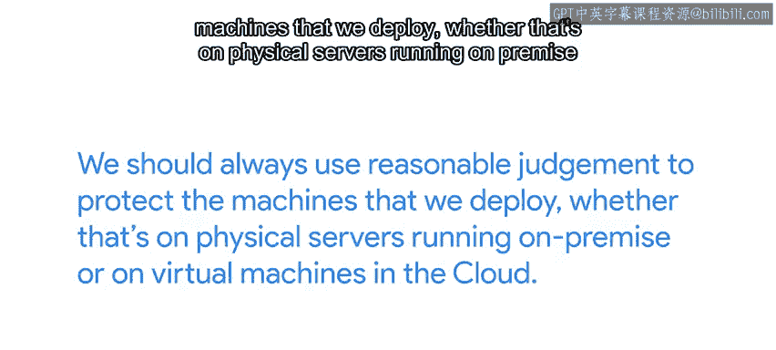

#  121：评估云计算 ☁️

在本节课中，我们将学习如何评估云计算方案。我们将探讨从传统IT环境迁移到云端的考量因素，包括控制权的变化、安全责任以及如何根据自身需求选择合适的云服务模型。

---

如果你一直在一个传统的IT环境中工作，公司物理拥有自己的服务器，那么迁移到云端的想法可能会让你感到不安。当你自己管理服务器时，如果出现问题，你可以直接走到服务器前修复它，或者从同一网络内部通过SSH连接它。你可以快速应用修复，让用户很快恢复工作。

作为IT团队的一部分，你拥有硬件、软件、网络连接以及其间的一切，这让你对整个系统的运行拥有很大的控制权。而在云解决方案中，我们需要将部分控制权交给云提供商。

根据我们选择的服务模型——无论是软件即服务（SaaS）、平台即服务（PaaS）还是基础设施即服务（IaaS）——我们拥有不同级别的控制权。

上一节我们提到了控制权的变化，本节中我们来看看不同的云服务模型。

以下是三种主要的云服务模型：

*   **软件即服务（SaaS）**：选择使用SaaS时，我们基本上将应用程序如何运行的控制权完全交给了提供商。我们可以更改的设置有限，但无需担心系统的运行维护。当提供的软件满足我们所有需求，并且我们更愿意专注于使用软件本身时，这是一个很好的选择。但正如我们指出的，以这种预打包方式提供的应用程序数量有限。
*   **平台即服务（PaaS）**：如果我们需要创建自己的应用程序，可以使用PaaS。通过这个选项，我们负责代码，但不控制应用程序的运行。
*   **基础设施即服务（IaaS）**：我们也可以选择IaaS，这样我们仍然可以保持高度的控制权。我们决定在虚拟机上运行的操作系统、安装在其上的应用程序等。不过，部署的其他方面，如网络配置或服务可用性，仍然依赖于供应商。

如果出现问题，你可能需要供应商的支持来解决问题。因此，在选择云提供商时，了解可用的支持类型并选择符合你需求的提供商非常重要。放弃对硬件、网络和整体基础设施的控制权听起来可能很奇怪，但就我个人而言，我发现不必担心维护运行我们服务的机器是件很棒的事。这意味着我们可以将执行工作负载的服务器视为商品，而不是特殊的“雪花”。

一个可能让你对迁移到云端犹豫不决的方面是，你并不确切知道正在实施哪些安全措施。因此，在选择使用哪个提供商时，检查他们如何保护你的实例和数据安全至关重要。你可以寻找一系列认证，如SOC1、ISO 27001和其他行业认可的资质，以验证你的提供商在安全方面进行了投资。

一旦你确信你的提供商采取了正确的安全措施，可能会想把安全问题完全交给专业人士而不再过问。但作为云用户，我们也有责任遵循合理的安全实践。谷歌、亚马逊、微软和其他云提供商在安全研究上投入巨资，但如果你云实例的root密码是“password1”，或者实例没有使用防火墙，这些投入就毫无意义。换句话说，无论部署在本地运行的物理服务器上，还是云中的虚拟机上，我们都应始终运用合理的判断来保护我们部署的机器。

同样重要的是要记住，正确实施安全系统可能成本高昂。一些高度敏感的部署可能需要专门的安全程序，如多因素认证、加密文件系统或公钥加密，但这些流程的实施也可能很昂贵。值得考虑这些技术是否对你的特定用例是必要的。如果你的应用程序存储近期的患者健康记录，这是需要保护的重要数据，你会希望应用最严格的安全实践。但如果你处理的是19世纪的患者健康记录，由于其年代久远，数据敏感性低得多，你需要的安全措施就不必那么全面。

你可能对云提供商抱有疑虑还有其他原因。例如，你可能担心数据将存储在哪里，或者担心提供的支持无法满足你的需求。无论出于何种原因，仔细阅读服务条款以了解条件，并弄清楚所提供的服务是否能满足你的需求，这非常重要。从某种意义上说，云服务有点像真正的云朵。它们有各种形状和大小，有时一片黑暗的暴风雨云会来扰乱你高效的一天。但如果你提前准备好正确的安全措施，也许再加一把“伞”，那么在云端工作将只是一阵清风。

那么，假设你已决定将部分基础设施迁移到云端，接下来该做什么？迁移到云端是一个大话题，我们将在下一个视频中讨论。

---

本节课中，我们一起学习了评估云计算的关键因素。我们比较了传统IT与云环境的控制差异，详细介绍了SaaS、PaaS和IaaS三种服务模型及其控制级别。我们还强调了安全是共同责任，用户必须与提供商协作，根据数据敏感性实施适当的安全措施。最后，我们指出选择云服务时需要仔细审查服务条款和支持选项。下一课，我们将深入探讨具体的云迁移策略。