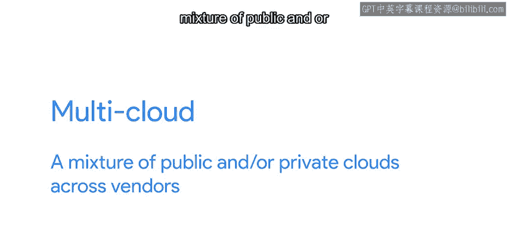

#  122：迁移到云端 ☁️

在本节课中，我们将学习如何将IT基础设施迁移到云端。我们将探讨不同的迁移策略、云服务模型（如IaaS和PaaS）以及各种云部署模式（如公有云、私有云、混合云和多云）。理解这些概念对于在现代IT环境中高效工作至关重要。

---

## 云迁移概述

如今，许多公司都在考虑将其至少部分IT基础设施迁移到云端。

迁移的具体细节取决于您当前基础设施的状况以及您希望通过迁移到云服务提供商实现的目标。

总体而言，我们需要在**对提供服务的计算机的控制权**和**维护它们所需的工作量**之间进行权衡。

---

## 基础设施即服务

我们提到过，当我们使用**基础设施即服务**时，我们是在云提供商的基础设施上运行的虚拟机中部署我们的服务。

我们对基础设施的设计拥有很大的控制权，这可能非常有用。

例如，我们可以决定使用哪种可用的机器类型，以及为它们附加何种存储。

IaaS对于采用“直接迁移”策略的管理员特别有用。

---

### 理解“直接迁移”策略

那么，这是什么意思呢？

假设您在一家正在扩张的小型组织工作。随着公司发展，员工的物理空间、办公桌、乒乓球桌和打印机变得稀缺。

最终，整个办公室可能需要搬到一个更大的空间。

这意味着不仅要移动办公桌和打印机，还要移动任何在本地运行的服务器。

如果需要移动物理服务器，您可能需要从旧办公室取出一台服务器，在维护窗口期间将其关闭，装上卡车，然后实际运送到新地点。

这可能是新办公室，甚至可能是一个小型数据中心。

所以，您实际上是“抬起”服务器并将其移动到新位置。这就是“直接迁移”中“迁移”一词的由来。

当迁移到云端时，过程有些类似。但您不是将物理服务器搬到卡车上，而是将本地运行的物理服务器迁移到在云端运行的虚拟机上。

在这种情况下，您是从一种运行服务器的方式“转换”到另一种方式。

这两种方法的关键在于，服务器的核心配置保持不变。

无论服务器是物理托管在本地还是虚拟托管在云端，需要在机器上安装以提供其功能的软件是相同的。

如果您已经使用配置管理来部署和配置您的物理服务器，那么迁移到云设置可能会非常容易。

您只需将相同的配置应用到在云端运行的虚拟机上，就能复制该设置。

另一方面，使用此策略意味着您仍然需要自己安装和配置应用程序。

您需要确保操作系统和软件保持最新，在更新时功能不会中断，以及其他一系列事情，具体取决于服务器运行的具体应用程序。

---

## 平台即服务

在这种情况下，一种替代方案是使用**平台即服务**。

当您有特定的基础设施需求，但不想参与平台的日常管理时，这非常合适。

在之前的视频中，我们提到了可以这种方式使用的SQL数据库示例。

通过将数据库的管理交给云提供商，您无需担心为计算机连接正确的磁盘、配置数据库或任何其他与机器设置相关的任务。

相反，您可以专注于使用数据库。

平台即服务的另一个例子是**托管Web应用程序**。

使用此服务时，您只需关心为Web应用程序编写代码，而无需关心运行它的框架。

这可以加速开发，因为开发人员无需花时间管理平台，可以只专注于编写代码。

一些流行的托管Web应用程序平台包括Amazon Elastic Beanstalk、Microsoft App Service和Google App Engine。

虽然这些平台非常相似，但它们并不完全兼容。因此，从本地框架迁移或在供应商之间切换将需要一些代码更改。

---

## 容器化应用

您可能听说过的另一个相关概念是**容器**。

容器是与它们的配置和依赖项打包在一起的应用程序。

这使得应用程序无论在使用何种环境运行时，都能以相同的方式运行。

换句话说，如果您有一个运行应用程序的容器，您可以将其部署到您的本地服务器、云提供商或不同的云提供商。

无论您选择哪一种，它都将始终以相同的方式运行。

这使得从一个平台迁移到另一个平台变得非常容易。

---

## 云部署模式

在讨论迁移到云端时，您可能还会听到公有云、私有云、混合云和多云。

让我们看看这些术语各自意味着什么。

我们将第三方提供给您的云服务称为**公有云**。

之所以称为“公有”，是因为云提供商也向公众提供服务。

**私有云**是指您的公司拥有服务及其余基础设施的情况，无论是在本地还是在远程数据中心。

它之所以是“私有”的，是因为它只供您的公司使用，就像拥有您自己天空中的云。

**混合云**是公有云和私有云的混合体。

在这种情况下，一些工作负载在您公司拥有的服务器上运行，而另一些则在第三方拥有的服务器上运行。

充分利用混合云的关键在于确保一切都能平稳集成。

这样，无论数据托管在何处，您都可以无缝地访问、迁移和管理数据。

最后，**多云**是跨供应商的公有云和/或私有云的混合体。

例如，多云部署可能包括托管在Google、Amazon、Microsoft以及本地的服务器。

混合云只是多云的一种类型，但关键区别在于多云将使用多个供应商，有时还包括本地服务。

使用多个云可能很昂贵，但它为您提供了额外的保护。如果您的某个提供商出现问题，您的服务可以在不同提供商提供的基础设施上继续运行。

---

## 总结

在本节课中，我们一起学习了将IT基础设施迁移到云端的关键概念。我们探讨了IaaS和PaaS两种主要服务模型，理解了“直接迁移”策略的含义。我们还介绍了容器技术如何简化跨环境部署。最后，我们区分了公有云、私有云、混合云和多云这几种不同的云部署模式，了解了它们各自的优缺点和适用场景。掌握这些知识将帮助您为组织制定合适的云迁移和部署策略。