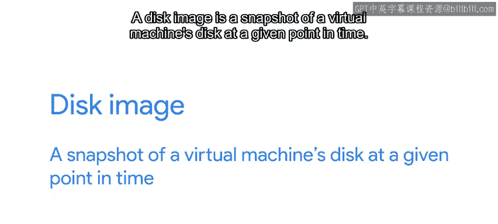

#  123：在云中启动虚拟机 🚀

在本节课中，我们将学习如何在云平台上启动和配置虚拟机。我们将了解创建虚拟机时需要设置的关键参数，并探索如何使用Web界面和命令行界面来管理这些资源。最后，我们将介绍如何使用参考镜像和模板化技术来自动化虚拟机的创建和配置过程。

---

我们已经讨论了很多关于云的工作原理、其中涉及的不同概念及其含义。

在接下来的几个视频中，我们将向您展示在云上执行的一些常见操作是什么样子，并进行实践。

正如我们指出的，您可以为项目使用许多不同的云服务提供商。每个提供商都有一些特定的优势，具体取决于您想要实现的目标。

虽然某个提供商使用的术语可能与其他提供商不完全相同，但其核心概念是相同的。在这些视频中，我们将使用Google Cloud Platform来演示我们的示例，因为这是我们最熟悉的平台。

所有云提供商都为您提供了一个控制台，用于管理您正在使用的服务。这个控制台包含了提供商提供的许多不同服务的入口。

起初，看到所有可用的选项可能会让人有点眼花缭乱，因此在尝试用它做任何事情之前，最好先熟悉一下平台。例如，可以查看可用的菜单和选项，并找出允许您使用基础设施即服务（IaaS）的部分位于何处。

无论具体的菜单条目是什么，当您想要创建在云中运行的虚拟机时，都需要设置一系列参数。云基础设施使用这些参数来启动具有我们所需设置的机器。

以下是创建虚拟机时需要配置的主要参数：

*   **实例名称**：您需要首先选择分配给实例的名称。这个名称稍后将帮助您识别实例，以便连接、修改甚至删除它。
*   **区域和可用区**：您还必须选择实例运行的区域和可用区。正如我们在之前的视频中指出的，通常您会希望选择一个靠近用户的区域，以提供更好的性能。
*   **机器类型**：另一个需要选择的重要选项是虚拟机的机器类型。云提供商允许用户配置其虚拟机的特性以满足需求。这意味着选择虚拟机将分配多少个处理单元（或虚拟CPU）以及多少内存。您可能会想选择最强大的虚拟机，但当然，虚拟机越强大，运行它的成本就越高。作为系统管理员，您可能需要在成本和处理能力之间做出权衡，以满足组织的需求。在设置此类实例时，最好从小规模开始，然后根据需要扩展。
*   **启动磁盘**：除了可用的CPU和内存之外，您还需要选择虚拟机将使用的启动磁盘。在云中运行的每个虚拟机都有一个关联的磁盘，其中包含它运行的操作系统和一些额外的磁盘空间。创建虚拟机时，您需要选择要为虚拟磁盘分配多少空间，以及希望机器运行什么操作系统。

为了创建这些资源，我们可以使用Web界面或命令行界面。

Web用户界面对于快速检查我们需要设置的参数非常有用。界面将让我们比较不同的可用选项，甚至显示我们选择的虚拟机每月大概需要多少费用。这对于实验来说很棒，但如果我们需要快速创建一批机器，或者想要自动化创建过程，它的扩展性就不太好。

在这些情况下，我们将使用命令行界面，它允许我们一次性指定所需内容，然后多次使用相同的参数。使用命令行界面，我们可以从脚本中创建、修改甚至删除虚拟机。这是迈向自动化的重要一步，但还不止于此。

我们还可以自动化准备这些虚拟机内容的过程。想象一下，花一个下午的时间安装和配置您的新Web服务器。😊

您可以在一个机器上完成此操作，这个过程相当简单。您安装任何必要的软件，修改任何配置设置，然后确保其正常工作。但是，很难在另一台机器上完全复制这个过程，更不可能在数千台机器上完成。

这就是参考镜像和模板化发挥作用的地方。参考镜像以可重用的格式存储机器的内容，而模板化是捕获所有系统配置的过程，以便我们以可重复的方式创建虚拟机。

参考镜像的确切格式将取决于供应商，但结果通常是一个称为磁盘镜像的文件。磁盘镜像是虚拟机磁盘在给定时间点的快照。

好的模板化软件允许您复制整个虚拟机，并使用该副本来生成新的虚拟机。根据软件的不同，磁盘镜像可能不是原始机器的精确副本，因为某些机器数据（如主机名和IP地址）会发生变化，但它将包含我们需要的数据，使其可在大量虚拟机上重用。如果我们想构建一个拥有10000台机器的集群，并且所有机器都安装了相同的软件，这将非常有帮助。

接下来，我们将对这个过程进行一些演示。我们将向您展示如何在Google Cloud控制台中创建新的虚拟机，如何自定义这些虚拟机，以及如何使用模板化和参考镜像来自动化创建过程。😊

---

在本节课中，我们一起学习了在云中启动虚拟机的完整流程。我们了解了创建虚拟机时需要配置的核心参数，如名称、区域、机器类型和启动磁盘。我们还比较了使用Web界面和命令行界面进行管理的不同场景，认识到CLI在自动化和批量操作中的优势。最后，我们探讨了通过参考镜像和模板化技术来实现虚拟机配置的标准化和自动化，这是构建可扩展、一致云基础设施的关键一步。