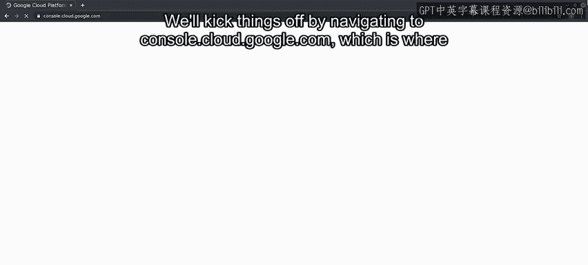
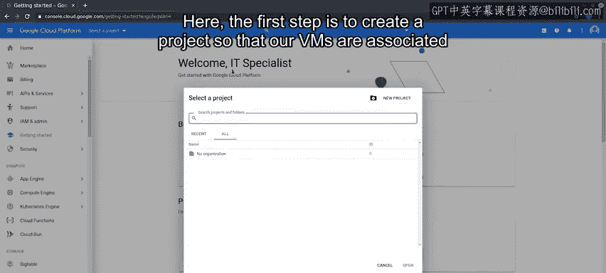
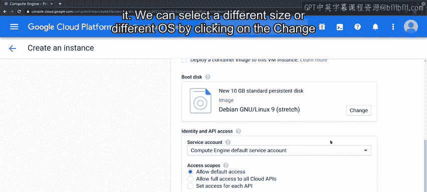
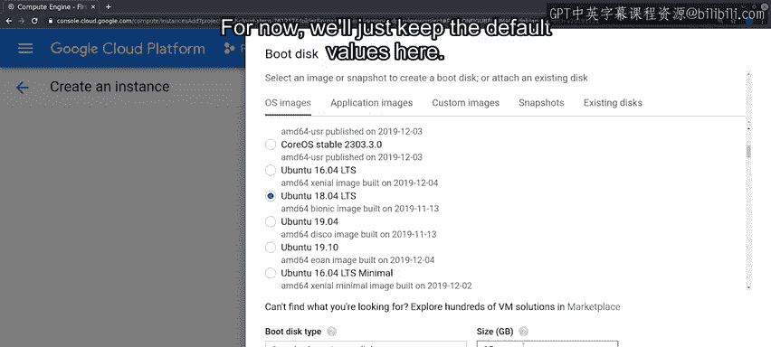
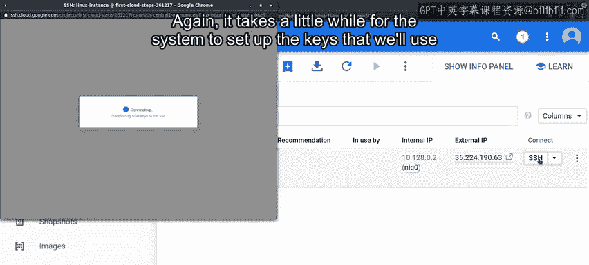
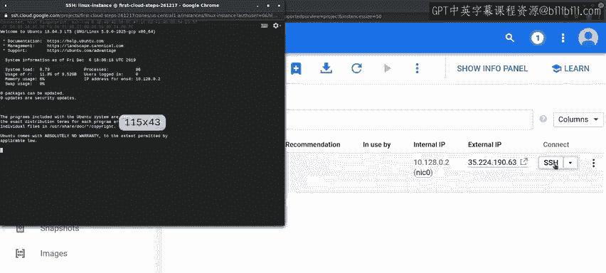
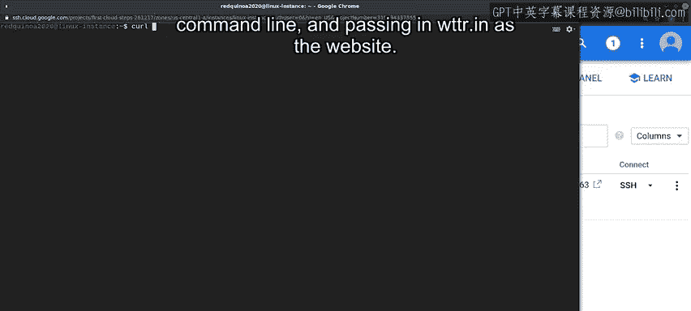

#  124：使用GCP Web界面创建新虚拟机 🖥️

在本节课中，我们将学习如何在Google Cloud Platform（GCP）项目中，通过Web用户界面（UI）创建并配置一台虚拟机（VM）。我们将从创建项目开始，逐步完成虚拟机的命名、区域选择、机器类型配置、启动磁盘设置，并最终通过SSH连接到新创建的虚拟机。

---

## 导航至GCP控制台

首先，我们需要访问GCP的云控制台。请打开浏览器，导航至 `console.cloud.google.com`。这是管理所有GCP服务和资源的中央界面。

---

## 创建新项目

在控制台中，第一步是创建一个新项目。所有虚拟机都需要关联到一个特定的项目，以便进行资源管理和计费。

我们为项目命名，例如“first-cloud-steps”。创建过程需要几秒钟。项目创建完成后，仪表板会显示更多信息。

---

## 进入虚拟机实例创建界面

接下来，我们需要找到创建虚拟机的菜单入口。为此，请进入“Compute Engine”菜单，并选择“VM instances”选项。

由于目前没有任何虚拟机，该屏幕显示为空。我们可以通过点击“Create”按钮来开始创建新的虚拟机。

---

## 配置虚拟机参数

点击创建后，我们会看到许多可以为此虚拟机设置的选项。以下是需要配置的主要参数：

### 命名虚拟机
我们将此虚拟机命名为“linux-instance”。

### 选择区域和可用区
点击区域下拉菜单，可以看到所有当前可用于创建新虚拟机的区域。点击可用区下拉菜单，可以看到该区域内可用于新虚拟机的可用区。

对于本示例，我们保留默认区域。但请注意，如果您部署的是服务，应选择靠近您用户的区域。

### 选择机器类型
我们需要选择要使用的机器类型。可以在“通用型”和“内存优化型”等系列之间选择。每个系列下又有多种不同的机器类型。

我们可以选择虚拟机所需的CPU数量和内存大小。正确的选择取决于我们计划用这台计算机做什么。对于本示例，我们保留默认机器类型。

### 配置启动磁盘
选择虚拟机后，需要选择要使用的磁盘。默认磁盘大小为10 GB，并预装了Debian操作系统镜像。

我们可以通过点击“Change”按钮选择不同的大小或不同的操作系统。操作系统列表很长，正确的选择取决于您计划用此实例做什么。

对于本示例，我们选择其中一个Ubuntu版本。我们还可以选择要使用的磁盘类型：标准磁盘（更便宜）或SSD版本（更快）。如果需要为服务器提供额外存储，也可以更改大小。目前，我们保留此处的默认值。

---

## 配置访问与防火墙规则

在启动磁盘设置之后，我们会看到用于确定机器访问方式的选项。根据项目的其他部分，这可以非常简单，也可以非常复杂。

默认的访问选项允许您使用SSH远程访问实例，因此我们现在选择它。

最后，创建向导允许我们预配置一些防火墙规则。选择这两个选项之一将允许HTTP或HTTPS流量到达我们的机器。当然，您可能还需要设置更多防火墙规则，这些可以在机器创建后另行设置。

在后续视频中，我们将需要连接到此机器上的Web服务器，因此让我们先启用HTTP。

还有许多其他选项可以设置，它们隐藏在此链接下。由于默认设置对我们的测试机器有意义，我们现在不深入研究这些，但您可以自行查看可以设置的其他参数。

---

## 通过命令行了解创建过程

我们基本上已准备好创建虚拟机。但在创建之前，让我们点击“command line”链接。这将向我们展示如何通过命令行创建相同的虚拟机。

这是一个很长的命令行。但请放心，您不需要理解所有参数。这里的要点是，您可以选择所有需要的选项来创建所需的虚拟机，然后复制此命令以创建一批与您选择的虚拟机完全相同的虚拟机。

现在，我们关闭此窗口，然后使用“Create”按钮创建虚拟机。

---

## 创建并连接虚拟机

我们的实例正在创建中。这需要一些时间。系统正在为我们的机器分配必要的资源、部署操作系统镜像、连接网络接口等。

一旦设置完成，我们就可以使用SSH连接到它。同样，系统设置我们将用于登录的密钥需要一点时间。但一旦完成，我们就可以远程使用这台机器。

让我们检查一下我们创建的机器是否使用了我们选择的操作系统。至此，我们已经使用Web界面创建了一台虚拟机，并使用SSH连接到它。这非常酷。

一旦登录到机器，您可以像对待任何普通的Linux机器一样对待它，这非常棒。例如，我们可以通过调用`curl`命令来获取当前位置的天气文本版本，该命令可用于从命令行访问网页，并传入`wttr.in`作为网站。

看起来云端是多云天气。接下来，我们将通过向虚拟机部署一个简单的Web应用程序来开始进行实验。

---

## 总结

在本节课中，我们一起学习了如何在Google Cloud Platform上通过Web界面创建一台完整的虚拟机。我们完成了从创建项目、配置虚拟机参数（包括名称、区域、机器类型和启动磁盘），到设置网络访问和防火墙规则的全过程。最后，我们成功通过SSH连接到新创建的虚拟机，验证了其运行状态。这为后续在云环境中部署和应用服务打下了坚实的基础。