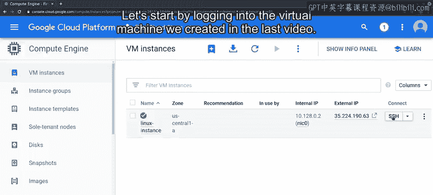
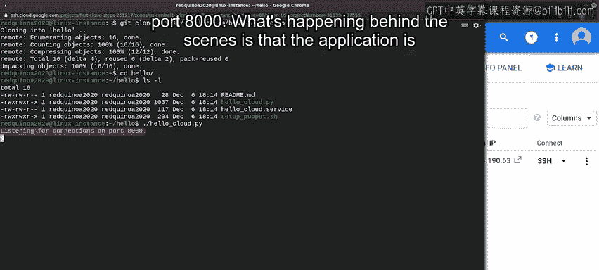
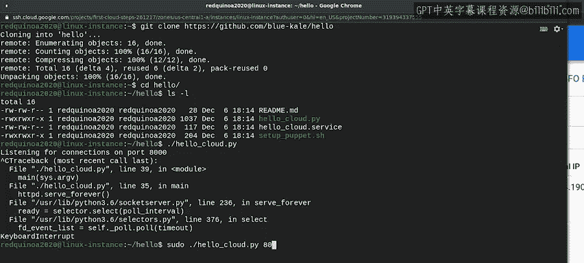
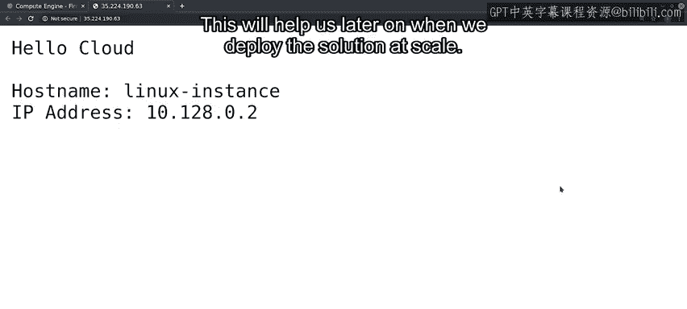
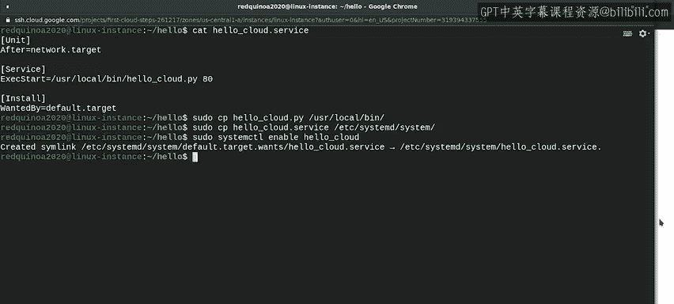
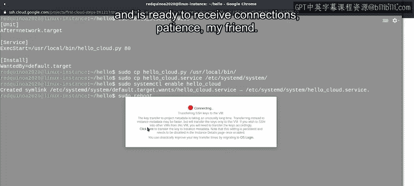
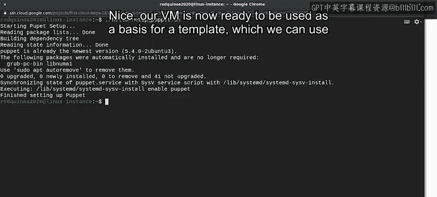

#  125：在GCP中定制虚拟机 🖥️


在本节课中，我们将学习如何定制一个云虚拟机，将其配置为可自动启动的Web服务器，并最终将其转化为一个可重复部署的参考镜像模板。这是实现大规模云部署的关键一步。

## 从单机到规模化部署

上一节我们介绍了如何在云中创建单个虚拟机。这很酷，但在云计算的规模下作用有限。请记住，大规模的云部署通常由成百上千台机器组成。因此，创建单台服务器仅仅是开始。

本节中，我们将对这台虚拟机进行一些修改，以便能够进行规模化部署。完成后，我们将把配置好的实例作为创建参考镜像的基础。参考镜像是一个可以反复部署、并能通过自动化工具使用的文件或配置。这非常重要，因为它能让我们快速构建可扩展的服务。

让我们从登录上一节视频中创建的虚拟机开始。



## 部署应用程序代码

我们将使用Git，它允许我们克隆包含待部署应用程序代码的仓库。

克隆的仓库包含一个用Python编写的非常简单的Web服务应用程序。让我们运行它看看会发生什么。



我们的脚本打印了一行信息，说明它正在监听8000端口上的连接。

在后台，应用程序正在打开一个套接字并在该端口上监听HTTP连接。在本例中，它运行在8000端口。如果我们在本地机器上运行，就可以连接到该端口。

但这运行在云中的虚拟机上，该虚拟机配有防火墙，并且只开放了几个端口。我们有哪些选择？

脚本实际上允许我们将要打开的端口号作为参数传递。我们希望它运行在我们上一节视频中配置的HTTP端口上，即端口80。

因为这是一个系统端口，为了让我们的应用程序使用它，我们需要以管理员权限运行。所以，现在让我们按 `Ctrl+C` 停止正在运行的进程，然后使用 `sudo` 并以80作为参数再次运行它。

```bash
sudo python3 app.py 80
```



现在，我们可以访问由我们的虚拟机提供的网站并查看其内容。让我们导航到它。

我们的Web应用程序非常简单。它只是在生成网页时打印“Hello Cloud”。它还打印了机器的主机名和IP地址。这将在我们后续进行大规模部署时有所帮助。

## 配置为自动启动服务



好了，我们有一个运行在HTTP端口上的Web服务应用程序。这很好，但我们必须手动启动应用程序，所以这无法扩展。

为了让我们的应用程序自动启动，我们需要将其配置为一项服务。幸运的是，我们的仓库已经包含了可以使用的服务定义文件。

让我们查看该文件的内容。这是一个systemd文件，它是大多数现代Linux发行版使用的初始化系统。

如果你不明白这里发生了什么，不用担心。你不需要理解这个文件的细节就知道如何将服务部署到云端。只需注意，配置期望我们要执行的脚本位于 `/usr/local/bin` 目录下。

我们需要将该文件复制到那里，然后将服务文件复制到 `/etc/systemd/system` 目录，这是用于配置systemd服务的目录。

最后，我们需要告诉 `systemctl` 命令，我们希望启用此服务，以便它能自动运行。

以下是需要执行的步骤：

1.  将应用程序脚本复制到系统目录。
    ```bash
    sudo cp app.py /usr/local/bin/
    ```
2.  将服务定义文件复制到systemd目录。
    ```bash
    sudo cp webapp.service /etc/systemd/system/
    ```
3.  启用并启动服务。
    ```bash
    sudo systemctl enable webapp.service
    sudo systemctl start webapp.service
    ```

现在，我们已经完成了这些步骤。任何时候这台机器启动，它都会启动我们配置的Web应用程序，我们将能够看到之前看到的内容。

让我们通过触发一次重启来测试一下。



## 验证服务自动启动

我们已经重启了机器。这需要一些时间来完成。它告诉我们连接已断开，我们可以让终端尝试重新连接。这需要一点时间，直到机器完成重启并准备好接收连接。



耐心点，我的朋友。好了，我们的虚拟机已经重启。我们可以使用 `ps ax` 命令获取运行进程列表，并使用 `grep` 命令进行过滤，只保留匹配特定模式的进程，以此来检查我们的应用程序是否在运行。在本例中，我们将使用“hello”作为模式。

```bash
ps ax | grep hello
```

太好了，我们的应用程序现在可以在启动时自动运行了。我们几乎准备好将配置好的虚拟机转变为创建更多虚拟机的模板了。

但在这样做之前，我们需要考虑一下，当我们想要对Web应用程序进行更改时，将如何升级它。

## 集成配置管理

这里有很多不同的选择。一个选择是每次应用程序有新版本时，都创建一个不同的参考镜像。这意味着删除所有旧的虚拟机，并基于新镜像创建新的虚拟机。

另一个选择是向镜像中添加一个配置管理系统，这样我们就可以用它来管理虚拟机创建后的任何更改。我们已经知道如何使用Puppet管理更改。还记得我们之前视频中的Puppet主服务器培训吗？

让我们在这个实例中安装Puppet客户端，以便将来可以使用Puppet。

当我们研究Puppet服务器和客户端设置时，我们看到在客户端需要运行一系列步骤才能准备好应用规则。我们克隆的仓库包含一个可以运行的脚本，它将为我们完成初始配置。它还会将Puppet进程设置为在启动时自动运行。让我们现在运行它。

```bash
sudo ./setup_puppet_client.sh
```

现在，任何时候这台机器启动，它都会提供我们的网站服务。如果我们想更新该网站的内容，可以使用我们的Puppet基础设施来完成。很好。

## 准备创建模板

我们的虚拟机现在已经准备好作为模板的基础，我们可以用它来创建任意数量的实例。接下来，我们将学习如何创建模板以及如何基于模板创建实例。



---

本节课中，我们一起学习了如何定制云虚拟机：部署代码、配置自动启动服务、验证其运行，并集成了Puppet以实现未来的配置管理。最终，我们将这台虚拟机准备成了一个可重复部署的参考镜像模板，为大规模、自动化的云部署奠定了基础。