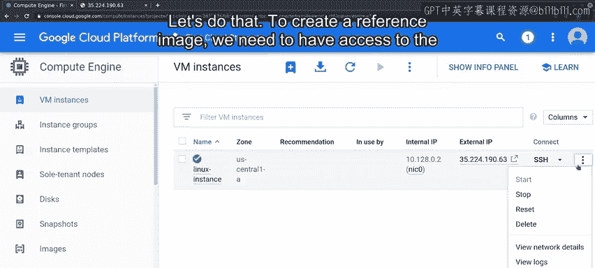
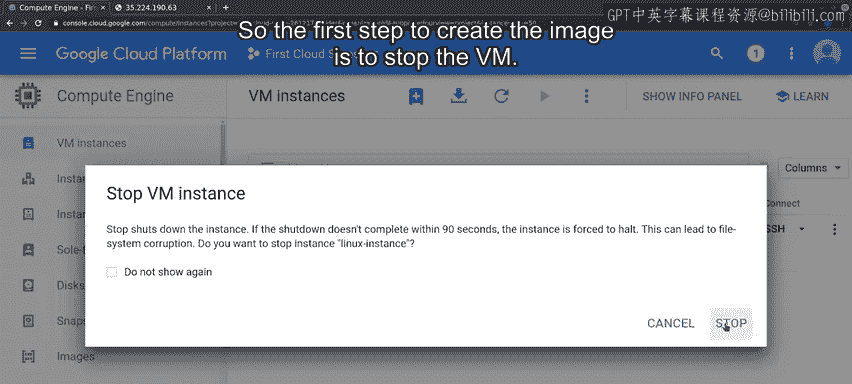
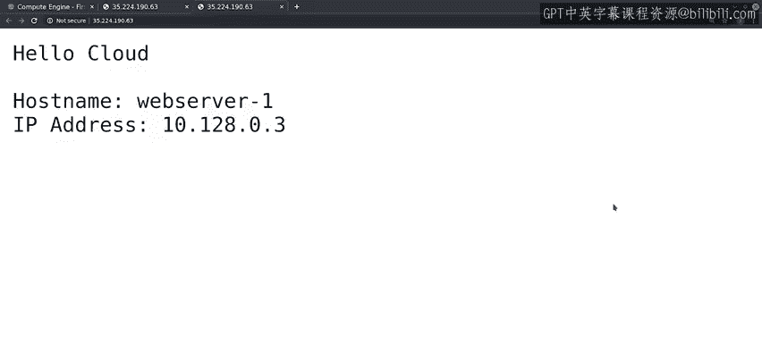
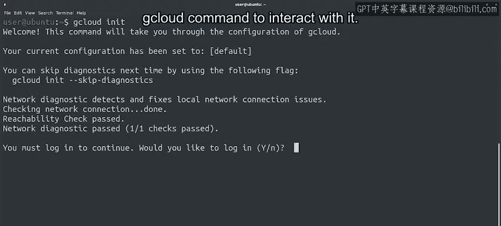
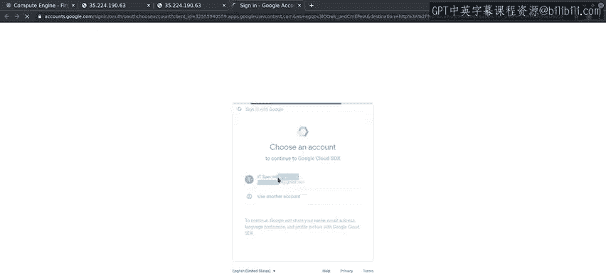
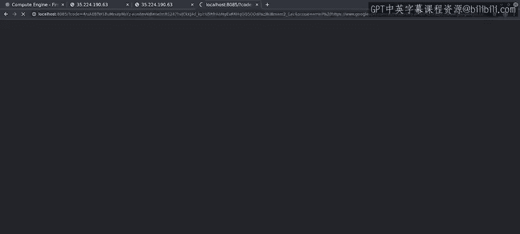
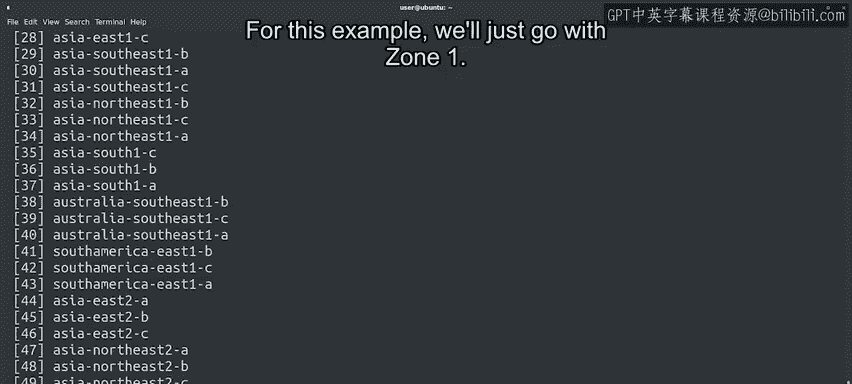

#  126：模板化定制虚拟机 🖥️


在本节课中，我们将学习如何将一个已配置好的虚拟机（VM）转换为一个可复用的模板，并利用该模板批量创建新的虚拟机实例。我们将涵盖从停止虚拟机、创建磁盘镜像、生成实例模板，到最终通过图形界面和命令行批量部署虚拟机的完整流程。

## 概述

在前几节课程中，我们创建了一个虚拟机，并确保它已配置好以运行我们的Web应用程序，并能通过Puppet保持更新。现在，我们可以将此虚拟机作为基础，创建一个实例模板，然后使用该模板批量创建基于它的多个虚拟机。





## 创建磁盘镜像

要创建一个参考镜像，我们需要访问当前在计算机上运行的虚拟磁盘。因此，创建镜像的第一步是停止虚拟机。

虚拟机需要一段时间才能完全关闭。一旦完成，我们可以点击虚拟机的名称以查看其所有详细信息，然后点击其启动磁盘。

这些是附加到虚拟机的磁盘的详细信息。我们可以创建一个快照（即磁盘当前状态的完整副本），或者创建一个镜像（允许我们基于它创建模板）。让我们点击“创建镜像”。

我们将镜像命名为 `web-server-image`。创建向导显示，我们将基于 `linux-instance-disk` 创建镜像，这正是我们想要的。对于此示例，我们将保留其余设置为默认值。

现在开始创建我们的镜像。这将创建我们将用于模板的镜像。正如之前提到的，工具会保留镜像的大部分内容，但会删除那些在不同虚拟机之间应该不同的部分。

创建完成后，它会显示我们可以访问的所有镜像列表。这是一个很长的列表，其中包含了许多公共镜像以及我们创建的镜像。其他镜像是我们可以用来部署不同类型虚拟机的公共镜像。

## 创建实例模板

现在，我们准备好创建实例模板了。为此，我们将转到“实例模板”选项，然后点击“创建新实例模板”。

像往常一样，我们会看到一个包含许多可设置选项的向导。我们将保留大多数默认值，只更改几项内容。

我们将模板命名为 `web-server-template`。我们将更改启动磁盘，以使用我们创建的镜像。在此屏幕上，我们可以看到所有可用镜像的列表。默认情况下，列表显示平台提供的官方操作系统镜像。对于我们的模板，我们希望使用我们创建的自定义镜像。

最后，我们还需要启用对使用此模板创建的实例的HTTP访问。设置完毕，现在可以创建我们的新模板了。

创建需要一点时间。完成后，我们就可以基于我们的镜像创建实例了。我们将再次通过Web界面操作一次，然后学习如何通过命令行操作。

## 通过模板创建虚拟机实例



让我们返回“VM实例”条目，然后点击“创建实例”。这次，我们将使用我们准备好的模板来创建实例，而不是从头开始创建。

我们将实例命名为 `web-server1`，其他所有设置保持不变。请注意，它显示将使用我们选择的基础镜像，并且允许HTTP流量。

我们已经基于模板创建了第二个虚拟机。我们无需更改任何选项，因为所有值都已预先在模板中选定。我们想要的Web应用程序已准备就绪，无需我们进行任何配置。让我们验证一下。

是的，我们的应用程序已在此机器上成功运行。这很棒，但如果我们要创建10个这样的虚拟机，这仍然有点繁琐。对于此类批量操作，使用命令行界面会更好。

## 使用命令行界面批量创建



接下来，让我们使用命令行来操作。为了与Google Cloud交互，我们将使用 `gcloud` 命令。我们已经在这台机器上安装了 `gcloud` 命令。你可以在接下来的阅读材料中找到如何在不同平台上安装 `gcloud` 的指引。





我们首先运行 `gcloud init` 命令，该命令会设置此计算机与Google Cloud之间的身份验证机制。我们需要向Google Cloud系统进行身份验证，才能使用 `gcloud` 命令与其交互。

这会在我们的浏览器中打开一个新标签页，我们可以用它来使用我们的账户进行身份验证。让我们按照此处的流程进行身份验证。

我们现在已登录到我们的云账户。我们可以选择默认项目。让我们在这里选择一个。除了选择默认项目，初始化向导还允许我们选择默认区域和可用区。最好选择这个，因为如果我们不指定其他区域，将来使用的命令将默认使用该区域和可用区。

这是一个很长的列表。有许多不同的可用区可供我们的实例使用。正如之前提到的，在选择运行服务的位置时，应选择离你最近的位置。对于此示例，我们将直接选择 `zone1`。



完成此身份验证后，我们就可以使用 `gcloud` 命令来操作我们的云项目了。我们可以修改已创建的虚拟机、创建新的虚拟机、删除一些现有的虚拟机等等。

对于我们的示例，我们将使用它来创建五个额外的虚拟机。命令如下：

```bash
gcloud compute instances create --source-instance-template=web-server-template ws1 ws2 ws3 ws4 ws5
```

首先我们调用 `gcloud`，然后传递 `compute` 参数（用于处理与虚拟机相关的一切事务）。接着传递 `instances` 参数，因为我们将处理虚拟机实例本身。然后传递 `create`，因为我们想要创建实例。我们指定要使用名为 `web-server-template` 的源实例模板。最后，我们给出要部署的实例名称。

只需很短的时间，所有实例就创建完成了。这绝对比通过Web界面操作快得多，也更容易通过我们的脚本实现自动化。

## 总结

在本节课中，我们一起学习了如何创建虚拟机、对其进行定制、从中创建模板，并使用该模板批量创建新的、完全相同的虚拟机。希望你现在开始体会到，这在创建新的IT部署时是多么有用。

接下来，有一篇阅读材料，其中提供了关于我们演示的所有工具的更多信息，然后是一个快速测验，以练习你刚刚学到的所有内容。