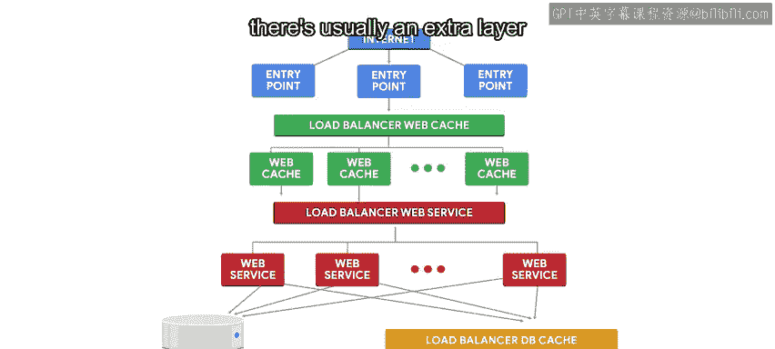

#  127：云端大规模部署 🚀

在本节课中，我们将学习如何在云环境中大规模部署服务。我们将探讨负载均衡、自动扩缩容以及多层缓存架构等核心概念，以构建一个高可用、可扩展的云端应用系统。

## 概述

在之前的课程中，我们探讨了在云端运行服务时可以使用的一些功能。使用云服务的最大优势在于能够轻松地扩展或缩减服务规模。为了充分利用这一优势，我们需要进行一些准备工作。

我们将设置服务，以便通过向资源池添加更多节点来轻松增加其容量。这些节点可以是虚拟机、容器，甚至是提供特定服务的应用程序。

## 负载均衡器

当一项服务由多个提供相同功能的不同实例组成时，我们会使用负载均衡器。负载均衡器确保每个节点接收均衡数量的请求。

当一个请求到达时，负载均衡器会选择一个节点来提供响应。

负载均衡器使用多种不同的策略来选择节点。最简单的策略是轮询，即依次给每个节点分配一个请求。更复杂的策略包括：始终为来自同一来源的请求选择同一节点、选择距离请求者最近的节点，或者选择当前负载最轻的节点。

## 自动扩缩容

正如我们提到的，这类实例组通常被配置为在需求增加时启动更多节点，在需求下降时关闭一些节点。这种能力称为自动扩缩容。

它允许服务根据需要增加或减少容量，而服务所有者只需为任何给定时间正在使用的机器成本付费。

由于需求较低时一些节点会关闭，它们的本地磁盘也会消失，因此应被视为临时或短暂的。如果需要数据持久化，您必须创建单独的存储资源来保存该数据，并将该存储连接到节点。

这就是为什么我们在云端运行的服务通常连接到数据库的原因，该数据库也在云端运行。这个数据库通常也由负载均衡器后面的多个节点提供服务，但这通常由云提供商使用平台即服务模型来管理。

## 实践示例：多层Web应用架构

为了了解这在实践中如何运作，让我们看一个拥有大量用户的Web应用程序示例。

当您通过互联网连接到网站时，您的网络浏览器首先会检索您要访问的网站的IP地址。这个IP地址标识了一台特定的计算机，即网站的入口点。通常，一个网站会有多个不同的入口点。这允许服务即使在其中某个入口点出现故障时也能保持运行。此外，可以选择一个距离用户更近的入口点以减少延迟。

在一个小规模应用中，这个入口点可能就是提供页面的Web服务器，仅此而已。对于速度和可用性至关重要的大型应用，在入口点和实际Web服务之间会有几层架构。

### 第一层：Web缓存服务器池

第一层将是一个Web缓存服务器池，并配有一个负载均衡器来在它们之间分配请求。用于此缓存的最流行应用之一是Varnish，当然，它不是唯一的选择。Nginx Web服务软件也包含此缓存功能，并且有许多提供商提供Web缓存即服务，例如Cloudflare和Fastly。

无论使用何种软件，结果基本相同。当发出请求时，缓存服务器首先检查内容是否已存储在其内存中。如果存在，它们就用内容进行响应。如果不存在，它们会向配置的后端请求内容，然后存储起来，以便为未来的请求提供。

### 第二层：实际Web服务

这个配置的后端是为网站生成网页的实际Web服务，它通常也是一个在负载均衡器下运行的节点池。

为了获取任何必要的数据，此服务将连接到数据库。但是，因为从数据库获取数据可能很慢，所以通常还有一个专门用于数据库内容的额外缓存层。

### 第三层：数据库缓存

用于此级别缓存的最流行应用是Memcached和Redis。

如您所见，在这个架构中有很多不同的节点。幸运的是，一旦您完成了准备工作并设置好了配置，您就可以依赖云提供商提供的能力，根据需要自动扩展或收缩系统。

基础设施将负责添加和删除实例、分配负载、确保每个地理区域拥有适当的容量以及处理更多事务。

## 总结

在本节课中，我们一起学习了云端大规模部署的关键组件。我们了解了如何使用负载均衡器在多个服务实例间分配流量，以及如何通过自动扩缩容机制根据需求动态调整资源。我们还探讨了一个典型的高流量Web应用的多层架构，包括Web缓存层、应用服务层和数据库缓存层。理解这些概念有助于我们设计出既高效又经济、能够应对不同负载的云端系统。