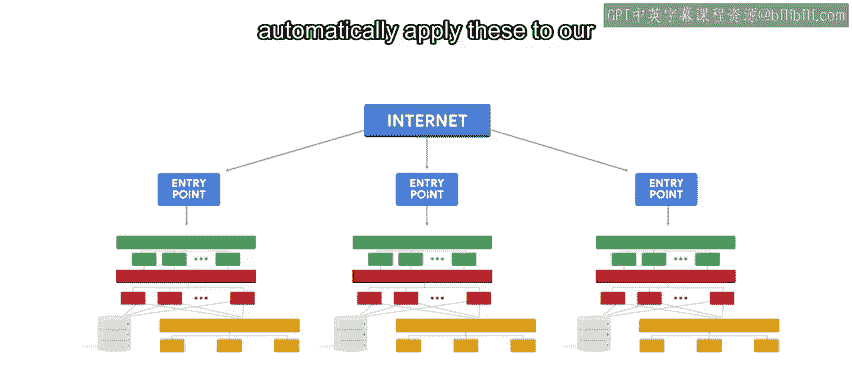

#  128：什么是编排？🎼


在本节课中，我们将要学习**编排**的概念。编排是自动化领域中协调复杂系统配置的关键环节，尤其在云计算和多服务环境中至关重要。

---

## 概述

到目前为止，在整个课程中我们一直在讨论自动化。自动化指的是用自动发生的步骤替代手动操作的过程。

在之前的视频中，我们提到了几种自动化创建云实例的方法。我们可以使用模板创建新的虚拟机，可以运行命令行工具自动创建实例，或者选择启用自动扩缩容，让基础设施工具根据需求来处理。然而，所有这些自动创建新实例的过程都需要进行协调，以确保实例之间能够正确交互。这正是编排发挥作用的地方。

## 什么是编排？

编排是复杂IT系统和服务的自动化配置与协调。

换句话说，编排意味着自动化许多需要相互通信的不同事物。这通常包含大量不同的自动化任务，并涉及配置一系列不同的系统。

以我们上一个视频中看到的网站基础设施为例。我们已经了解了如何自动化创建系统中的每个实例。现在，假设你想在一个尚未有任何实例的独立数据中心部署该系统的新副本，你还需要自动化整个系统的配置，包括所涉及的不同实例类型、每个实例如何发现其他实例、内部网络的结构等等。

## 编排如何工作？

关键在于，整个系统的配置需要是**可自动重复**的。

我们可以使用多种不同的工具来实现这一点。这些工具通常不通过Web界面或命令行与云系统通信，而是使用**应用程序编程接口**，即**API**，它允许我们直接从脚本与云基础设施进行交互。

```python
# 示例：通过云服务商API创建实例（概念性代码）
cloud_api.create_instance(image="ubuntu-20.04", instance_type="n1-standard-1")
```

在云服务商API的情况下，它们通常允许你直接从脚本或程序处理想要设置的配置，而无需调用单独的命令。这将编程能力与所有可用的云资源结合了起来。

云服务商提供的API让我们能够执行之前提到的所有任务，例如创建、修改和删除实例，以及部署这些实例之间如何通信的复杂配置。所有这些操作也可以通过Web界面或命令行完成，但从我们的程序中执行这些操作提供了额外的灵活性，这在自动化复杂设置时至关重要。

## 编排的应用场景

假设你想部署一个系统，它结合了在云服务商上运行的一些服务和在本地运行的一些服务。这被称为**混合云**设置，即只有部分服务在云中。这种设置在当今行业中非常普遍。

编排工具可以成为一个非常有用的工具，以确保本地服务和云服务都知道如何相互通信，并使用正确的设置进行配置。

回到我们之前讨论的网站示例，为了确保服务平稳运行，我们应该设置监控和告警。这使我们能够在用户甚至注意到问题之前就检测并纠正服务中的任何问题。这是基础设施的关键部分，但正确设置它可能需要相当长的时间。

通过使用编排工具，我们可以自动化配置需要设置的任何监控规则，例如我们想要查找的指标、希望何时收到告警等，并自动将这些规则应用到我们的完整部署中，无论服务在哪个数据中心运行。



## 总结

本节课我们一起学习了编排的核心概念。编排是自动化复杂系统配置与协调的过程，它通过API等工具实现，使得部署混合云架构、配置监控告警等任务变得可重复和高效。虽然这看起来是一项超级复杂的任务，但幸运的是，有工具可以让我们的生活更轻松。我们将在下一个视频中讨论这些工具。