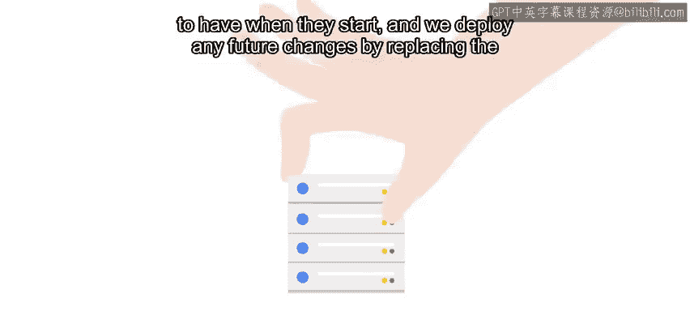

#  129：基础设施即代码 🏗️

在本节课中，我们将学习如何将复杂云基础设施的管理视为代码，并探讨相关的工具与实践。

## 概述

上一节我们讨论了如何编排复杂的云设置。这包括处理具有不同工作负载的多个节点，管理混合部署的复杂性，或在多个数据中心之间修改部署。

在本节中，我们将深入探讨“基础设施即代码”的概念，了解其优势，并介绍实现这一目标的主流工具。

## 基础设施即代码的优势

在课程开始时，我们曾提到基础设施即代码。将基础设施以类似代码的格式存储，使我们能够创建可重复的基础设施。使用版本控制系统存储这些配置，意味着我们可以保留所做更改的历史记录，并轻松回滚错误。

这些原则同样适用于云基础设施。根据所使用的工具，存储方式可能略有不同，但我们仍将以类似代码的格式存储此配置，并使用版本控制来跟踪更改。

这使我们能够以小型团队管理大规模解决方案。通过查看配置，我们可以快速了解部署的样貌。我们可以尝试新事物，并在出现问题时回滚。我们可以查看更改历史，以了解为何进行特定更改等等。

## 云提供商专用工具

大多数云提供商都提供自己的工具来将资源作为代码管理。例如：
*   **Amazon** 有 **CloudFormation**。
*   **Google** 有 **Cloud Deployment Manager**。
*   **Microsoft** 有 **Azure Resource Manager**。
*   **OpenStack** 有 **Heat Orchestration Templates**。

这些工具特定于云提供商，这意味着迁移到不同提供商或将云部署与本地部署结合可能会变得复杂且繁琐。

## 通用编排工具：Terraform

编排领域一个日益流行的选项是 **Terraform**。与 Puppet 类似，Terraform 使用自己的领域特定语言，让我们可以指定我们希望云基础设施呈现的样子。

Terraform 的优点是它知道如何与许多不同的云提供商和自动化供应商进行交互。因此，你可以编写 Terraform 规则在一个云提供商上部署服务，然后使用非常相似的规则将服务部署到另一个云提供商。

Terraform 通过调用每个云提供商的 API 来实现这一点。这使你在迁移到不同云提供商时无需学习新的 API，让你可以专注于基础设施设计。

## 工作原理类比

在之前的视频中，我们看到 Puppet 规则可以指定计算机应安装特定软件包，然后本地的 Puppet 代理会分析计算机，并根据操作系统、特定的 Linux 发行版等决定使用哪种安装机制。

Terraform 也发生着类似的事情。定义资源（如要使用的虚拟机或容器）的规则将使用与云提供商相关的特定值，例如选择使用哪种机器类型或在哪个区域部署。

但大量的整体配置与提供商无关，如果我们决定将配置迁移到其他提供商，或者想要使用混合设置，这些配置可以被重用。

## 其他选项与节点管理

当然，Terraform 不是唯一的选择。Puppet 本身也附带了许多插件，可用于与不同的云提供商交互，以创建和修改所需的云基础设施。

最后，让我们花点时间讨论一下由编排工具管理的节点或实例的内容。在处理云中的节点时，基本上有两种选择：

以下是两种节点生命周期的管理方式：
1.  **长期运行节点**：其内容需要定期更新。这类节点通常是预期不会消失的服务器，例如公司的内部邮件服务器或内部文档共享服务器。我们使用像 Puppet 这样的配置管理系统来管理这些实例，它可以在机器运行时部署任何必要的更改，使其保持最新状态。
2.  **短期运行节点**：这类节点来去非常快。对于这些情况，在它们运行时应用更改的意义不大。相反，我们通常在实例启动时应用我们希望它们拥有的配置，并通过用新实例替换旧实例来部署任何未来的更改。

我们仍然可以使用 Puppet 进行初始设置，但不需要定期运行代理，只需在启动时运行即可。

## 总结

如果这一切听起来非常复杂，没关系。关于云编排有很多需要学习。一旦你尝试过，许多概念会变得更加清晰。

在本节课中，我们一起学习了基础设施即代码的核心思想，它通过将配置代码化、版本化来提升云基础设施管理的可重复性、可追溯性和灵活性。我们介绍了云提供商专用工具的局限性，并重点探讨了跨平台工具 Terraform 的工作原理及其优势。最后，我们还区分了针对长期运行和短期运行节点的不同管理策略。

接下来，我们提供了一些额外的信息供你深入探索，然后是一个小测验来帮助你巩固这些概念。