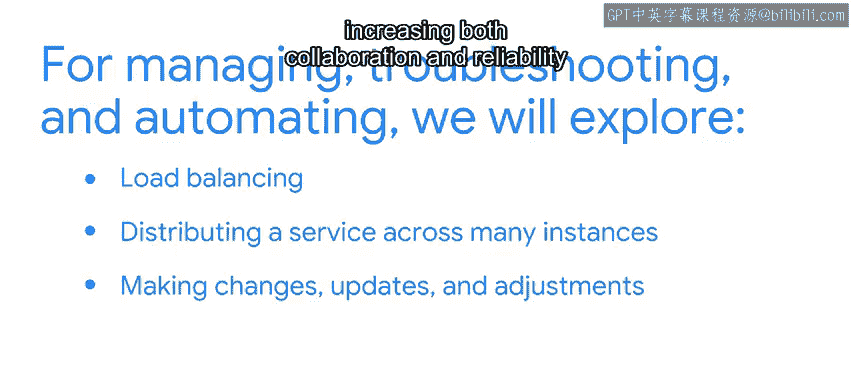

#  130：大规模管理云实例 🚀

在本节课中，我们将学习如何大规模地使用和管理云实例。我们将探讨在云环境中管理、扩展和自动化应用程序所面临的挑战，并介绍应对这些挑战的关键技术与策略。

---

上一节我们介绍了云服务的基础知识。本节中，我们将深入探讨在云中管理和运行应用程序的实际考量。

如果你在一家小型公司从事IT工作，可能主要将云用于在受保护的位置归档和存储记录与财务信息。在这种情况下，你或许可以直接使用云服务提供商提供的预打包应用程序来满足所有需求。

但对于规模更大或正在成长的公司而言，这种浅层次的云应用可能不够。你可能需要开始基于云提供商提供的平台和基础设施模型来开发自己的应用程序。

开发自有应用程序能为你的IT团队带来更多控制权和灵活性，允许你创建和定制应用程序以更好地满足公司的需求和目标，但这同时也带来了新的挑战。你和你的团队将需要：

以下是团队需要应对的几个关键挑战：
*   弄清楚不同的应用程序和组件如何协同工作以及独立工作。
*   确保每个工具和应用程序每次都能可靠运行。
*   知道如何在问题或兼容性问题出现时进行故障排除。
*   根据最新的工作流程，制定扩展或缩减服务的方案。

本课程旨在帮助你理解、规划并应对这些问题。

---

我们已经了解了可用的各种云服务，如何根据公司需求评估它们，以及在云中构建或适配软件时涉及的迁移和扩展问题。我们还初步了解了云基础设施中的虚拟机、编排和部署。

随着课程的推进，你将有机会学习如何管理和排查你已适配或创建的应用程序的问题，并实现其使用的自动化。

为了进行管理、故障排除和自动化，我们将探索以下核心概念：

以下是本课程将涵盖的几个核心领域：
*   **负载均衡**：将服务分发到多个实例上。
*   **在不破坏应用程序或其相互关系的前提下进行更改、更新和调整**，从而提高协作性和可靠性。
*   审视在云中运行软件应用程序时可能遇到的一些限制。

---

我们还需要管理你的期望并提供必要的背景知识，尤其是在事情未按预期发展时。有时软件甚至系统会出故障，这很正常。此处的关键是找出问题发生的原因，并确定最佳的修复方案。

为此，本课程还将为你提供可用于响应和排查云服务工作中可能出现问题的技巧和流程。之后，你甚至将有机会调试和修复常见问题。这些知识可以在你的整个职业生涯中应用。

最后，我们将通过介绍一些最佳实践来结束课程，例如使用监控系统衡量你的操作，并设置警报以便在计划外情况发生时自动收到通知。

---

也许你感到兴奋，甚至有点紧张。没有必要紧张，我们将全程与你同行。此外，讨论提示和论坛将允许你在此过程中与同伴分享想法、问题和成功经验。

感觉好点了吗？很好，因为我们还有很多内容要学习。让我们继续深入吧。

---

本节课中我们一起学习了大规模管理云实例的概述、挑战以及本课程将提供的解决方案。我们明确了开发自有云应用带来的控制力与随之而来的管理复杂性，并预告了后续将深入学习的负载均衡、无缝更新、故障排除和监控警报等关键主题。