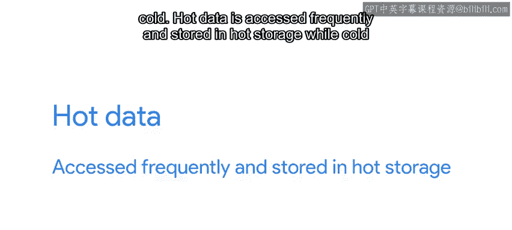

#  131：在云端存储数据 🗄️

在本节课中，我们将学习云环境中不同的数据存储解决方案。我们将探讨块存储、对象存储和数据库服务等核心概念，并了解如何根据性能、成本和访问模式等因素选择合适的存储类型。

---

几乎所有IT系统都需要存储数据。有时数据量很大，有时则只是零散的信息。

云服务提供商为我们提供了多种存储选项。选择正确的数据存储解决方案取决于您正在构建的服务类型。您需要考虑一系列因素，例如：您希望存储多少数据、数据的类型、使用的地理位置、主要是写入还是读取数据、数据变化的频率以及您的预算。

这听起来需要考虑很多事情，但别担心，情况没那么复杂。我们将查看云提供商提供的一些最常见解决方案，以便让您更好地了解在云端选择存储方案时，何时该选择什么。

在选择云存储解决方案时，您可以选择传统的存储技术，如**块存储**，也可以选择更新的技术，如**对象存储**或**Blob存储**。让我们来看看这些术语分别是什么意思。

## 块存储 💾

正如我们在之前的视频中所见，当我们在云中创建一台虚拟机时，它会连接一个本地磁盘。这些本地磁盘就是块存储的一个例子。这种类型的存储非常类似于物理机器上使用物理硬盘的存储方式。云中的块存储行为几乎与硬盘完全相同。

虚拟机的操作系统将在块存储之上创建和管理一个文件系统，就像它是一个物理驱动器一样。不过，有一个很酷的区别：这些是虚拟磁盘，因此我们可以轻松地移动数据。例如，我们可以将磁盘上的信息迁移到不同位置，将相同的磁盘映像附加到其他机器，或者创建当前状态的快照。所有这些操作都无需物理设备在不同地点之间运输。

我们的块存储可以是**持久性**的，也可以是**临时性**的。持久性存储用于生命周期长、需要在重启和升级后保留数据的实例。相反，临时性存储用于仅临时存在、只需在运行时保留本地数据的实例。临时性存储非常适合服务在运行时需要创建但无需保留的临时文件。这种类型的存储在容器使用时尤其常见，但在处理只需在运行时存储数据的虚拟机时也很有用。

在典型的云设置中，每台虚拟机都连接有一个或多个磁盘。这些磁盘上的数据由操作系统管理，不易与其他虚拟机共享。如果您希望在多个实例之间共享数据，可能需要研究云提供商使用平台即服务模型提供的一些共享文件系统解决方案。使用这些解决方案时，可以通过NFS或CFS等网络文件系统协议访问数据。这允许您将许多不同的实例或容器连接到同一个文件系统，而无需编程。

当您管理需要访问文件的服务器时，块存储和共享文件系统工作得很好。但是，如果您尝试部署需要存储应用程序数据的云应用程序，则可能需要研究其他解决方案，例如对象存储。

## 对象存储（Blob存储） 📦

对象存储，也称为Blob存储，允许您在存储桶中放置和检索对象。这些对象只是通用文件，如照片或猫咪视频，它们被编码并以二进制数据形式存储在磁盘上。这些文件通常被称为**Blob**，源自“二进制大对象”。正如我们提到的，这些Blob存储在称为**桶**的位置。

您放入存储桶的所有内容都有一个唯一的名称。这里没有文件系统。您将一个对象以某个名称放入存储中。如果您想取回该对象，只需通过名称请求它。要与对象存储交互，您需要使用API或可以与您正在使用的特定对象存储交互的特殊工具。

## 数据库即服务 🗃️

除了上述方案，我们在之前的视频中还提到，大多数云提供商都提供**数据库即服务**。这些服务基本分为两种类型：**SQL**和**NoSQL**。

**SQL数据库**，也称为关系型数据库，使用传统的数据库格式和查询语言。数据存储在具有行和列的表中，这些表可以被索引，我们通过编写SQL查询来检索数据。许多现有应用程序已经使用这种模型，因此在将现有应用程序迁移到云端时通常会选择它。

**NoSQL数据库**在扩展性方面提供了许多优势。它们设计为分布在大量机器上，并且在检索结果时速度极快。但是，它们没有统一的查询语言，我们需要使用数据库提供的特定API。这意味着我们可能需要重写应用程序中访问数据库的部分。

## 选择存储类别与性能指标 ⚙️

在决定如何存储数据时，您还必须选择**存储类别**。云提供商通常以不同价格提供不同类别的存储。性能、可用性或数据访问频率等变量会影响月度价格。

存储解决方案的性能受多种因素影响，包括**吞吐量**、**IOPS**和**延迟**。让我们看看这些术语的含义：

*   **吞吐量**：指在给定时间内可以读取和写入的数据量。读取和写入的吞吐量可能大不相同。例如，读取吞吐量可能为每秒1吉字节，而写入吞吐量可能为每秒100兆字节。
*   **IOPS**：即每秒输入/输出操作数。它衡量在一秒钟内可以执行多少次读取或写入操作，无论访问的数据量是多少。每个读取或写入操作都有一些开销，因此在给定秒内可以执行的操作数量是有限的。
*   **延迟**：指完成一次读取或写入操作所需的时间。这将考虑IOPS、吞吐量以及特定服务细节的影响。读取延迟有时报告为发出读取请求后存储系统开始传送数据所需的时间，也称为“首字节时间”。而写入延迟通常衡量写入操作完成所需的时间。

选择要使用的存储类别时，您可能会遇到**热**和**冷**等术语。热数据被频繁访问，存储在热存储中；而冷数据不常被访问，存储在冷存储中。这两种存储类型具有不同的性能特征。例如，热存储后端通常使用固态硬盘构建，其速度通常比传统的旋转硬盘快。

那么，如何在两者之间做出选择呢？假设您希望将服务产生的所有数据保留五年，但您不期望会定期访问超过一年的数据。您可能会选择将最近一年的数据保留在热存储中，以便快速访问。一年后，您可以将数据移动到冷存储中，在那里您仍然可以访问它，但访问速度会变慢，并且成本可能更高。

---

关于云存储还有很多内容可以探讨，这确实是一个热门话题，但我们不会在此深入更多细节。如果您想了解更多信息，我们将在下一篇阅读材料中提供更多信息的链接。

接下来，我们将探讨另一个我们已经接触过的云规模特性：为同一服务使用多台机器。