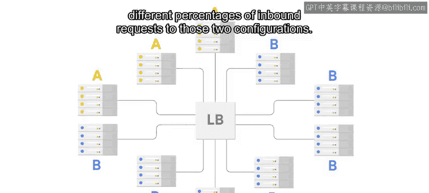

#  133：变更管理 🛠️

在本节课中，我们将学习如何通过变更管理，在保持云服务稳定运行的同时，安全地进行更新与改进。我们将探讨测试、持续集成与部署、多环境策略以及A/B测试等核心实践。

你已经取得了长足的进步，现在知道了如何让服务在云端运行。接下来，让我们讨论如何保持它的运行。大多数情况下，服务停止工作是因为某些东西发生了变更。

如果我们希望云服务保持稳定，可能会倾向于完全避免变更。但变更是云环境中的常态。为了修复错误和改进服务功能，我们必须进行变更，但我们可以以受控且安全的方式进行。这就是**变更管理**。它让我们能够在服务持续运行的同时不断创新。

## 确保变更安全：测试先行 🧪

提高变更安全性的第一步，是确保它们经过充分测试。这意味着运行单元测试和集成测试，并在每次变更时都运行这些测试。

在之前的课程中，我们简要提到了**持续集成**。这里做一个回顾：持续集成系统会在每次有变更时构建和测试我们的代码。理想情况下，CI系统甚至会对正在审查的变更运行测试。这样，你可以在问题被合并到主分支之前就发现它们。

你可以使用常见的开源CI系统，如 **Jenkins**。如果你使用Github，可以利用其 **Travis CI** 集成。许多云提供商也提供持续集成即服务。

一旦变更被提交，CI系统将构建并测试生成的代码。

## 自动化部署：持续部署 🚀

现在，你可以使用**持续部署**来自动部署构建结果或构建产物。持续部署允许你通过规则来控制部署。

例如，我们通常配置CD系统，使其仅在所有测试都成功通过时才部署新的构建。此外，我们还可以根据某些规则配置CD，将构建推送到不同的环境。

这是什么意思呢？在之前的视频中我们提到，在推送Puppet变更时，我们应该有一个独立于生产环境的测试环境。将它们分开，可以让我们在变更影响用户之前验证其正确性。

在这里，**环境**指的是运行服务所需的一切，包括用于运行服务的机器和网络、部署的代码、配置管理、应用程序配置以及客户数据。

*   **生产环境**，通常简称为 **prod**，是真实的环境，是用户看到并与之交互的环境。因此，我们必须保护、关爱并培育prod。
*   **测试环境**需要与prod足够相似，以便我们用它来检查变更是否正常工作。

你可以将CI系统配置为将新变更推送到测试环境。然后，你可以在那里检查服务是否仍能正常工作，再手动告知部署系统将这些相同的变更推送到生产环境。

## 多环境策略 📊

如果服务很复杂，并且有许多不同的开发人员对其进行更改，你可能会设置额外的环境，让开发人员在发布变更前在不同阶段测试他们的更改。

例如，你可以让CD系统将所有新变更推送到**开发环境**。然后，设置一个名为**预生产环境**的独立环境，它只会在批准后接收特定的变更。只有在经过彻底测试后，这些变更才会被推送到prod。

假设你正试图将服务效率提高20%，但不确定所做的更改是否可能导致系统部分崩溃。你会希望先将其部署到某个测试或开发环境中，以确保其正常工作，然后再将其发布到Prod。

请记住，这些环境需要尽可能与prod相似。它们应该以相同的方式构建和部署。虽然我们不希望它们总是出问题，但某些变更导致开发环境甚至预生产环境出故障是正常的。我们庆幸能及早发现问题，从而避免它们破坏prod。

## 生产环境实验：A/B测试 🔬

有时你可能想试验一项新的服务功能。你已经测试了代码，知道它能工作，但你想知道它是否会对你的用户有效。当你有一些想要在真实客户的生产环境中测试的东西时，你可以使用**A/B测试**进行实验。

在A/B测试中，一部分请求使用一组代码和配置来服务，另一部分请求则使用另一组不同的代码和配置来服务。这是负载均衡器和实例组可以发挥作用的另一个地方。

你可以部署一个采用A配置的实例组，以及第二个采用B配置的实例组。然后，通过更改负载均衡器的配置，你可以将不同比例的入站请求定向到这两种配置。

如果你的A配置是当前的生产配置，而B配置是实验性的，你可能希望开始时只将1%的请求定向到B。然后，随着你检查B配置是否比A表现更好，可以慢慢提高这个比例。

请注意，确保你拥有基本的监控，以便轻松判断A或B的表现是更好还是更差。如果很难识别负责服务A请求或B请求的后端，那么A/B测试的许多价值就会在A/B调试中丧失。

## 应对故障：从失败中学习 💡

如果我们采取的所有预防措施都不够，并且我们在生产中破坏了某些东西，该怎么办？记住我们在之前课程中关于**事后分析**的讨论：我们从失败中学习，并将新知识融入我们的变更管理中。

问问自己：我必须做什么才能发现问题？我能否让我的某个变更管理系统在未来寻找类似的问题？我能否向我的单元测试、CI/CD系统或服务健康检查中添加测试或规则，以防止未来发生此类故障？

所以请记住，如果出现问题，给自己一个喘息的机会。在IT领域，有时这些事情会发生，无论你多么小心。随着你使用和完善你的变更管理系统和技能，你将获得更快、更安全地对服务进行更改的信心。

## 总结 📝

本节课中，我们一起学习了云服务变更管理的核心实践。我们了解到，通过**充分的测试**、**持续集成与部署**的自动化流程、建立**多环境策略**（如开发、测试、预生产和生产环境）以及利用**A/B测试**进行生产环境实验，可以在持续创新的同时保障服务的稳定性。最后，我们认识到当故障发生时，应通过**事后分析**从中学习，并不断完善变更管理流程，从而建立起安全、快速进行变更的信心。