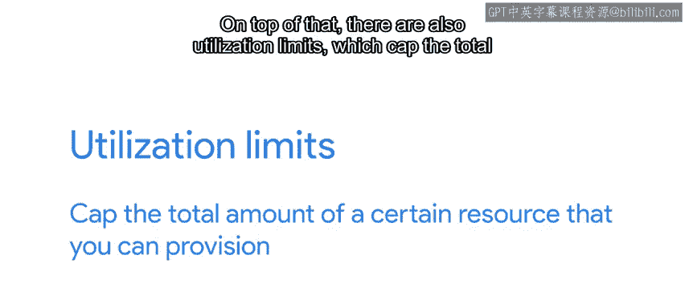

#  134：了解云端部署的限制 🚧

在本节课中，我们将要学习在云端部署服务时可能遇到的各种限制和挑战。了解这些限制有助于我们设计出更健壮、更具成本效益的云服务。

上一节我们讨论了如何让服务在云端平稳运行。本节中，我们来看看部署过程中可能遇到的具体问题。

## 保持应用部署方式在心

编写在云端运行的软件时，必须时刻牢记应用程序的部署方式。创建的软件需要具备**容错能力**，并能处理意外事件。实例池中的机器可能会根据需要被添加或移除。如果单台机器崩溃，服务需要能够**平稳过渡**，不引发问题。

并非所有问题都会导致崩溃。有时我们会遇到配额或限制。

## 理解配额与速率限制

以下是几种常见的限制类型：

*   **操作频率限制**：例如，在使用Blob存储时，可能限制在给定秒数内对同一Blob的写入操作不超过1000次。如果服务常规执行大量此类操作，可能会被这些限制阻止。此时，需要评估是否能改变操作方式，例如将所有调用**分组为一个批次**，或者**切换到不同的服务**。
*   **API调用速率限制**：云服务中使用的一些API调用可能成本高昂。因此，大多数云提供商会强制执行速率限制，以防止单个服务使整个系统过载。例如，对于一个昂贵的API调用，速率限制可能为**每秒一次**。
*   **资源利用配额**：这类配额限制了你可配置的特定资源总量。

## 配额的作用与管理

这些配额旨在帮助你避免无意中分配超出预期的资源。

想象一下，你配置了服务使用自动扩展，而它突然收到巨大的流量高峰。这可能意味着要部署大量新实例，从而产生高昂费用。

对于其中一些限制，如果你需要额外容量，可以向云提供商申请**增加配额**。你也可以设置一个比默认值更小的配额来避免超支。这在预算紧张的情况下运行服务是一个好主意。

如果服务常规执行昂贵的操作，应确保了解所选解决方案的限制。许多**平台即服务**和**基础设施即服务**产品的成本与其使用量直接相关，并且也有使用配额。如果构建的服务突然变得非常流行，可能会耗尽配额或预算。

通过对自动扩展系统施加配额，系统将增长以满足用户需求，直到达到配置的限制。此处的诀窍是围绕此类行为建立良好的**监控和警报**。如果系统配额耗尽，但对“小狗视频”的需求却在增加，系统可能会出现性能下降甚至中断等问题。因此，你希望在此情况发生时立即收到通知，以便决定是否增加配额。

## 处理服务依赖

最后，我们来谈谈依赖关系。当你的服务依赖于**平台即服务**产品，如托管数据库或CI/CD系统时，你就将该服务的维护和升级责任移交给了云提供商。这很好，需要担心和维护的事情更少，但也意味着你并不总能选择所使用的软件版本。

你可能会发现自己处于升级周期的任一侧：要么希望停留在对你运行良好的版本，要么希望云提供商加快升级以解决影响你服务的错误。

云提供商有强烈的动机保持其服务软件相对最新。保持**软件即服务**解决方案处于最新状态，可确保客户不易受到安全漏洞的影响，错误能得到及时修复，并且新功能能尽早发布。同时，云提供商必须谨慎行事并测试变更，以将服务中断降至最低。

他们会主动沟通你所使用服务的变更。在某些情况下，云提供商可能会让你提前访问这些服务的早期版本。例如，你可以为服务设置一个测试环境，该环境使用给定**软件即服务**解决方案的**测试版或预发布版本**，让你在其影响生产环境之前进行测试。

## 总结

本节课中，我们一起学习了云端部署的关键限制，包括操作频率、API速率和资源配额。我们探讨了配额的管理策略，以及如何处理对PaaS产品的依赖和版本控制。希望你现在开始理解，为了从云端部署软件中获得最大收益，需要做出哪些权衡。