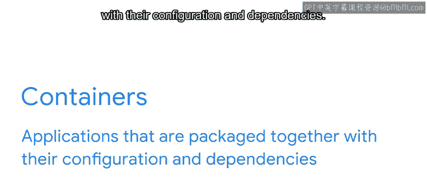
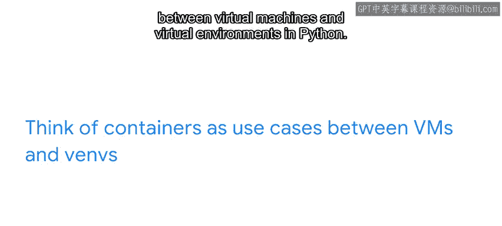

#  135：什么是容器？📦

在本节课中，我们将要学习容器的基本概念。容器是一种将应用程序与其配置和依赖项打包在一起的技术。通过本课，你将理解容器如何工作，以及它们为何在现代软件开发中如此重要。

---

## 容器是什么？

在模块1中，我们简要提到了容器，将其定义为**将应用程序与其配置和依赖项打包在一起的应用**。

那么，这具体意味着什么？假设你正在购买制作世界著名烤土豆的食材。你买了牛奶、酸奶油、辣椒、甜椒、香料和四个大土豆。

但你不会分多次单独将它们搬到车上，对吗？当然不会。

杂货店会将它们放入一个容器中，比如袋子。你的食材被打包在一起，以便你可以将它们运回家中，制作你的美食杰作。

---

## 容器的用途

容器不仅仅用于打包。它们还用于共享你正在开发的应用程序、将应用程序发布到服务器进行审查、测试同一应用程序的不同实例，以及分别处理复杂系统架构的关键部分。

让我们进一步扩展我们的例子。如果你想在朋友家或你要去的派对上制作你的烤土豆怎么办？这不是问题，因为你需要的所有东西都在从商店得到的容器里。这个食谱在任何厨房都适用。在Python中也是如此。

容器允许应用程序以相同的方式运行，无论你在什么环境中运行它们。

假设你正在与编程同行分享你的应用程序。你不想让他们下载你用来创建应用程序的所有Python库和依赖项，因此你将应用程序的虚拟环境（VN）打包到一个容器中。然后你将其发送给他们，将其导出为一个`requirements.txt`文件（这是一个一一列出所有必需库和依赖项的清单）以及一个Dockerfile。我们将在后面的视频中详细讨论Docker。

---

## 容器、虚拟机与虚拟环境

容器填补了虚拟机（VMs）和Python虚拟环境之间的空白。可以将容器视为虚拟机和Python虚拟环境之间的**用例**。

使用容器基本上就像打包你电脑的一部分并交给别人一样。

编写软件时的一个常见问题是，不同的服务器或同行计算机的设置方式可能与你的不完全相同。因此，即使一切在你的电脑上运行完美，但在他们的电脑上可能无法正确运行，甚至根本无法运行。通过容器，你可以虚拟地打包所有使软件在你电脑上运行所需的东西，并给他们提供按预期使用软件所需的一切。

这本质上是允许他们使用你系统的快照来运行应用程序。你也可以在容器内运行一个小型数据库，并用另一个程序连接到该数据库。

容器使程序员能够测试客户端-服务器应用程序，而无需使用另一台计算机或启动昂贵的云服务。

作为程序员，你可以编写自己的容器，或调整现有的容器或容器模板以满足项目需求。

---

## 总结

在本节课中，我们一起学习了容器的核心概念。容器允许你组装一个包含应用程序及其配置和依赖项的包，这个包位于一个虚拟环境中，本质上是你用来创建它的计算机的快照（包括使用的Python版本、库、配置等）。因此，它可以运行在任何其他地方，包括互联网上，而不受特定计算机或服务器操作规格的限制。

这就是容器赋予你的能力。当你将它们与Docker结合使用时，这种能力将变得更加强大，我们将在下一课中介绍Docker。