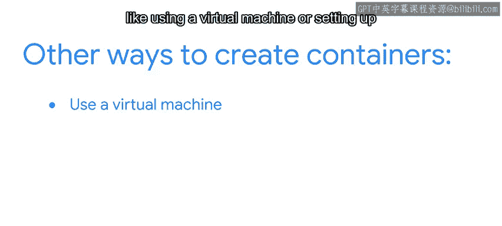

#  136：Docker Web应用 🐳

在本节课中，我们将学习Docker这一行业标准的容器工具，了解它如何简化将应用程序打包为容器的过程，以及如何创建和共享Docker Web应用。

---

现在你已经了解了容器是什么以及它们的用途，你可能会想知道接下来该怎么做。接下来，我们将介绍Docker。

Docker是一个行业标准的容器工具。它是一个开源平台，可用于构建、部署、运行、更新和管理容器。换句话说，它简化了将应用程序转换为容器的过程。

回顾一下，要共享或发布打包在容器中的应用程序，你需要发送两个文件：一个`requirements.txt`文件和一个Docker文件（有时也称为Docker镜像，这两个名称可以互换使用）。Docker本身是一个在命令行上运行的应用程序。它读取Docker文件，然后Docker文件再读取`requirements.txt`文件。最后，Docker启动Python运行时引擎及其所有依赖项，并独立运行Python脚本。这就像将你计算机的一部分上传到另一台计算机或云端的服务器上。

为了澄清，容器通常是通过互联网共享，而不是在人与人之间传递。这被称为Docker Web应用。对于Docker Web应用，你需要将容器上传到服务器，以便人们可以远程连接到它。在Docker文件中，你需要指定它是一个支持Web的应用程序。一个Docker Web应用的例子是，你在计算机上运行一个像数据库这样的Docker镜像，并且它也允许来自其他计算机的流量。

当你共享一个带有Docker文件的容器时，重要的是要与共享对象（尤其是如果他们不熟悉Docker）设定好预期。第一次运行Docker文件时，它需要下载并安装用于创建该应用程序的Python版本的运行时文件，但这只发生一次。如果你使用相同的参数共享其他容器，它将直接运行Python脚本。

由于Docker是开源的，你可以免费使用它，没有任何许可要求。但Docker也有一个提供企业和订阅计划的付费版本，它可以将你的Docker镜像保存在私有云上，并允许你管理所有的Docker镜像。不过，购买计划只是其中一个选项。Google Cloud平台内置了Docker支持，因此你可以直接将镜像上传到那里。此外，许多网络存储设备和云备份服务器（如Buffalo和Western Digital）也包含对Docker的支持。

尽管Docker是一个相对较新的工具，但它实际上已成为创建容器的代名词。这主要是因为它比其他创建容器的方法（如使用虚拟机或设置像VM或Conda这样的虚拟环境）更简单。

---

如果你还没有使用Docker，不妨试一试。让我们快速回顾一下，以防你忘记了为什么应该使用它。

以下是Docker的核心优势：

*   Docker是一个行业标准工具，用于将应用程序转换为容器。
*   它允许你轻松地与同行和评审者发布和共享你的容器。
*   它独立运行你的Python脚本，这就像将你的计算机上传到另一个位置。
*   别忘了，Docker无需许可费用，并且预装在许多服务器和网络存储设备上。

请始终记住，编程是一项协作活动，而Docker让你更容易进行协作。

---

本节课只是使用Docker与容器的一个入门介绍。在接下来的几节阅读材料和视频中，你将有机会进行更深入的探索。希望你和我一样感到兴奋。