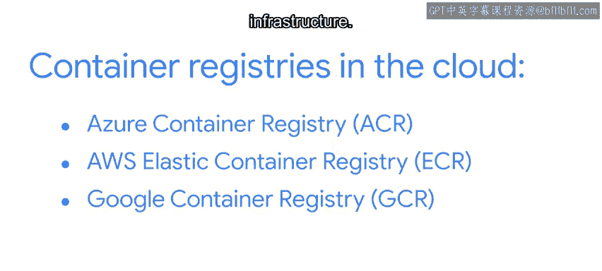

#  137：容器与制品注册表 📦

在本节课中，我们将学习容器和制品注册表的基本概念、区别以及它们在软件开发中的作用。我们还将介绍几种主流的云服务提供商提供的注册表服务。

---

## 概述

容器技术为程序员在协作、共享乃至获取Python应用反馈方面提供了显著优势。本节我们将探讨如何组织和管理容器，特别是容器注册表与制品注册表。

## 核心概念解析

上一节我们介绍了容器的优势，本节中我们来看看容器与制品注册表的具体定义与区别。

### 容器注册表

**容器注册表**是存储容器镜像的场所，同时包含编程接口路径和访问控制规则（例如针对Docker Web应用）。它们被组织起来以实现高效访问。

### 容器仓库

**容器仓库**是一种容器注册表，它不仅存储容器镜像，还管理这些镜像及其关联的制品。

例如，假设你有一台运行Windows 11的新PC。微软的注册表包含了与Windows 11操作系统相关的所有制品。但微软的注册表还负责管理镜像和制品，以便向你和所有其他Windows 11 PC用户推送更新。因此，更准确地说，这个注册表应被称为仓库。

### 制品

**制品**是应用程序容器中的依赖项之一。它是软件开发过程中的副产品，即在编程过程中产生的项目，例如Docker镜像或代码的编译版本。制品使你能够分发代码，供他人使用，正如我们提到的Windows 11更新。

容器和制品通常拥有不同的注册表，这是合理的。一个容器可以包含多个制品，但一个制品具有特定的目的或用途。它通常存储在注册表中，以便在需要时被访问和使用。

## 主流云容器注册表

以下是三种你应该了解的云容器注册表：

*   **Azure容器注册表 (ACR)**：一项Microsoft Azure服务，允许你存储、管理和部署容器镜像。
*   **AWS弹性容器注册表 (ECR)**：一项Amazon Web Services注册表服务，允许你在AWS上存储、管理和部署容器镜像。
*   **Google容器注册表 (GCR)**：一项由Google云平台提供的私有容器注册表服务，允许你使用GCP基础设施存储、管理和部署容器镜像。

这三种服务都提供诸如身份验证、访问控制和镜像地理复制等功能。它们也都提供用于制品存储的注册表。

## 如何选择注册表

如果你为公司编程，你将使用公司订阅的注册表。如果是个人使用，请花时间研究这些提供商，以确定最适合你的选项。

以下是选择时需要考虑的要点：

*   权衡每种服务的优点和缺点。
*   在做出决定前，仔细研究不同服务的选项，同时关注其功能和安全性协议。
*   进行一些研究，并在有机会时尝试使用它们。

## 总结

本节课中我们一起学习了以下核心概念：

*   **注册表**：存储和组织容器或制品的场所。
*   **仓库**：允许你管理容器或制品的注册表或注册表集合。
*   **制品**：存储在注册表中、供需要时访问和使用的开发副产品。

最后再次提醒，在决定使用前请仔细考虑注册表服务。注册表在DevOps工作流中管理容器和制品尤为重要，我们将在课程后续部分进一步讨论。届时我们将继续这个话题。