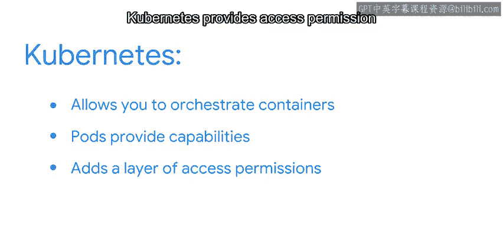

#  138：Kubernetes 概览 🐳

在本节课中，我们将要学习一个名为 Kubernetes 的强大工具，它用于管理和编排容器。我们将了解它如何解决资源分配不均的问题，以及它与 Docker 的关系。

---

你是否注意到，有些人就是不喜欢分享？在本节中，我们将探讨如何利用资源管理并进行扩展，从而降低那些不愿分享的人独占所有资源、损害他人利益的可能性。

假设你将一个 Docker 镜像部署在云服务器上，以便与 20 位用户共享你的应用程序。服务器端实际上没有任何机制能防止少数极度热情的用户垄断所有服务器带宽。结果就是，部分用户会得到缓慢、不稳定的服务。

为了预见并解决这个问题，许多程序员会部署同一应用程序的多个 Docker 镜像，以确保每个人都能获得最佳、最快速的服务。但是，当需要更新应用程序、修复漏洞或添加新功能时，你做出的每一项更改也必须同步到这云端的 20 个实例中。

Kubernetes 正是为了解决此类问题而生的工具。Kubernetes，缩写为 K8s，是一个开源平台，它赋予程序员编排或管理容器的能力。

你可以把它想象成一群鱼，或者更贴切地说，一锅鲸鱼。在 K8s 中，你使用和命名的容器在集群中被部署为 **Pod**。

一个 **Pod** 是一个逻辑组，包含一个或多个容器，它们被调度并在单个工作节点（即 Kubernetes 集群中的一个主机）上一起运行。同一个 Pod 中的容器共享网络命名空间、相同的 IP 地址和资源，因此它们可以相互通信。这使得部署非常高效。

你可以对 Kubernetes Pod 做很多事情：

以下是 Pod 的核心操作：

*   **扩展（Scale）**：这意味着为你的 Pod 添加更多副本，就像我们在贪婪用户例子中需要的 20 个实例一样。
*   **更新（Update）**：更好的是，你可以通过更新你的 Pod，同时更新所有这些副本。
*   **回滚（Rollback）**：如果你发现了一个漏洞，需要让用户回退到更新前的版本，你可以回滚 Pod 及其副本。这允许你修复漏洞并发布新的更新。
*   **监控与检查**：Kubernetes 还允许你列出所有 Pod 和副本，并检查描述信息和日志，以寻找趋势或基于使用情况发现信息。
*   **对外暴露（Expose）**：或者，你可以将你的部署暴露给外部世界，这在 Docker 提供的访问权限之上提供了第二层访问控制。

这第二层权限允许你实现自动化的负载均衡。一旦你暴露了你的部署，就可以使用一个特殊的服务器与所有客户端通信，将每个连接实时重定向到 Pod 中最空闲的 Docker 镜像，从而确保每个人都能获得最佳访问。

为了更好地理解 Docker 和 Kubernetes 之间的关系，我们可以打一个比方：

想象 Docker 是一个**运输集装箱**。它让你将每个应用程序及其依赖项打包在一个独立的容器“板条箱”里，就像运输集装箱让你打包货物以便运输一样。

在这个例子中，**Kubernetes 就是港口**，它编排着集装箱和包裹的处理方式，并将它们引导到正确的地方。

由此可见，Kubernetes 使你能够在云端自动化容器部署，以最优方式实现你的应用策略目标。

但请注意，强大的能力伴随着一定的代价。它的学习曲线比较陡峭。

因此，除非你需要所有这些强大的功能和效率，否则你可能希望使用一种更简单的部署方法。这是你和你的 IT 部门需要做出的决定。

在本模块中，我们将为你提供大量关于 Kubernetes 的信息，所以在继续深入学习之前，让我们快速回顾一下基础知识。

以下是 Kubernetes 的核心要点：

*   **Kubernetes** 是一个开源平台，赋予程序员管理容器的能力。
*   **Kubernetes Pod** 是一个或多个容器，它们被调度并在单个工作节点或主机上一起运行。
*   **Pod** 可以被扩展、回滚，并可以深入挖掘其日志信息以寻找趋势。
*   **Kubernetes** 在 Docker 提供的功能之上，还提供了访问权限管理。

---

Kubernetes 对于合适的应用场景来说是一个重要工具。它使得与其他团队和用户共享数据、资源和应用程序变得容易。这有助于提高协作、效率和生产力。下次我们将更详细地讨论这些 Pod。