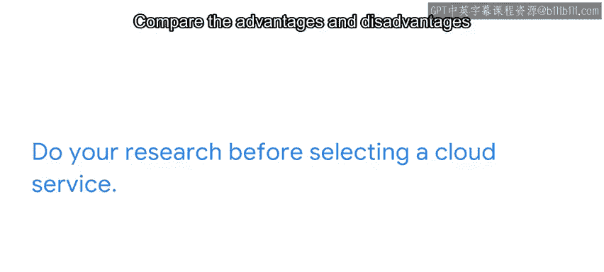

#  139：GCP 上的 Kubernetes 🚀

在本节课中，我们将探讨如何在谷歌云平台（GCP）上使用 Kubernetes，特别是通过 Google Kubernetes Engine（GKE）来简化和增强容器管理。

---

## 概述

Kubernetes 是一个强大的工具，用于组织、共享和管理容器。它允许程序员进行扩展、复制、推送更新、回滚版本以及处理版本控制等操作。然而，直接在本地或基础云服务上运行 Kubernetes 可能需要大量的手动配置和管理工作。本节我们将了解，通过 GCP 的 GKE 服务，如何让 Kubernetes 的使用变得“更好”。

---

## Kubernetes 的部署选择

上一节我们介绍了 Kubernetes 的基本功能，本节中我们来看看它的不同部署方式。

作为一个开源程序，Kubernetes 非常灵活。程序员可以选择多种方式来运行它：

*   在自己的电脑上运行。
*   直接在 Google Compute Engine（GCE）上运行。
*   在 GCP 上使用 **Google Kubernetes Engine（GKE）** 运行。GKE 是一项托管服务，专门致力于改善用户使用 Kubernetes 的体验。

你也可以在其他云服务提供商上运行 Kubernetes，它们大多提供类似 GKE 的引擎来增强 Kubernetes 的功能。

---

## GKE 的优势

以下是使用 GKE 在谷歌云上运行 Kubernetes 的主要优势：

*   **基于 Web 的界面**：GKE 提供了一个仪表盘，让程序员可以即时查看他们的容器、项目及其管理状态。大多数开源工具不提供这样的界面，用户需要自己创建或使用第三方界面。
*   **集群管理自动化**：GKE 提供自动化的集群配置、扩展和升级功能。
*   **简化部署**：使用 GKE，你可以简单地复制粘贴 Docker 文件，而无需通过终端上传。
*   **自动安全维护**：GKE 会自动处理 Kubernetes 软件的安全补丁和更新。如果没有 GKE，这些任务将落在程序员或其 DevOps 团队身上。

这意味着，即使是没有专职 DevOps 团队的系统开发人员，也可以使用 GKE 作为 DevOps 解决方案，通过单一的 Web 门户来管理其基础设施。

---

## GKE 的角色与价值

我们可以将 GKE 视为一个额外的管理层，它让像你这样的 Python 程序员能更容易、更好地利用 Kubernetes 的能力。

随着你在 Python 和其他编程语言上经验日益丰富，GKE 可以通过自动化常见任务和创建高级部署触发器，帮助你更高效地使用 Kubernetes。

---

## 选择前的考量

但在做出选择前，请务必进行研究。

比较 GKE 及其他类似引擎的优缺点，仔细评估它们的成本与功能是否符合你或你公司的目标，然后再选择像 GKE 这样的服务。

---

## 总结

本节课中我们一起学习了 Kubernetes 在 GCP 上的应用。

请记住，Kubernetes 是一个用于优化 Docker 容器和项目部署管理的工具。😊

在谷歌云上通过 GKE 使用 Kubernetes，为你提供了一个基于 Web 的界面或仪表盘，让你可以更高效地查看和管理容器与项目。

GKE 并没有解锁 Kubernetes 的任何隐藏功能，但它确实让使用变得更简单，并自动处理了安全和更新问题。

回到我们最初的问题：用云还是不用云？这个选择权完全在你手中。