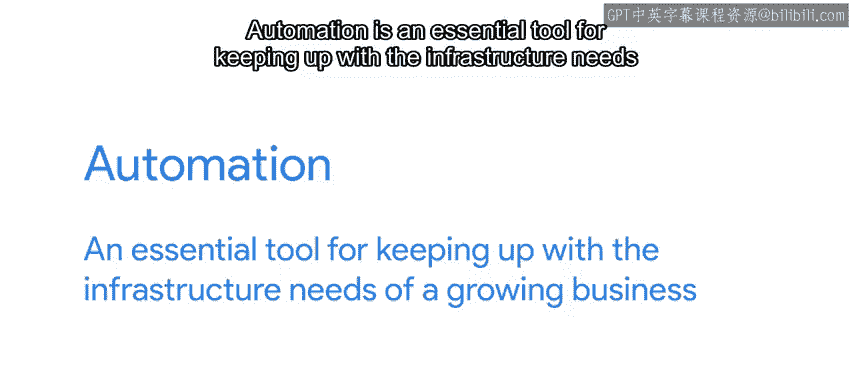

#  141：什么是规模 📈

在本节课中，我们将学习“规模”在IT自动化中的含义，以及如何通过自动化实现高效扩展。

---

## 概述

在IT领域，谈论“规模”通常指的是系统或流程处理更大工作量的能力。一个具备良好扩展性的系统，能在工作量增加时，通过提升容量来应对，而无需线性增加人力或资源投入。本节课将探讨规模的概念、其重要性，以及如何通过自动化工具实现高效扩展。

---

## 什么是规模？

当我们讨论“规模”时，指的是使我们的工作能够扩展的能力。这意味着我们可以用相同的努力，持续实现更大的影响。

当一个系统具备良好的扩展性时，其需要处理的工作量增加，可以通过增加容量来适应。

例如，如果你公司提供的网络应用是可扩展的，那么它可以通过添加更多服务器来处理用户数量的增长，从而服务更多请求。

简而言之，一个可扩展的系统是灵活的系统。向服务网站的服务器池中添加更多计算机，可能是一个非常简单的操作，也可能非常困难，这取决于你的基础设施是如何设置的。

---

## 评估当前设置的扩展性

为了评估你当前设置的扩展性，可以问自己以下问题：

以下是几个关键的自查问题：

*   添加更多服务器是否会增加服务的容量？
*   新服务器是如何准备、安装和配置的？
*   你能多快设置好新计算机并使其投入使用？
*   你能否用现有的IT团队部署100台服务器，还是需要雇佣更多人来更快完成？
*   所有部署的服务器是否都以完全相同的方式配置？

---

## 规模不仅限于网站服务

当然，规模不仅仅关乎提供内容的网站。

如果你的公司正在快速招聘大量新员工，你将需要一个能够按需扩展的入职流程。

随着你不断向网络中添加新计算机，你需要确保你的系统管理流程能够扩展到公司日益增长的需求。

这可能包括应用最新的安全策略和补丁等任务，同时确保用户需求仍能得到满足，而且是在越来越多用户加入网络、却没有新的支持人员支持你的情况下完成。

---

## 自动化的关键作用

如果现在让这一切发生听起来有点像魔法，请记住，我们在这里与你分享秘密成分：**自动化**。

自动化是跟上不断增长业务基础设施需求的重要工具。

通过使用正确的自动化工具，我们可以在相同的时间内完成更多工作。

例如，我们可以通过运行一条命令来部署一台全新的服务器，并让自动化处理其余的工作。

我们还可以基于数据库中已存储的数据，创建一批具有所有必要权限的用户账户，从而消除所有人工交互。

**自动化正是让我们能够扩展的关键**。它允许一个小的IT团队管理数百甚至数千台计算机。

---

## 实践中的工具

那么，这在实践中是什么样子呢？我们可以使用多种不同的工具来实现这一点。

接下来，我们将讨论一种称为**配置管理**的工具类型，它可以帮助我们自动化管理计算机群组的方式。

---

## 总结

本节课中，我们一起学习了“规模”在IT环境中的核心含义：即系统或流程高效应对增长的能力。我们探讨了评估系统扩展性的关键问题，并认识到规模挑战不仅限于技术服务，也涉及人力资源和流程管理。最重要的是，我们明确了**自动化**是实现高效扩展、让小团队管理大规模基础设施的基石。下一节，我们将深入介绍实现自动化的具体工具——配置管理。