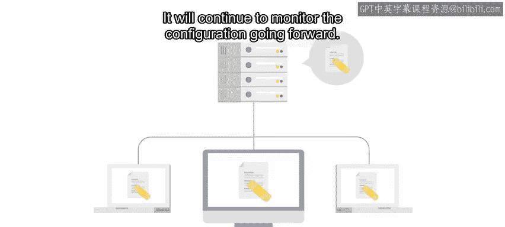

#  142：什么是配置管理？⚙️

在本节课中，我们将要学习配置管理的基本概念。我们将了解什么是配置、为什么需要管理配置，以及配置管理系统如何帮助我们自动化、一致地管理大量设备。

---

想象一下，你的团队负责设置一台新服务器。这台服务器可以是你附近运行的一台物理计算机，也可以是云中某处运行的虚拟机。

为了让工作启动，团队会安装操作系统、配置一些应用程序和服务、设置网络堆栈。当一切准备就绪后，通过手动部署安装和配置计算机，将服务器投入使用。

当我们在这里谈论配置时，我们指的是从当前操作系统和已安装的应用程序，到任何必要的配置文件或策略，以及服务器执行其工作所需的所有相关设置。当你在IT领域工作时，通常需要负责许多不同设备的配置，而不仅仅是服务器。网络路由器、打印机，甚至智能家居设备，都可能存在我们可以控制的配置。例如，网络交换机可能使用一个配置文件来设置其每个端口。

---

## 什么是配置管理？

上一节我们介绍了配置的含义。我们说手动部署服务器意味着配置是**未管理的**。那么，配置被**管理**意味着什么呢？

它意味着使用一个配置管理系统来处理你整个设备群（也称为节点）的所有配置。根据所涉及的设备和服务，有许多不同的工具可用。

通常，你会定义一组必须应用于你想要管理的节点的规则，然后通过一个过程确保这些设置在每一个节点上都成立。

---

## 为什么需要配置管理？

在小规模情况下，未管理的配置似乎成本不高。如果你只管理少数几台服务器，或许可以在没有自动化帮助的情况下应付。你可以在必要时登录每台设备并手动进行更改。

当你的公司需要一台新的数据库服务器时，你或许可以直接在一台备用计算机上手动安装操作系统和数据库软件。

但是，这种方法并不总能很好地扩展。你需要部署的服务器越多，手动操作所需的时间就越长。而当出现问题时（问题常常会发生），恢复并使服务器重新上线可能需要大量时间。

配置管理系统旨在解决这个扩展性问题。

---

## 配置管理系统如何工作？

通过使用这样的系统来管理设备群的配置，大规模部署变得更容易处理，因为无论你管理多少设备，系统都会自动部署配置。

当你使用配置管理并且需要在一台或多台计算机上进行更改时，你无需手动连接到每台计算机来执行操作。相反，你编辑配置管理规则，然后让自动化程序在受影响的机器上应用这些规则。

这样，你对一个系统或一组系统所做的更改是以一种系统化、可重复的方式完成的。可重复性很重要，因为它意味着在所有设备上结果都将相同。

一个配置管理工具可以获取你定义的规则，并将其应用于它所管理的系统，使更改高效且一致。配置管理系统通常还内置某种形式的自动纠错功能，以便它们能够自行从某些类型的错误中恢复。

例如，假设你发现公司广泛使用的某个应用程序配置非常不安全。你可以向配置管理系统添加规则，以改进所有计算机上的设置。这不仅会应用一次更安全的设置，还会持续监控未来的配置。

如果用户更改了他们机器上的设置，配置管理工具将检测到此更改，并重新应用你在代码中定义的设置。

---

## 常见的配置管理工具

IT行业中有许多可用的配置管理系统。一些流行的系统包括：

以下是几种主流的配置管理工具：

*   **Puppet**
*   **Chef**
*   **Ansible**
*   **CFEngine**

这些工具可用于管理本地托管的基础设施，例如公司员工使用的笔记本电脑或工作站等物理机或虚拟机。许多工具还具有某种云集成功能，允许它们管理云环境（如Amazon EC2、Microsoft Azure或Google Cloud Platform）中的资源。

这个列表还不止于此。还有一些特定于平台的工具，例如用于Windows的SCCM和组策略。这些工具在某些特定环境中可能非常有用，即使它们不如其他工具灵活。

---

## 本课程的选择

对于本课程，我们选择重点介绍Puppet，因为它是当前配置管理的行业标准。但请记住，选择配置管理系统很像决定使用哪种编程语言或版本控制系统。

你应该选择最适合你需求的工具，并在必要时进行相应调整。每种工具都有其自身的优点和缺点，因此事先做一些研究可以帮助你决定哪种系统最适合你的特定基础设施需求。市面上有很多工具，请务必查看它们。

---

## 下节预告

接下来，我们将讨论如何利用**基础设施即代码**范式，最大限度地发挥配置管理系统的作用。

---

本节课中，我们一起学习了配置管理的核心概念。我们明确了配置的含义，探讨了手动管理配置在规模扩大时面临的挑战，并介绍了配置管理系统如何通过自动化、一致性和可重复性来解决这些问题。我们还列举了Puppet、Ansible等主流工具，并强调了根据实际需求选择合适工具的重要性。