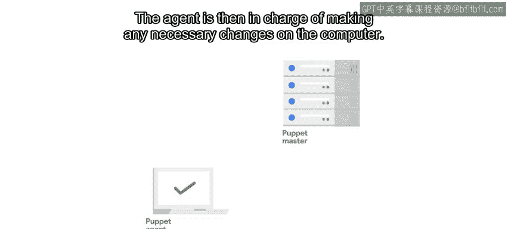
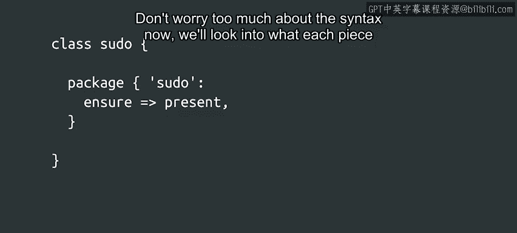

#  144：什么是Puppet？🤖


## 概述

在本节课中，我们将要学习Puppet这一配置管理工具的基本概念。Puppet是当前业界管理大批量计算机配置的标准工具，我们将了解其工作原理、基本架构以及它能完成的任务。

---

## 什么是Puppet？

正如我们已经多次提到的，在本课程中，我们将学习如何通过使用Puppet来应用基本的配置管理概念。

Puppet是当前业界管理大批量计算机配置的标准工具。Puppet之所以如此流行，部分原因在于它是一个存在已久的跨平台工具。

它是一个在2005年创建的开源项目，已经经历了多个不同的版本。随着其发展，该工具不断吸纳用户的反馈，使其变得越来越有用。本Google课程上线时，最新的可用版本是2018年底发布的Puppet 6。

---

## Puppet的架构

我们通常使用客户端-服务器架构来部署Puppet。客户端被称为Puppet代理，服务器被称为Puppet主控端。

当使用这种模型时，代理会连接到主控端，并向主控端发送一系列描述计算机状态的事实信息。主控端随后处理这些信息，生成需要在设备上应用的规则列表，并将此列表发送回代理。代理则负责在计算机上执行任何必要的更改。



Puppet是一个跨平台的应用程序，适用于所有Linux发行版、Windows和Mac OS。

这意味着你可以使用相同的Puppet规则来管理一系列不同的计算机。

---

## Puppet规则示例

我们一直在谈论的这些规则到底是什么？让我们来看一个非常简单的例子。

```puppet
package { 'pseudo':
  ensure => present,
}
```



这个代码块表示，`pseudo`这个软件包应该出现在应用此规则的每台计算机上。如果这个规则应用在100台计算机上，它将在所有计算机上自动安装该软件包。

这是一个小而简单的代码块，但已经可以让我们对Puppet中规则的编写方式有一个基本的印象。现在不必过于担心语法，我们将在未来的视频中探讨每一部分的含义。

---

## 跨平台支持

根据操作系统的类型，有多种可用的安装工具。Puppet会确定正在使用的操作系统类型，并选择正确的工具来执行软件包安装。

在Linux发行版上，有几种包管理系统，如`apt`、`yum`和`dnf`。Puppet也会确定应该使用哪个包管理器来安装软件包。

在MacOS上，根据软件包的来源，有几种不同的可用提供程序。Apple提供程序用于操作系统自带的软件包，而Macports提供程序用于来自Macports项目的软件包。

对于Windows，我们需要在规则中添加一个额外的属性，指定安装程序文件在本地磁盘或网络挂载资源上的位置。Puppet随后会执行安装程序并确保其成功完成。如果你使用Chocolatey来管理Windows软件包，你可以为Puppet添加一个额外的`chocolatey`提供程序来支持它。我们将在下一篇阅读材料中提供更多相关信息的链接。

---

## Puppet的能力范围

使用像这样的规则，我们可以让Puppet为我们做的远不止安装软件包。

以下是Puppet可以执行的一些任务：
*   我们可以添加、删除或修改系统中存储的配置文件，或者更改Windows上的注册表项。
*   我们可以启用、禁用、启动或停止运行在我们计算机上的服务。
*   我们可以配置cron作业或计划任务。
*   我们可以添加、删除或修改用户和组。
*   我们甚至可以在需要时执行外部命令。

---

## 总结

关于Puppet有很多内容可以讲。我们不会深入每一个细节，但会在本课程中涵盖最重要的概念。目标是让你对配置管理（特别是Puppet）有一个入门级的了解。我们也会为你提供指引，让你能够自行查找更多信息。

接下来，我们将探讨可以用来定义规则的不同资源。