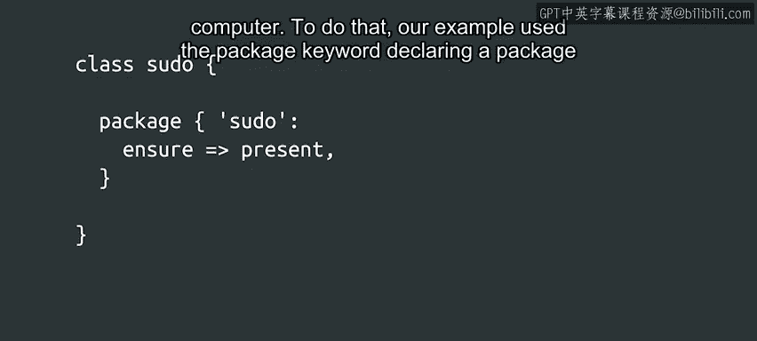
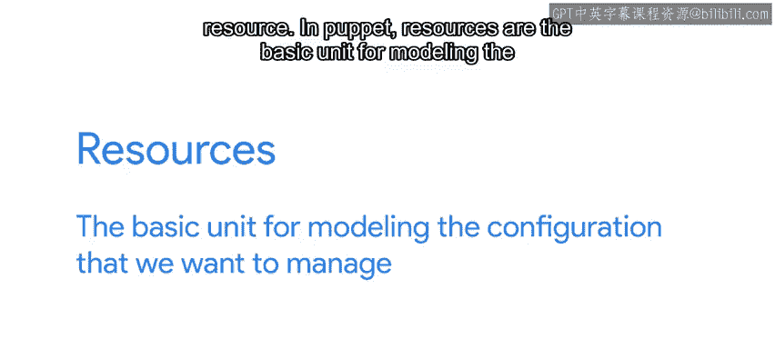
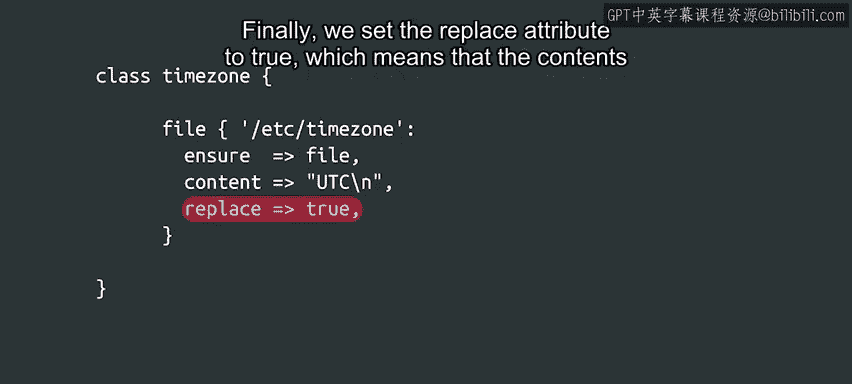

#  145：Puppet 资源 🧩


在本节课中，我们将要学习 Puppet 配置管理工具中的核心概念——资源。我们将了解什么是资源，如何声明资源，以及资源如何通过提供者（Provider）在计算机上实现期望的配置状态。



---



在上一节视频中，我们看到了一个在计算机上安装 `pseudo` 软件包的例子。为了实现这个目标，我们的示例使用了 `package` 关键字来声明一个软件包资源。

在 Puppet 中，资源是我们想要管理的配置的基本建模单元。换句话说，每个资源都指定了我们试图管理的一项配置，例如一项服务、一个软件包或一个文件。

让我们来看另一个例子。在这个例子中，我们定义了一个文件资源。这种资源类型用于管理文件和目录。在这个具体规则中，它确保 `/etc/sysctl.d` 目录存在并且是一个目录。

```puppet
file { '/etc/sysctl.d':
  ensure => directory,
}
```

---

让我们简单讨论一下语法。在上一个例子和这个例子中，我们可以看到，在 Puppet 中声明资源时，我们将其写在一个以资源类型（本例中是 `file`）开头的代码块中。

资源的配置随后写在一对花括号 `{}` 内。在左花括号之后，首先是资源的标题，后跟一个冒号。冒号之后是我们想要为该资源设置的属性。在这个例子中，我们再次设置了 `ensure` 属性，其值为 `directory`，但我们也可以设置其他属性。

让我们查看一个不同的文件资源示例。在这个例子中，我们使用一个文件资源来配置 `/etc/timezone` 文件的内容，该文件在某些 Linux 发行版中用于确定计算机的时区。

```puppet
file { '/etc/timezone':
  ensure  => file,
  content => "UTC\n",
  replace => true,
}
```

这个资源有三个属性。首先，我们明确声明这将是一个文件，而不是目录或符号链接。然后，我们将文件内容设置为 UTC 时区。最后，我们将 `replace` 属性设置为 `true`，这意味着即使文件已存在，其内容也将被替换。



---

我们现在已经看到了几个使用文件资源可以做什么的例子。实际上，我们可以设置的属性还有很多，例如文件权限、文件所有者或文件修改时间。我们在下一节的阅读材料中提供了一个官方文档的链接，你可以在那里找到每个资源所有可以设置的属性。

那么，这些规则是如何转化为我们计算机上的变化的呢？当我们在 Puppet 规则中声明一个资源时，我们是在定义该资源在系统中的期望状态。然后，Puppet 代理（agent）会使用提供者（Provider）将期望状态变为现实。

所使用的提供者将取决于定义的资源和代理运行的环境。Puppet 通常会自动检测这一点，无需我们做任何特殊操作。当 Puppet 代理处理一个资源时，它首先决定需要使用哪个提供者，然后将我们在资源中配置的属性传递给该提供者。每个提供者的代码负责使我们的计算机反映出资源中请求的状态。

---

在这些例子中，我们一次只查看了一个资源。接下来，我们将看到如何将一堆资源组合成更复杂的 Puppet 类。

---


**总结**

本节课中我们一起学习了 Puppet 资源的基础知识。我们了解到资源是 Puppet 配置管理的基本单元，用于定义系统组件的期望状态（如文件、软件包）。我们学习了声明资源的语法结构，包括资源类型、标题和属性。最后，我们明白了 Puppet 代理如何通过提供者，将代码中定义的资源状态应用到实际的计算机系统中。