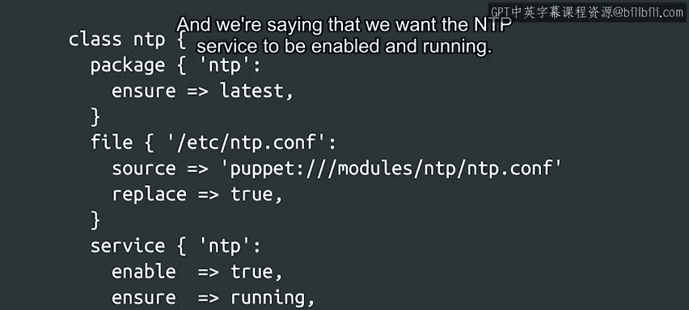

#  146：Puppet类 🧩


在本节课中，我们将学习Puppet中的“类”概念。我们将了解如何通过类来组织相关的资源，从而更高效地管理配置。

---

## 概述

在之前的Puppet代码示例中，我们已经看到了一些声明了单个资源的类。你可能会好奇这些类的作用是什么。实际上，我们使用这些类来将实现某个目标所需的所有资源集中在一个地方。

## 类的用途

上一节我们介绍了Puppet的基本资源，本节中我们来看看如何通过类来组织这些资源。类的核心目的是将相关的资源组合在一起，以便于管理和理解。

例如，你可以创建一个类，它负责安装一个软件包、设置配置文件的内容，并启动该软件包提供的服务。

## 示例：NTP配置类

让我们来看一个具体的例子。在这个例子中，我们有一个包含三个资源的类：一个`package`、一个`file`和一个`service`。所有这些资源都与网络时间协议（NTP）相关，这是我们的计算机用来同步时钟的机制。

以下是该类的Puppet代码示例：

```puppet
class ntp_config {
  package { 'ntp':
    ensure => latest,
  }

  file { '/etc/ntp.conf':
    source => 'puppet:///modules/ntp/ntp.conf',
    ensure => file,
  }

  service { 'ntp':
    ensure => running,
    enable => true,
  }
}
```

我们的规则确保NTP软件包始终升级到最新版本。我们使用`source`属性来设置配置文件的内容，这意味着代理将从指定位置读取所需内容。我们通过声明希望NTP服务被启用并运行。



通过将所有与NTP相关的资源分组到同一个类中，我们只需快速浏览就能理解服务是如何配置的以及它应该如何工作。

## 类的优势

将所有相关资源放在一起，未来进行更改会变得更加容易。因此，每当我们想要对相关资源进行分组时，使用这种技术都是有意义的。

以下是其他一些可以使用类来分组资源的场景示例：

*   **日志文件管理**：将所有与日志文件管理相关的资源分组。
*   **时区配置**：将所有与时区配置相关的资源分组。
*   **临时文件处理**：将所有与处理目录中临时文件相关的资源分组。
*   **软件配置**：你还可以创建类来分组与你的Web服务软件、电子邮件基础设施，甚至公司防火墙相关的所有设置。

## 过渡与后续

我们刚刚开始接触Puppet的基本资源，并了解了如何应用它们。在接下来的视频中，我们将学习更多关于使用配置管理工具时的常见实践。

但在深入探讨之前，我们准备了一份阅读材料，其中包含了关于Puppet语法、资源的更多信息以及官方参考链接。之后还有一个快速测验，以检查你是否理解了所有内容。

---

## 总结

本节课中我们一起学习了Puppet中“类”的概念。我们了解到类是将实现特定功能所需资源（如`package`、`file`、`service`）组织在一起的强大工具。通过将相关资源分组，代码变得更容易理解、维护和修改。我们还通过一个配置NTP服务的具体示例，实践了如何定义和使用一个类。