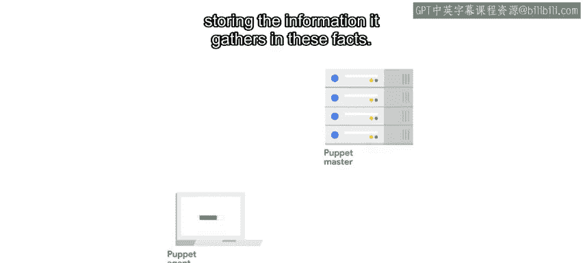
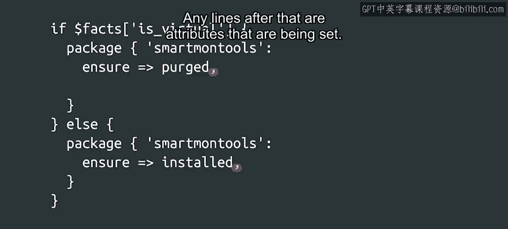

#  147：什么是领域特定语言？ 🤔


在本节课中，我们将要学习Puppet配置管理工具中的**领域特定语言**。我们将了解它与通用编程语言的区别，并通过一个具体示例来探索其核心语法，包括变量、条件语句和资源定义。

到目前为止，我们已经见过一些非常简单的Puppet规则示例，这些规则只定义了一个或多个资源。这些资源是Puppet规则的基础构建块。然而，我们可以使用Puppet的**领域特定语言**来执行更复杂的操作。

典型的编程语言，如Python、Ruby、Java或Go，是**通用语言**，可用于编写具有不同目标和用例的多种应用程序。相反，**领域特定语言**是一种范围更有限的编程语言。

学习领域特定语言通常比学习通用编程语言更快、更容易，因为它涵盖的内容少得多。你不需要学习太多语法，理解太多关键字，也无需考虑太多通用开销。就Puppet而言，其DSL仅限于与何时以及如何将配置管理规则应用到我们的设备相关的操作。

例如，我们可以使用DSL提供的机制，在笔记本电脑或台式机上设置不同的值，或者在公司网络服务器上安装一些特定的软件包，这些操作都建立在我们已了解的基本资源类型之上。

Puppet的DSL包含**变量**、**条件语句**和**函数**。使用它们，我们可以根据某些条件应用不同的资源或将属性设置为不同的值。

在深入探讨示例之前，我们先简单介绍一下Puppet的**事实**。事实是代表系统特征的变量。当Puppet代理运行时，它会调用一个名为`facter`的程序，该程序分析当前系统，并将其收集到的信息存储在这些事实中。完成后，它会将这些事实的值发送给服务器，服务器则利用这些值来计算应应用的规则。



Puppet附带了一系列内置的**核心事实**，用于存储有关系统的有用信息，例如当前的操作系统是什么、计算机有多少内存、它是否是虚拟机，或者当前的IP地址是什么。如果我们做决策所需的信息无法通过这些事实获得，我们也可以编写一个脚本来检查信息并将其转化为我们自己的自定义事实。

让我们看一个使用内置事实的Puppet代码示例。

以下代码块使用了`is_virtual`事实和一个条件语句来决定是安装还是清除`smartmontools`软件包。这个软件包用于通过SMART技术监控硬盘状态，因此在物理机上安装它很有用，但在虚拟机上安装则意义不大。

```puppet
if $facts['is_virtual'] {
  package { 'smartmontools':
    ensure => purged,
  }
} else {
  package { 'smartmontools':
    ensure => installed,
  }
}
```

我们可以在这个代码块中看到Puppet领域特定语言的几个特点。让我们花点时间看看这里的所有语法元素。

首先，`$facts` 是一个**变量**。在Puppet的DSL中，所有变量名前面都有一个美元符号。具体来说，`facts`变量在Puppet DSL中被称为**哈希**，相当于Python中的字典。这意味着我们可以使用键来访问哈希中的不同元素。在本例中，我们正在访问与`is_virtual`键关联的值。

其次，我们看到了如何使用`if`编写**条件语句**，并用花括号将条件的每个代码块括起来。

最后，每个条件块都包含一个**包资源**。我们之前见过资源，但还没有详细研究其语法，现在让我们来仔细看看。



每个资源都以定义的资源类型开头，在本例中是`package`，然后资源的内容用花括号括起来。在资源定义内部，第一行包含标题，后跟一个冒号。之后的任何行都是正在设置的属性。我们使用`=>`为属性赋值，然后每个属性以逗号结尾。

我们现在已经涵盖了Puppet DSL语法的大部分内容。如果你回想一下学习第一门编程语言时的情景，你可能会注意到这里需要学习的语法要少得多。这是配置管理工具使用的领域特定语言的典型特征。虽然每种工具都使用自己的DSL，但它们通常非常简单，可以很快学会。

本节课中，我们一起学习了Puppet的**领域特定语言**及其与通用编程语言的区别。我们探讨了**事实**、**变量**、**条件语句**和**资源定义**的核心语法。通过一个具体示例，我们看到了如何利用系统信息来动态决定配置操作。掌握这些基础概念是有效使用Puppet等配置管理工具的关键。接下来，我们将讨论大多数配置管理工具背后的一些其他原则。