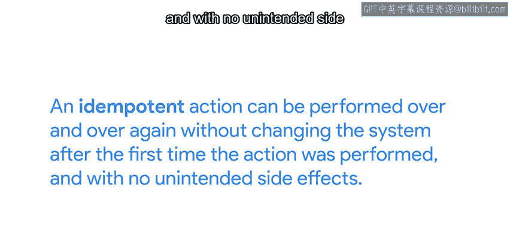
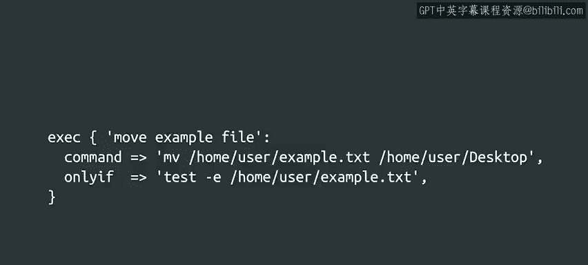

#  148：配置管理的驱动原则 🧭


在本节课中，我们将学习配置管理工具（以Puppet为例）背后的核心驱动原则。我们将探讨声明式语言、幂等性、测试与修复范式以及无状态性等关键概念，理解它们如何帮助我们高效、可靠地管理大量计算机系统。

---

到目前为止，我们已经看到了几个Puppet规则示例，包括一系列不同的资源，甚至还有一个条件表达式。

你可能已经注意到，在我们查看的所有示例中，我们从未告诉计算机为了达到我们的目的应该遵循哪些具体步骤。相反，我们只是声明了我们想要实现的最终目标。

这就像开车去得来速餐厅点一个汉堡，我们并没有亲手制作它，但它就在那里。我们之前提到的提供者（Providers），如 `apt` 和 `yum`，负责将我们的目标转化为任何必要的具体操作。

我们说Puppet使用一种**声明式语言**，因为我们声明的是希望达到的状态，而不是达到该状态所需的步骤。像Python或C这样的传统语言被称为**过程式语言**，因为我们需要写出计算机为了达到我们期望目标而需要遵循的过程。

对于来自像Python这样的过程式语言的开发者来说，可能需要一些时间来习惯编写像Puppet所使用的这种声明式代码，这很正常。只需记住，在配置管理中，简单地陈述配置**应该是什么**，而不是计算机**应该做什么**来达到这个配置，是合理的。例如，你使用一个资源来声明你想要安装一个软件包，你并不关心计算机必须运行什么命令来安装它，你只关心在配置管理工具运行之后，这个软件包被安装好了。

---

配置管理的另一个重要方面是操作应该是**幂等的**。

在此上下文中，一个幂等操作可以被重复执行多次，而不会在第一次执行后改变系统状态，也不会产生意外的副作用。

让我们通过一个文件资源的例子来理解这一点。



```puppet
file { '/etc/motd':
  ensure  => file,
  content => 'Welcome to our server!',
  mode    => '0644',
}
```

这个资源确保 `/etc/motd` 文件存在，具有一组特定的权限，并且包含特定的内容。满足这个要求就是一个幂等操作。

*   如果文件已经存在并且具有期望的内容，那么Puppet会理解无需采取任何行动。
*   如果文件不存在，那么Puppet会创建它。
*   如果内容或权限不匹配，Puppet会修复它们。

无论代理应用这个规则多少次，最终结果都是这个文件将拥有所要求的内容和权限。

幂等性是任何自动化任务的一个宝贵特性。如果一个脚本是幂等的，意味着它可以在任务执行到一半时失败，然后重新运行，而不会产生问题性的后果。

假设你正在运行配置管理系统来设置一台新服务器。不幸的是，设置失败了，因为你忘记给计算机添加第二块磁盘，而配置需要两块磁盘。如果你的自动化是幂等的，你可以添加缺失的磁盘，然后让系统从它中断的地方继续执行。

大多数Puppet资源都提供幂等操作，我们可以确信，运行同一组规则两次将导致相同的最终结果。

对此的一个例外是 `exec` 资源，它为我们运行命令。`exec` 资源采取的操作可能不是幂等的，因为一个命令每次执行时都可能修改系统。为了理解这一点，让我们看看在计算机上执行一个移动文件的命令时会发生什么。

```bash
# 第一次执行
mv example.txt ~/Desktop/
# 第二次执行（如果文件已移动）
mv example.txt ~/Desktop/  # 这将导致错误
```

我们收到一个错误，因为文件已不在原位置。换句话说，这不是一个幂等操作，因为执行相同的操作两次产生了不同的结果，并带来了错误的意外副作用。如果我们在Puppet中运行这个，会导致Puppet运行以错误结束。

因此，如果我们需要使用 `exec` 资源来运行命令，我们需要小心确保该操作是幂等的。例如，我们可以通过使用 `onlyif` 属性来实现：

```puppet
exec { 'move_file':
  command => 'mv /path/to/example.txt /path/to/destination/',
  onlyif  => 'test -f /path/to/example.txt',
}
```

使用 `onlyif` 属性，我们指定这个命令只有在我们要移动的文件存在时才应该被执行。这意味着如果文件存在，它将被移动；如果不存在，则什么都不做。通过添加这个条件，我们就把一个非幂等的操作变成了一个幂等的操作。

---

配置管理运作方式的另一个重要方面是**测试与修复范式**。

这意味着只有在为实现目标所必需时，才会采取行动。Puppet会首先测试被管理的资源（如文件或软件包）是否真的需要被修改。

*   如果文件已经存在于我们想要的位置，则无需采取行动。
*   如果一个软件包已经安装，则无需再次安装。

这避免了浪费时间去做不需要的操作。



最后，另一个重要特性是Puppet是**无状态的**。这意味着在代理的两次运行之间不保留任何状态。每次Puppet代理运行都是独立的，不依赖于前一次或下一次运行。

每次Puppet代理运行时，它都会收集当前的事实（facts）。Puppet主服务器仅基于这些事实生成规则。然后代理根据需要应用它们。

---

我们才刚刚开始了解配置管理是什么，以及在Puppet中它是什么样子，但希望你已经开始理解这些基本概念，以及如何将它们转化为实际规则，来帮助你管理一支计算机“小部队”。

---

**本节课总结**

在本节课中，我们一起学习了配置管理的核心驱动原则：

1.  **声明式语言**：我们声明期望的最终状态（“是什么”），而不是实现它的具体步骤（“怎么做”）。
2.  **幂等性**：操作可以安全地重复执行，确保系统始终处于期望状态，这对于自动化的可靠性至关重要。
3.  **测试与修复范式**：系统首先检查当前状态是否符合期望，只在必要时才采取行动，提高了效率。
4.  **无状态性**：每次配置运行都是独立的，基于当前系统事实生成和应用规则，简化了管理和故障排除。

理解这些原则是有效使用任何配置管理工具（包括Puppet）的基础。