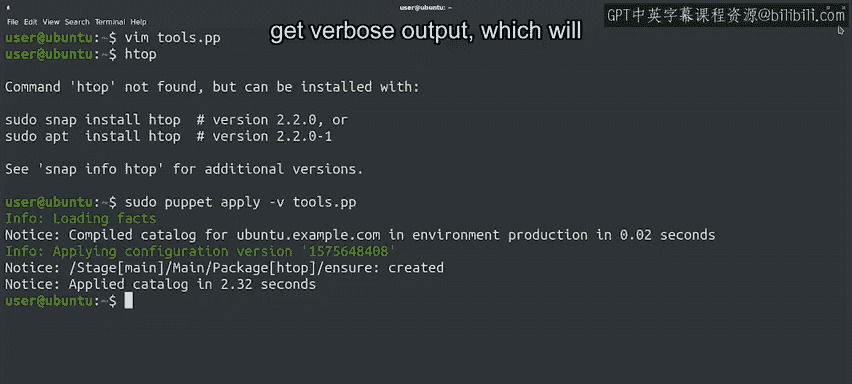
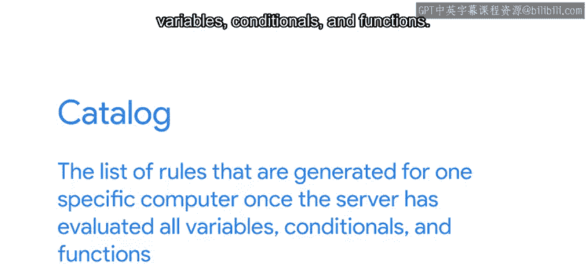
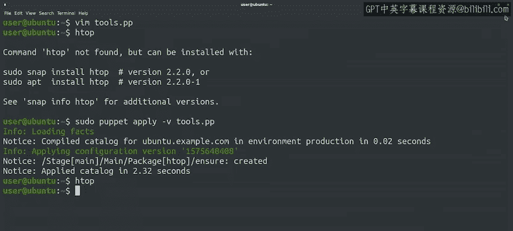

#  152：本地应用Puppet规则 🛠️


在本节课中，我们将学习如何将Puppet规则应用于本地计算机。我们将从安装Puppet开始，然后创建并应用一个简单的清单文件，以管理软件包的安装。通过这个过程，您将了解Puppet如何作为独立应用程序运行，并验证规则是否按预期工作。

---

## 安装Puppet

上一节我们介绍了Puppet的语法和可用资源。本节中，我们来看看如何在本地计算机上安装Puppet。

Puppet可在多种平台上使用。我们可以通过操作系统的包管理系统安装，或从官方网站下载。两种方式均可，选择取决于具体需求。在本练习中，我们将使用Ubuntu发行版提供的Puppet包。

以下是安装步骤：

```bash
sudo apt install puppet-master
```

安装完成后，我们可以开始尝试编写一些规则。

---

## 创建清单文件

现在Puppet已安装，我们将创建一个最简单的Puppet文件。随着部署的改进，我们可以使其更复杂。

在本例中，我们希望使用Puppet确保每台计算机都安装了一些用于调试问题的有用工具。

首先，我们需要创建一个文件来存储要应用的规则。在Puppet术语中，这些文件称为“清单”，必须以`.pp`扩展名结尾。

我们将创建一个名为`tools.pp`的新文件，并在其中定义一个包资源。

以下是文件内容：

```puppet
package { 'htop':
  ensure => present,
}
```

此资源声明我们希望Puppet确保计算机上安装了`htop`包。`htop`是一个类似于`top`的工具，可显示额外信息。

保存文件后，我们可以在应用规则前检查命令是否尚未存在。

---

## 应用Puppet规则

在应用规则之前，我们先验证`htop`是否尚未安装。



确认未安装后，我们使用以下命令运行规则：

```bash
sudo puppet apply -v tools.pp
```

`-v`标志告诉Puppet我们想要详细输出，这将显示Puppet应用规则时的过程。

Puppet首先加载事实，然后编译目录，接着应用当前配置，安装请求的包，最后通知目录应用完成。

目录是服务器评估所有变量、条件语句和函数后，为特定计算机生成的规则列表。在本例中，目录与代码完全相同，因为代码不包含任何变量、函数或条件语句。

更复杂的规则集可能根据事实值生成不同的目录。

---



## 验证规则应用

现在检查规则是否实际生效。尝试再次运行`htop`命令，因为Puppet已为我们安装。

这次命令应成功运行。如果计算机出现问题，我们现在可以使用此工具更好地了解原因。

退出`htop`后，我们再次尝试应用Puppet规则。Puppet会检测到包已安装，因此不会尝试重新安装。这意味着目录应用得更快，因为无需更改任何内容。



---

## 总结

本节课中，我们一起学习了如何在清单文件中编写Puppet资源，并使用`puppet apply`将这些规则应用于一台计算机。我们还验证了Puppet能够智能地检测已安装的包，避免重复操作。

下一节，我们将探讨如何管理不同Puppet资源之间的关系，以及应用时的表现。