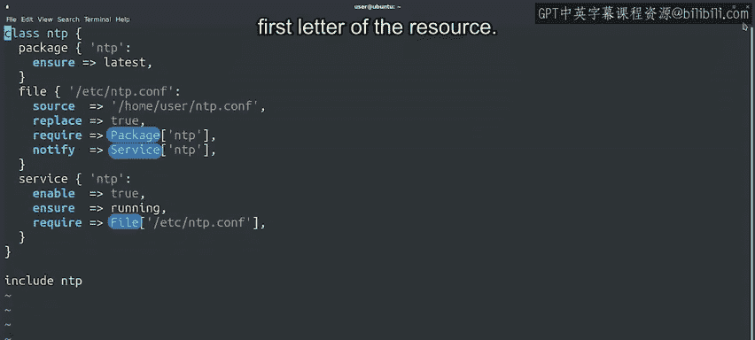
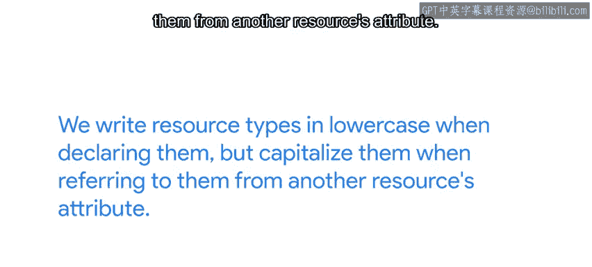
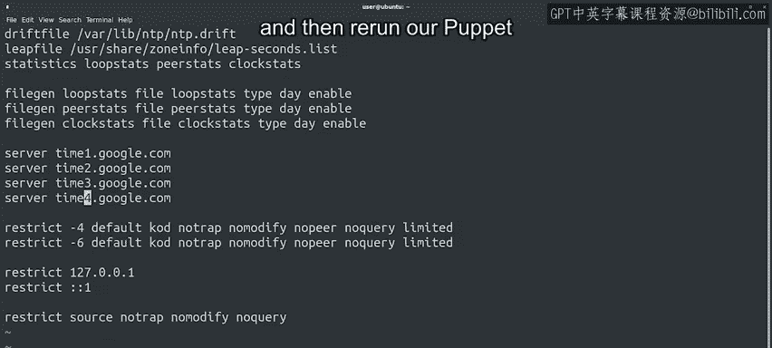

#  153：Puppet资源关系管理 🧩


在本节课中，我们将学习如何在Puppet清单中管理多个资源之间的关系。我们将看到如何确保资源按照正确的顺序执行，例如先安装软件包，再配置文件，最后启动服务。

## 概述

上一节我们编写了一个简单的Puppet清单并在本地应用。这是练习应用Puppet规则的好方法，但内容非常简单。现在，让我们挑战一些更复杂的任务。

我们用于管理计算机群的Puppet清单通常包含多个相互关联的资源。你不可能配置一个未安装的软件包，也不希望在软件包和配置文件就位之前启动服务。Puppet允许我们通过资源关系来控制这一点。

## 资源关系示例

让我们通过一个例子来了解资源关系。我们有一个名为`NTP.pp`的文件，其中包含与NTP配置相关的一系列资源，就像我们在之前的视频中看到的那样。

这次，除了声明需要管理的资源外，我们还声明了它们之间的一些关系。

以下是`NTP.pp`文件内容的示例：

```puppet
class ntp {
  package { 'ntp':
    ensure => installed,
  }

  file { '/etc/ntp.conf':
    ensure  => file,
    content => 'server ntp.org',
    require => Package['ntp'],
  }

  service { 'ntp':
    ensure    => running,
    enable    => true,
    require   => File['/etc/ntp.conf'],
    subscribe => File['/etc/ntp.conf'],
  }
}

include ntp
```

我们声明配置文件需要NTP软件包，服务需要配置文件。这样，Puppet就知道在启动服务之前，配置文件需要正确设置；在设置配置文件之前，软件包需要安装。

我们还声明如果配置文件发生变化，NTP服务应该收到通知。这样，如果我们将来对配置文件的内容进行额外更改，服务将重新加载新设置。





如果你仔细观察，可能会注意到资源类型是小写的，但像`require`或`subscribe`这样的关系在引用资源时首字母是大写的。这是Puppet语法的一部分。我们在声明资源类型时使用小写，但在从另一个资源的属性中引用它们时将其首字母大写。

如果现在听起来令人困惑，别担心，可能需要一些时间来理解，但最终会明白的。

## 应用规则

现在，最后一件事，在文件底部，我们有一个`include ntp`的调用。这就是我们告诉Puppet要应用类中描述的规则的方式。在这个例子中，我们将类的定义和包含类的调用放在同一个文件中。通常，类在一个文件中定义，在另一个文件中包含。我们将在以后的视频中查看这方面的例子。

好的，让我们在本地应用这些规则。

```bash
sudo puppet apply NTP.pp --verbose
```

我们的规则已经运行，在详细输出中，我们可以看到它做了一系列事情。首先，它安装了软件包。然后它检查配置文件是否需要更新，因此更改了其内容。最后，在更改配置内容后，Puppet知道重新启动NTP服务。

我们在这里看到我们的Puppet规则如何转化为几个不同的操作。这很酷，但接下来会更好。

## 修改配置文件

让我们通过编辑此目录中的`NTP.conf`文件来更改配置文件。这是NTP服务使用的配置文件。它当前使用来自`ntp.org`的一堆服务器，但我们希望尝试使用Google提供的NTP服务器。这些服务器称为`time1.google.com`、`time2.google.com`、`time3.google.com`和`time4.google.com`。

我们已经进行了更改，用`:wq`保存，然后使用新的配置文件重新运行我们的Puppet规则。



```bash
sudo puppet apply NTP.pp --verbose
```

太棒了，Puppet用新内容更新了配置文件，然后刷新了服务，因此它加载了配置。

## 总结

在本视频中，我们看到了如何应用包含具有多个资源的类的Puppet清单。我们将与NTP服务相关的所有信息分组到一个特定的清单中，这在处理Puppet规则时是常见做法。我们希望将相关操作保持在一起，并将不相关的事物分开。接下来，我们将研究如何使用Puppet模块来实现这一点。