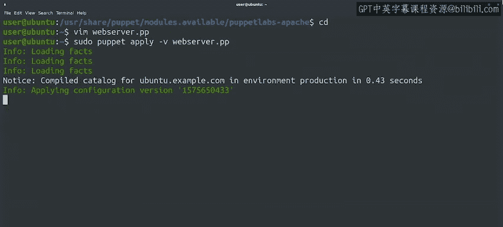

#  154：组织Puppet模块 📦


在本节课中，我们将学习如何在Puppet中组织和管理复杂的配置。我们将了解模块的概念、结构，以及如何创建和使用模块来高效地管理大量资源。

---

在任何配置管理部署中，通常需要管理许多不同的事务。

我们可能需要安装一些软件包、复制一些配置文件、启动一些服务、安排一些周期性任务、确保创建某些用户和组并授予其对特定设备的访问权限，以及执行一些现有资源未提供的命令。

此外，不同的计算机可能需要应用不同的配置。

例如，工作站和笔记本电脑可能包含服务器上不使用的资源，而每种特定类型的服务器都需要其自身的特定设置。

需要管理的事务非常多。我们需要以一种有助于长期维护的方式来组织所有这些资源和信息。

这意味着需要将相关的资源分组，为这些组起恰当的名称，并确保其组织结构对新用户而言是清晰易懂的。

## 什么是Puppet模块？🧩

上一节我们介绍了配置管理的复杂性，本节中我们来看看Puppet的核心组织单元——模块。

在Puppet中，我们将清单（manifests）组织成模块。一个模块是清单及相关数据的集合。

我们可以将任何想要的资源放入模块中，但为了保持配置管理的条理性，我们会将相关事务按合理的主题分组。

例如，我们可以有一个模块专门管理与计算机健康监控相关的一切，另一个模块用于设置网络栈，还有一个模块用于配置Web服务应用程序。

## 模块的结构 📁

模块包含清单和关联数据，但具体是如何组织的呢？


所有清单都存储在一个名为 `manifests` 的目录中。其余数据则根据其功能存储在不同的目录中。

以下是模块中常见的目录及其作用：

*   **`files` 目录**：包含无需任何更改即可复制到客户端机器的文件，例如我们上一节视频中看到的 `ntp.conf` 文件。
*   **`templates` 目录**：包含在复制到客户端机器之前需要预处理的文件。这些模板可以包含在计算清单后会被替换的值，或者仅在满足特定条件时才存在的部分。

根据模块的具体功能，还可以包含更多目录，但在创建第一个Puppet模块时，你无需担心这些。

## 创建你的第一个模块 🛠️

了解了模块的结构后，我们来学习如何创建一个简单的模块。

你可以从一个简单的模块开始，它只在 `manifests` 目录中有一个清单文件。

这个文件应命名为 `init.pp`，并且它应该定义一个与所创建模块同名的类。

然后，你的规则所使用的任何文件都需要存储在 `files` 或 `templates` 目录中，具体取决于你是直接复制它们还是需要预处理它们。

例如，我们上一节视频中看到的NTP类在转换为模块后是这样的：

*   有一个 `init.pp` 文件，其中包含我们之前看到的NTP类。
*   部署到机器上的 `ntp.conf` 文件现在存储在 `files` 目录中。

## 使用预打包模块 🔌

像这样的模块无论谁使用，看起来都几乎一样。因此，随着时间的推移，使用Puppet的系统管理员会分享他们编写的模块，让其他人也能使用相同的规则。

现在，已经存在大量预打包的、可供直接使用的模块。如果某个模块能满足我们的需求，我们只需将其安装到Puppet服务器上，并在部署中使用它。

让我们安装由Puppet Labs提供的Apache模块，来了解一下这是如何工作的。

```bash
# 安装Apache模块的示例命令（具体命令可能因环境而异）
puppet module install puppetlabs-apache
```

我们已经安装了模块，先快速查看一下它的内容。首先，切换到存储模块文件的目录并列出其内容。

我们看到之前提到的 `files`、`manifests` 和 `templates` 目录。除此之外，还有一个 `lib` 目录，用于向Puppet已有的功能中添加函数和事实（facts）。`metadata.json` 文件则包含关于我们刚安装的模块的一些额外数据，例如它与哪些操作系统的哪些版本兼容。

让我们看看 `manifests` 目录里面。哇，文件真多！就像我们将要管理的不同事务拆分到单独的模块中一样，我们也可以将想要配置的每个独立功能拆分到单独的清单文件中。这有助于我们在修改代码时组织代码。

请注意，这个目录也包含它自己的 `init.pp` 文件。正如我们指出的，这个清单很特殊，它必须始终存在，因为当包含一个模块时，它是Puppet读取的第一个文件。

## 如何包含和使用模块 ➕

那么，我们如何包含像这样的一个模块呢？这非常简单。

让我们创建一个清单文件，来包含我们刚刚安装的模块。

```puppet
# site.pp 或你的主清单文件
include ::apache
```



在这里，我们告诉Puppet包含Apache模块。模块名前的双冒号 `::` 让Puppet知道这是一个全局模块。

现在保存这个文件，并像之前一样使用 `puppet apply` 来应用它。

我们的清单超级简单，它只是包含了Apache模块。但是，通过包含这个模块，我们让Puppet应用了该模块中默认运行的所有规则。现在，这台机器上已经配置好了一个Apache服务器并准备运行了。

## 总结 📝

本节课中，我们一起学习了如何将代码组织到模块中，以及如何甚至可以使用其他团队提供的模块，从而避免重复造轮子。

接下来，有一份阅读材料提供了更多信息的指引，之后是一个快速测验。在那之后，请在下一个视频中与我见面，我们将探讨如何将我们的规则部署到更多机器上。