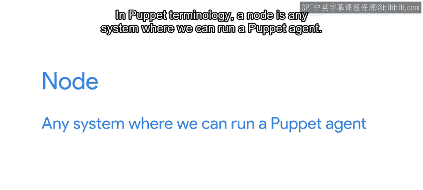
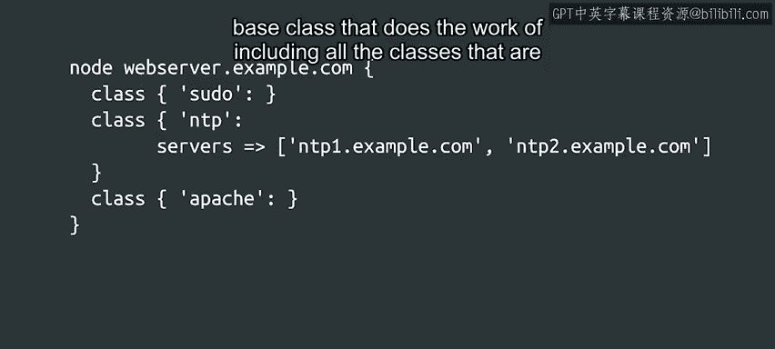

#  155：Puppet 节点管理 🎯


## 概述

在本节课中，我们将学习如何使用Puppet管理计算机集群，特别是如何为所有计算机设置通用规则，同时为特定子集系统应用特殊规则。我们将探讨节点定义的概念，并通过示例了解如何配置默认节点和特定节点。

---

## 节点定义基础

上一节我们介绍了Puppet的基本概念，本节中我们来看看如何通过节点定义来管理不同系统。

在Puppet术语中，**节点**指任何可以运行Puppet代理的系统。它可以是物理工作站、服务器、虚拟机，甚至是网络路由器。只要该系统安装了Puppet代理并能应用给定规则，它就是一个节点。

我们可以设置Puppet为所有节点提供一些基本规则，然后为需要不同的节点应用一些特定规则。

---

## 默认节点配置

以下是默认节点定义的示例：



```puppet
node default {
  include sudo
  class { 'ntp':
    servers => ['ntp1.example.com', 'ntp2.example.com']
  }
}
```

在这个例子中，默认节点包含两个类：`sudo`类和`ntp`类。对于`ntp`类，我们设置了一个额外的`servers`参数，列出了可用于获取网络时间的服务器。

如你所见，在定义节点时，如果没有额外设置，可以直接使用类名包含类；如果需要，可以包含类并设置额外参数。

默认节点将默认应用于集群中的所有计算机。

---

## 特定节点配置

如果你希望某些设置仅应用于特定节点，可以通过添加更多节点定义来实现，如下所示：

```puppet
node 'webserver.example.com' {
  include sudo
  class { 'ntp':
    servers => ['ntp1.example.com', 'ntp2.example.com']
  }
  include apache
}
```

在这个例子中，我们为名为`webserver.example.com`的主机定义了节点。对于这个节点，我们包含了之前相同的`sudo`和`ntp`类，并在此基础上添加了`Apache`类。

集群中的特定节点通过其FQDN（完全限定域名）来标识。

---

## 节点匹配机制

需要理解的重要一点是：默认节点定义中包含的类仅应用于没有明确条目的节点。换句话说，当节点请求应应用哪些规则时，Puppet会查看节点定义，找出与节点FQDN匹配的定义，然后仅提供这些规则。

为了避免重复包含所有公共类，我们可以定义一个基础类，负责包含所有节点类型共有的类。

---

## 节点定义存储位置



节点定义通常存储在名为`site.pp`的文件中，该文件不属于任何模块。它仅定义哪些类将包含在哪些节点中。

这是帮助我们以更易于维护的方式组织代码的另一步骤。

---

## 总结

本节课中我们一起学习了Puppet节点管理的关键概念。我们了解了如何通过节点定义为计算机集群设置通用和特定规则，探讨了默认节点和特定节点的配置方法，并理解了节点匹配机制和节点定义的存储方式。下一节中，我们将研究Puppet用于验证节点是否确实具有其所声称名称的基础设施。