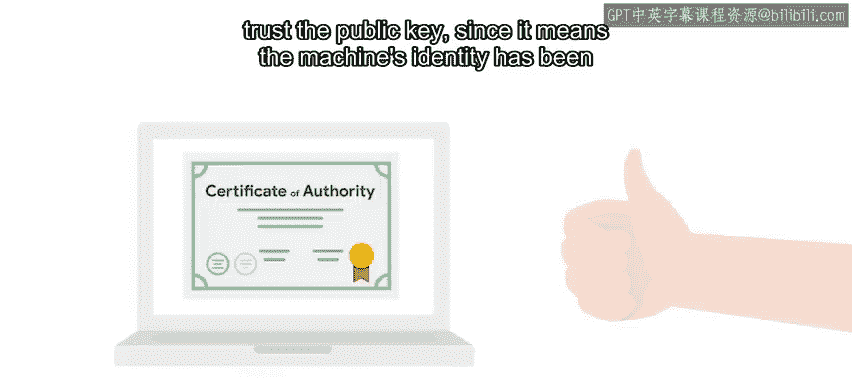

#  156：Puppet证书基础设施 🔐

在本节课中，我们将学习Puppet如何通过公钥基础设施（PKI）确保服务器与客户端之间的安全通信，以及如何验证节点的身份。

---

在典型的Puppet部署中，所有被管理的机器都会连接到一个Puppet服务器。客户端将信息发送给服务器，服务器随后处理清单，生成相应的目录，并将其发送回客户端以在本地应用。在上一节中，我们提到可以根据节点名称对其应用不同的规则。客户端在连接时会向服务器发送其名称。但服务器如何信任客户端确实是其所声称的身份呢？这是一个涉及重要安全概念的复杂主题。

## 公钥基础设施（PKI）概述 🔑

Puppet使用公钥基础设施（PKI）在服务器与客户端之间建立安全连接。Puppet采用的安全套接层（SSL）技术与HTTPS加密传输所使用的技术相同。客户端使用此基础设施检查服务器身份，服务器则用它检查客户端身份。所有通信都通过使用这些身份的加密通道进行，因此无法被第三方截获。

以下是其工作原理：每台参与的机器都拥有一对相互关联的密钥：一个私钥和一个公钥。私钥是保密的，只有该特定机器知道。公钥则与其他参与的机器共享。机器随后可以使用标准化流程验证任何其他机器的身份。发送方使用其私钥对消息进行签名，接收方则使用相应的公钥验证签名。

## 证书颁发机构（CA）的作用 🏛️

但机器如何知道该信任哪些公钥呢？这就是证书颁发机构（CA）的作用所在。CA验证机器的身份，然后创建证书，声明该公钥属于该机器。之后，其他机器可以依赖该证书，从而信任该公钥。Puppet自带一个证书颁发机构，可用于为每个客户端创建证书。您可以使用此内置CA，或者如果您的公司已有验证机器身份的CA，可以将其与Puppet集成，以便只进行一次身份验证。

## Puppet证书签发流程 🔄

现在，假设您使用内置的证书基础设施，深入了解此流程的工作原理。当节点首次向Puppet主服务器注册时，它会请求证书。Puppet主服务器查看此请求，如果能够验证节点的身份，则为该节点创建证书。系统管理员可以手动检查身份，或使用一个自动流程，利用有关机器的额外信息来验证其身份。当代理节点获取此证书后，它便知道可以信任Puppet主服务器。并且从那时起，节点可以在请求目录时使用该证书来标识自己。

## 节点身份验证的重要性 ⚠️

您可能会想，为什么我们如此关心节点的身份？原因有很多。首先，Puppet规则有时可能包含机密信息，您不希望这些信息落入错误的人手中。但即使没有任何规则包含机密信息，您也希望确保您设置为Web服务器的机器确实是您的Web服务器，而不是一台仅声称具有相同名称的恶意机器。如果随机计算机以错误设置出现在您的网络中，可能会导致各种问题。如果您正在创建测试部署以尝试Puppet规则的应用方式，并且只管理测试机器，可以配置Puppet自动签署所有请求，但对于真实用户使用的真实计算机，绝不应这样做。请记住，安全总比后悔好。因此，请始终花时间验证您的机器。

## 手动与自动签名方法 🛠️

刚开始使用Puppet时，通常使用手动签名方法。在这种情况下，当节点连接到主服务器时，它将生成证书请求，该请求将进入Puppet主服务器机器的队列中。然后，您需要验证机器的身份是否正确，内置CA将颁发相应的证书。如果您的机器群规模很大，这种手动方法将无法有效工作。相反，您需要编写一个脚本，自动为您验证机器的身份。一种方法是在机器配置时将唯一信息复制到机器中，然后将此预共享数据用作其证书请求的一部分。这样，您的脚本可以在不涉及任何人工干预的情况下验证机器是否是其声称的身份。

---

本节课中，我们一起学习了Puppet用于在节点连接到主服务器时识别其身份的基础设施。接下来，我们将看看使用独立Puppet服务器和客户端的典型Puppet设置在实际中是什么样子。