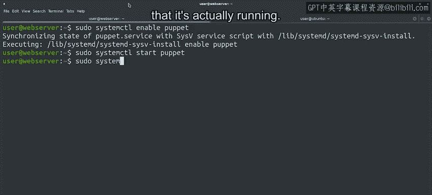

#  157：设置Puppet客户端与服务器 🚀


在本节课中，我们将学习如何实际部署Puppet，包括设置Puppet主服务器（Master）和客户端（Agent），并实现基本的配置管理自动化。

---

## 概述

我们将通过一个测试部署来演示Puppet的工作流程。首先，我们会配置Puppet主服务器，然后在一台名为“web Server”的客户端机器上安装并配置Puppet代理（Agent）。最后，我们将创建一个简单的节点定义清单，让Puppet自动在客户端上安装Apache软件包，并设置代理服务持续运行以保持配置同步。

---

## 配置Puppet主服务器

上一节我们介绍了Puppet的基本概念。本节中，我们来看看如何配置Puppet主服务器。

我们已经在这台计算机上安装了`puppet-master`软件包，因此我们将用它作为主服务器。由于这是一个用于演示的测试部署，我们会将其配置为自动签署所添加节点的证书请求。请注意，如果在真实计算机上部署，则需要手动签署请求或实施适当的验证脚本。

我们通过以下命令进行配置：
```bash
puppet config set master autosign true
```
此命令在`[master]`配置部分将`autosign`设置为`true`。

---

## 连接并配置Puppet客户端

配置好主服务器后，我们现在可以连接到需要管理的客户端。

我们将通过SSH连接到一台名为`web Server`的机器。在这台机器上，我们需要安装Puppet客户端软件包。

以下是安装Puppet代理的步骤：
1.  在客户端机器上安装`puppet`软件包（该软件包包含代理程序）。
2.  安装完成后，需要配置代理以与我们运行在另一台机器上的Puppet服务器通信。

我们使用类似的`puppet config`命令进行配置，但这次是指定服务器地址：
```bash
puppet config set server ubuntu.example.com
```
此命令将客户端要连接的服务器设置为`ubuntu.example.com`。

---

## 测试连接并申请证书

配置好服务器地址后，我们可以测试与Puppet主服务器的连接。

使用以下命令进行测试运行，`-v`参数用于获取详细输出，`--test`参数执行测试运行：
```bash
puppet agent -v --test
```
代理程序会执行一系列操作：
*   首先为机器创建SSL密钥。
*   然后从机器读取一系列信息，并用这些信息创建证书签名请求（CSR）。
*   代理会显示所请求证书的指纹。如果采用手动签署方式，我们可以使用此指纹来验证请求与服务器生成的请求是否匹配。
*   证书随后在我们的Puppet主服务器上生成（此过程在另一台计算机上完成，因此本地看不到记录）。
*   客户端计算机会接收证书并将其存储在本地。

证书交换完成后，代理会检索机器的所有信息并发送给主服务器。作为交换，它会收到一份“目录”（catalog）并应用它。由于我们尚未配置任何要应用于客户端的规则，因此目录几乎立即应用完毕，没有实际变更。

---

## 创建节点定义清单

现在，我们应该开始创建一些规则了。让我们回到Puppet主服务器并创建几个节点定义。

如前所述，节点定义存储在一个名为`site.pp`的清单文件中，该文件位于节点环境的根目录下。我们将在后续视频中详细讨论环境。目前，我们只需知道我们的客户端正在尝试访问`production`环境。

因此，我们需要创建的文件位于以下路径：
```
/etc/puppet/code/environments/production/manifests/site.pp
```
在该文件中，我们将创建几个节点定义。我们希望在我们的Web服务器上安装Apache，因此我们将为Web服务器创建一个节点定义，其中包含`Apache`类（暂时不设参数）。我们还会添加一个默认的节点定义，暂时保持为空，未来可以添加更多类。

一个基本的节点定义示例如下：
```puppet
node 'web Server' {
  class { 'apache': }
}

node default {
  # 可以在此处为其他节点添加默认配置
}
```
保存此文件后，我们可以在Web服务器机器上再次运行`puppet agent`。这次，代理连接到Puppet主服务器并获取到一个目录，该目录指示它安装和配置Apache软件包，这包括设置一系列不同的服务。

---

## 启用并启动Puppet代理服务

到目前为止，我们一直为了测试目的而手动运行Puppet代理。既然我们知道它工作正常，我们希望让Puppet自动持续运行。这样，如果我们对配置进行更改，客户端将自动应用这些更改，而无需我们执行任何手动步骤。



为此，我们将使用`systemctl`命令，它允许我们控制机器启动时启用的服务以及当前正在运行的服务。

以下是启用并启动Puppet服务的步骤：
1.  首先，告诉systemctl启用puppet服务，以便机器重启时自动启动代理。
    ```bash
    systemctl enable puppet
    ```
2.  然后，告诉systemctl启动puppet服务，使其开始运行。
    ```bash
    systemctl start puppet
    ```
3.  最后，询问systemctl关于puppet服务的状态，以检查它是否确实在运行。
    ```bash
    systemctl status puppet
    ```

运行成功后，Puppet代理将持续定期与主服务器检查，询问是否有需要应用到机器上的更改。

---

## 总结

本节课中，我们一起学习了Puppet在服务器-客户端模型下的实际应用。我们使用在Puppet主服务器上设置的配置来管理Web服务器中软件的安装和配置。同时，我们在Web服务器中设置Puppet代理持续运行，以保持配置处于最新状态。虽然我们只看到了配置Puppet的最基础知识，但这已经可以让你体会到配置管理功能的强大之处。

接下来，我们将收集更多关于如何进行客户端-服务器设置的信息，之后会有一个快速测验来检查大家是否都理解了所学内容。