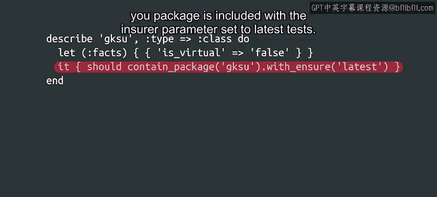

#  158：修改和测试清单 🛠️


在本节课中，我们将学习如何安全地修改Puppet清单，并通过多种方法测试这些修改，以确保它们能正确、安全地应用于整个服务器集群。

---

## 概述

当我们修改一个由Puppet管理的配置设置时，Puppet代理会将此更改应用到所有节点上。它执行必要的操作，使节点达到新的期望状态。这意味着，只需对清单做一个小改动，就能修改集群中的所有机器。这功能非常强大，但责任也重大。在接下来的内容中，我们将探讨如何测试我们的更改，以确保它们按预期工作，并能安全地应用到集群中，避免引发问题。

## 手动测试及其风险

IT专家在配置管理工作中，一个常见的做法是直接在机器上强制应用他们想要测试的清单，以此来测试新规则。我们在之前的示例中，也曾在应用到远程机器之前，先在本地应用过规则。

然而，这种方法可能会适得其反。例如，假设你试图使用Puppet来更改节点上某些文件的权限，锁定一些你认为用户不需要的路径。现在，想象一下你在自己的计算机上测试这些规则，结果发现自己犯了个错误，把自己锁在了系统之外。这就很麻烦了。

## 更安全的测试策略

那么，我们可以采取哪些替代方案呢？有许多事情需要考虑。一个简单的第一步是使用 `puppet parser validate` 命令来检查清单的语法是否正确。

**代码示例：**
```bash
puppet parser validate your_manifest.pp
```

除此之外，我们还可以使用 `--noop` 参数（意为“无操作”）来运行规则。这会让Puppet模拟它将要执行的操作，而实际上并不执行。你可以查看它计划采取的操作列表，并检查这些操作是否完全符合你的预期。

**代码示例：**
```bash
puppet apply --noop your_manifest.pp
```

但如果更改很复杂，我们很可能在查看计划操作时遗漏一些重要的细节。

## 使用测试机器

另一个选择是使用专门用于测试更改的测试机器。你可以在这些机器上应用规则，然后在Puppet运行后，检查一切是否正常工作。但同样，这是一个手动过程，我们可能会忘记验证某些重要的方面。

## 自动化测试：RSpec

我们如何才能实现自动化呢？就像我们在早期课程中看到的Python自动化测试一样，Puppet也允许我们使用RSpec测试来自动化测试我们的清单。

在这些测试中，我们可以设置相关的事实（Facts）和不同的值，并检查最终生成的目录（Catalog）是否包含我们期望的内容。

让我们看一个例子。在这个测试中，我们将 `is_virtual` 事实设置为 `false`，然后要求测试基础设施验证 `GKSU` 包是否被包含，并且其 `ensure` 参数被设置为 `latest`。

**代码示例：**
```ruby
# 这是一个RSpec测试示例
describe ‘your_module::your_class’ do
  let(:facts) do
    { :is_virtual => false }
  end

  it { is_expected.to contain_package(‘GKSU’).with_ensure(‘latest’) }
end
```



像这样的测试是检查我们编写的目录是否正确的一种有效方式。当我们的规则使用大量相互关联的事实时，它们会非常有帮助，我们可以借此检查结果是否符合我们的初衷。

我们可以编写一系列这样的测试，并在规则发生更改时自动运行它们。这样，我们可以确保规则保持有效，并知道新的更改没有破坏旧的规则。

## 验证实际效果

但这只是检查了目录是否包含我们所说的规则。我们如何验证这些规则是否真的产生了我们想要的效果呢？例如，启用了公司网站或设置了严格的防火墙？

我们需要在节点上应用这些规则，并检查结果是否正确。我们也可以自动化这个过程。为此，我们可以使用一组测试机器，首先在其上应用目录，然后使用脚本来检查机器的行为是否正确。

## 准备发布更改

现在，假设你所有的测试都成功了，更改已准备好发布。你如何安全地将其推送到整个集群呢？这将是我们下一个视频要讨论的内容。

---

## 总结

本节课中，我们一起学习了修改Puppet清单后的关键步骤：测试。我们探讨了手动测试的风险，介绍了使用 `puppet parser validate` 进行语法检查和 `--noop` 参数进行模拟运行的更安全方法。我们还了解了使用专用测试机器进行手动验证的局限性，并最终引入了强大的自动化测试工具——RSpec。通过编写RSpec测试，我们可以自动验证目录内容的正确性。最后，我们提到，要验证规则的实际效果，需要在测试机器上应用更改并进行自动化验证。下一节课，我们将学习如何安全地将经过充分测试的更改部署到整个生产环境。