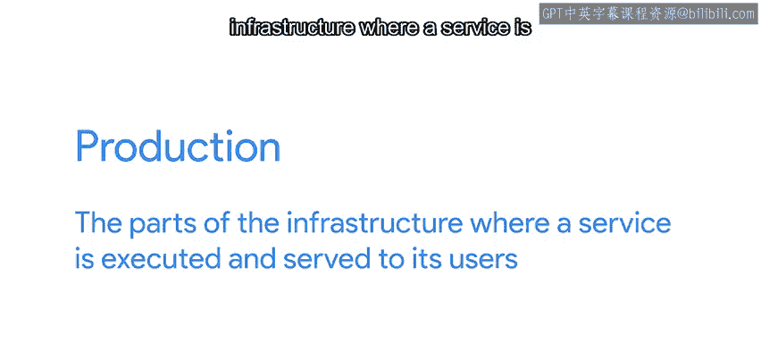

#  159：安全地推出和验证变更 🚀

在本节课中，我们将学习如何安全地将配置变更部署到生产环境。我们将探讨测试环境的重要性、分批次部署的策略，以及如何通过小范围、自包含的变更来最小化风险。

---

一旦你准备并测试了想要进行的变更，就是时候将它们推出了。

但别着急，即使你已经在自己的电脑或测试电脑上测试过变更，并且一切正常，这也不意味着该变更在所有运行中的生产机器上都能正确工作。

首先，什么是“生产环境”？在基础设施的语境中，生产环境是指执行服务并将其提供给用户的基础设施部分。

如果你托管一个网站，向用户提供网站内容的服务器就是生产服务器。在你的公司内部，验证用户密码的服务器就是生产认证服务器。你应该明白了。

对生产服务器进行变更可能很棘手，因为如果出现问题，服务可能会中断。那么，我们如何才能安全地推出变更呢？

---

## 关键：使用测试环境 🔬

关键是要始终先在测试环境中运行变更。测试环境应该有一台或多台机器，其配置与生产环境完全相同，但这些机器实际上并不为服务的任何用户提供服务。

这样，如果在部署变更时出现问题，你可以在没有任何实际用户看到的情况下修复它。

正如我们在之前的视频中简要提到的，Puppet 内置了环境功能。每个环境都有自己的目录，包含自己的一组清单和模块。Puppet 环境让我们可以根据代理运行的环境，完全隔离它们看到的配置。

这不仅仅是决定哪些节点安装哪些模块，还包括模块的全部内容。例如，我们可以利用这一点，在测试环境的机器上尝试一个全新的 Apache 模块版本，同时在生产环境中仍使用旧版本。

你可以根据需要定义任意多的环境。例如，你可以有一个开发环境，供 IT 专家在变更进入测试环境之前尝试新的 Puppet 规则。或者，假设你正在为系统开发一个非常棘手的新功能，并且不知道它何时能准备好，你可以有一个专门测试该特定功能的环境。

---

## 分批次部署变更 📦

现在，假设你有一批准备推出的变更。你通常会先将它们推送到测试环境中的机器，并检查一切是否正常。这可以包括手动验证和自动检查。

好的，假设变更在测试环境中运行良好。你如何将它们部署到机群中的其他机器上呢？

你可能想直接将变更应用到所有机器上，然后完事。但将变更同时推送到每台机器通常不是一个好主意。我们总是有可能在准备变更时遗漏了一些特殊情况，而这些情况并不在我们的测试环境中，结果可能导致我们一半的机群突然离线——糟糕。

因此，我们通常不会将变更推送到所有节点，而是分批进行。

根据你的机群组织方式，有多种方法可以实现这一点。你可以让一些机器带有一个标记它们为“早期采用者”或“金丝雀”的事实。就像煤矿工人用来检测矿井中有毒气体的金丝雀一样，这些节点可以在问题波及到其他计算机之前检测到潜在问题。

所以，你可以在某一天将变更推送到金丝雀节点，检查一切是否正常，然后在第二天将它们部署到机群的其余部分。这样，如果变更中存在测试时未发现的问题，只有一部分用户可能会看到它。一旦你收到问题通知，就可以回滚变更，避免它影响到机群的其他部分。

---

## 变更的最佳实践：小而独立 🧩

到目前为止，我们一直在讨论变更，但没有详细说明这些变更具体是什么。一个好的做法是让这些变更**小而自包含**。这样，如果出现问题，找出问题所在会容易得多。

想象一下，你试图将积累了六个月的变更推送到你的计算机机群。当你将这些变更推送到测试环境的机器时，你发现它们完全停止响应了。现在，你需要梳理所有捆绑在一起的变更，试图找出是哪一个导致了问题。

相反，你可以**争取每一到两周推出一次变更**。这意味着每当检测到问题时，只需要检查一个简短的变更列表就能找出罪魁祸首。

当然，关于安全测试和发布变更，还有很多可以说的内容。但你不需要一开始就实施所有最佳实践。你可以从小处着手，随着进展不断改进。随着你的清单变得越来越复杂，你会希望改进所有部分的自动化测试。随着你用配置管理系统管理的机群规模增长，你会希望扩大测试环境的规模，将一些节点转为金丝雀节点，等等。

---

## 总结 📝

在本节课中，我们一起学习了安全部署变更的核心策略。我们了解到，**使用与生产环境一致的测试环境**是验证变更的第一步。接着，我们探讨了通过**分批次部署**（例如使用金丝雀节点）来降低风险。最后，我们强调了保持变更**小而独立**的重要性，这有助于在出现问题时快速定位和修复。

记住，安全部署是一个迭代过程。从基础开始，随着你的系统和团队经验的增长，逐步引入更复杂的测试和部署实践。